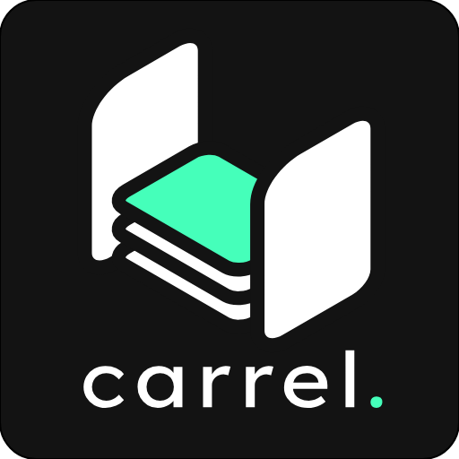
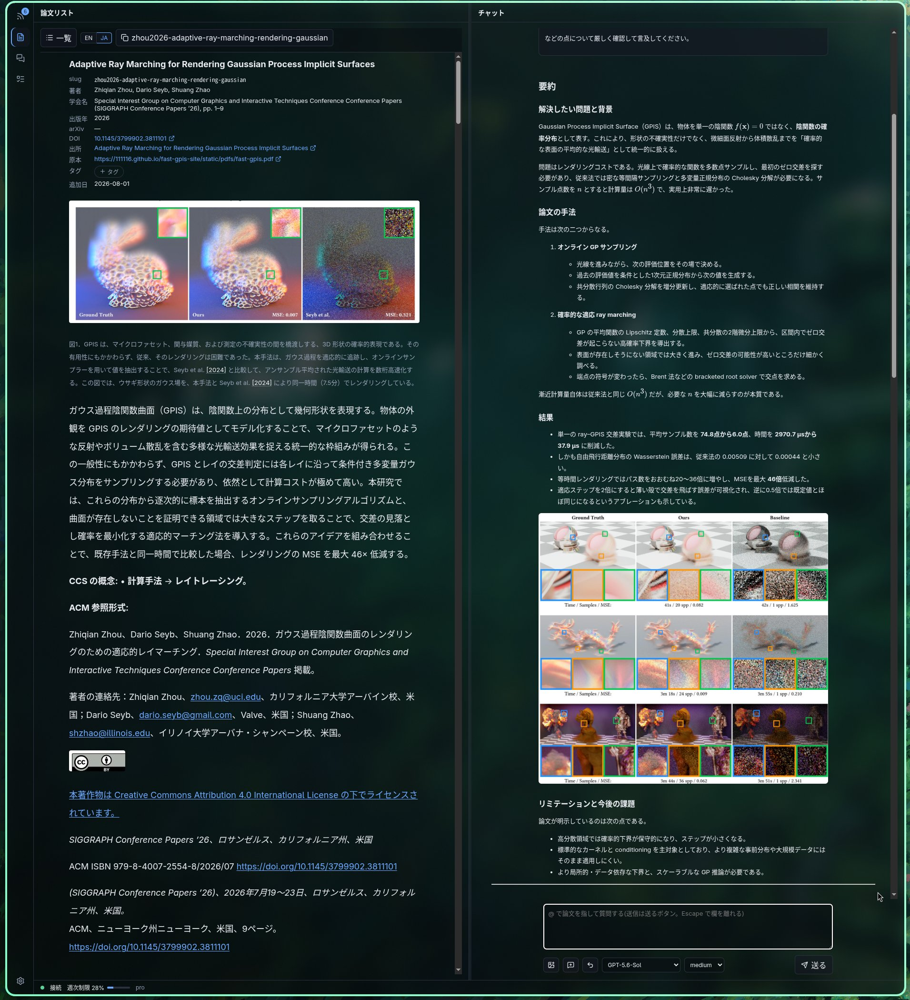
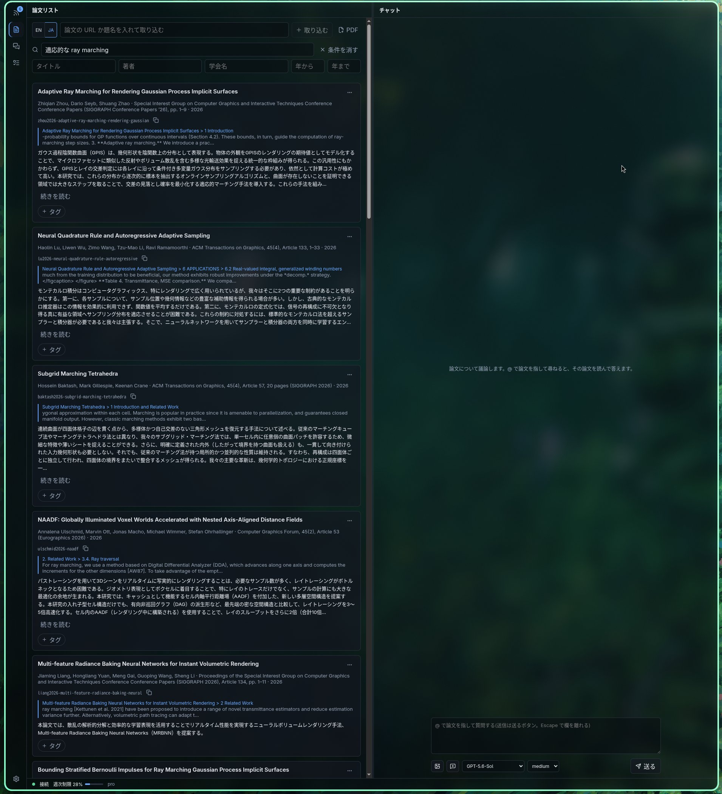
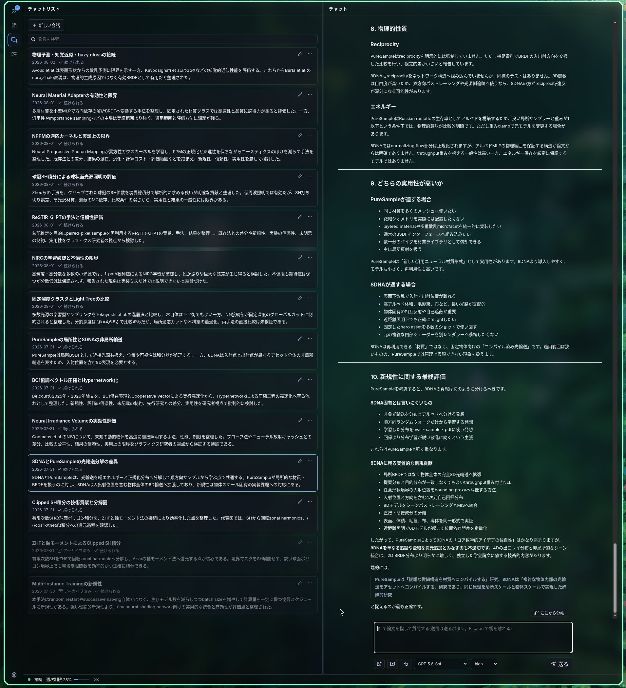

<p align="center">
  
</p>

# carrel.

論文を読み、調べ、議論するための場所。
carrel は図書館の中にある、本を持ち込んで調べものをする個室の机を指す。

## できること

- **論文を markdown で手元に置く。** PDF を取り込んで markdown に変換し、日本語訳を添えて保存する。図も数式も本文の中に残る。
- **論文をセマンティック検索する。** 日本語で尋ねて英語の論文に当てられる。題名・著者・学会名・出版年での絞り込みと併せて使う。
- **Codex のエージェントと論文について議論する。** その論文を読ませたうえで尋ねられる。議論の記録も markdown で手元に残る。
- **arXiv のフィードから取り込む。** 購読するカテゴリを決めておくと新着が並び、abstract の和訳を見てから取り込むかを決められる。
- **議論の中から取り込みを頼む。** 会話で「この論文を取り込んで」と頼めばエージェントが取り込みを積む。取り込み済みの論文は `@` で指して尋ねられ、エージェント自身もコレクションを検索して答える。

<p align="center">
  
</p>

論文を開くと、和訳された本文と図が並ぶ。
右の欄では、その論文を読んだエージェントと議論できる。

<p align="center">
  
</p>

「適応的な ray marching」と日本語で尋ねて、英語で書かれた論文に当てている。

<p align="center">
  
</p>

議論はすべて markdown として残り、後から検索できる。

## 動かすのに要るもの

- **ChatGPT の Codex の契約。** 取り込みも議論も Codex を通す。`codex app-server` を子プロセスとして動かし、行区切りの JSON でやりとりする。型は `codex app-server generate-ts` が出すものをそのまま取り込んでいる。
- **Codex の Pro プラン。** 論文 1 本の取り込みで、変換結果とページ画像の照合に 3 万トークン規模、本文の全訳に 1 万トークン規模を使う。まとめて取り込むと 5 時間の枠にすぐ届くので、Pro を前提にしている。
- Node.js 22 以上、pnpm
- Ollama(埋め込みの生成に使う。既定は `bge-m3`)
- Python と GPU(PDF の変換に使う)

## 置き場

論文と議論の記録は**アプリケーションとは別のディレクトリ**に置く。
場所は設定の欄から決められるので、NAS のマウント先や同期しているディレクトリを指してよい。

設定そのものは `$XDG_CONFIG_HOME/carrel/config.json`、検索の索引と運用の状態は `$XDG_STATE_HOME/carrel/` に置く。

## 導入について

**このアプリケーションは、作者の環境だけを見て作ってある。**
配布物も用意していない。

使ってみたい場合は、このリポジトリを clone して、コーディングエージェントに「自分の環境で動くように直して」と頼むのがよい。
変換器の venv の場所、Ollama の待ち受け先、systemd の有無、GPU の有無といった前提が環境ごとに違うので、そこを読み替える作業が要る。

参考までに、作者の環境での手順は次のとおりである。

```sh
pnpm install
pnpm --filter @carrel/server build
apps/server/scripts/install-service.sh   # systemd の user service として登録する
```

## 認証を持たない

**carrel は認証の仕組みを持たない。**
既定では `0.0.0.0:7817` で待ち受けるので、同じ LAN にいる誰もが論文と議論の記録を読み、書き替えられる。

作者の環境では、信頼できる相手しかいない LAN に閉じているという前提でこうしている。
不特定多数がいる LAN に置くなら、認証を自分で足す必要がある。
リバースプロキシで前に立てるか、サーバーに認証を実装するかは環境による。

## 開発

```sh
pnpm install
pnpm dev          # 開発用のサーバー(口は 7818)
pnpm dev:web      # 画面
pnpm typecheck
pnpm test
```

設計の判断は [`docs/design/`](docs/design/) に番号付きの design doc として残してある。
