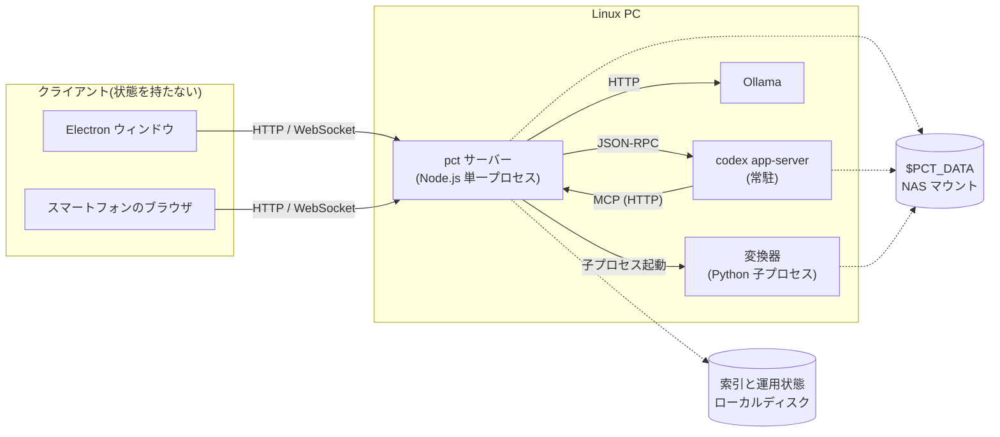

# pct の全体アーキテクチャと配置

- created: 2026-07-27
- status: ready for review
- implementation: not-started

## 解決したい問題

論文を収集して読み、AI エージェントと議論するという一連の作業が、1 台の Linux PC を拠点にしながら、机の前でも外出先のスマートフォンからでも同じ状態で続けられる。

この作業には性質の異なる仕事が混ざっている。
PDF を GPU で markdown に変換する数分単位の処理、arXiv を定期的に見に行く処理、AI エージェントとの対話、そして画面の描画である。
これらをどのプロセスに置き、どこで境界を引くかは、実装が進んでから分割し直すと全体に波及する。
この doc はその配置を決める。

## 問題の背景

pct が扱うデータ(論文の markdown と議論の履歴)は、ユーザーの研究の蓄積そのものである。
そのため保存先は NAS 上のディレクトリをマウントしたものにし、NAS からクラウドストレージへバックアップする。
アプリケーションはこのディレクトリを操作する道具という位置づけになる。

閲覧の経路は 2 つ要る。
1 つはデスクトップのスタンドアロンアプリケーションで、他のアプリケーションと馴染むように背景を半透明にして表示する。
もう 1 つは Web ページで、この PC が接続している tailscale の VPN 越しに、外出先のスマートフォンから開く。

AI エージェントとの対話には Codex を使う。
Codex は `codex app-server` という常駐プロセスとして起動でき、双方向の JSON-RPC で会話スレッドを作り、ターンを流し、逐次のイベントを受け取れる。
このプロセスはローカルのファイルを読み書きする権限を持つので、置き場所と誰が起動するかを決める必要がある。

## この文書では書かないこと

- 論文とチャットのファイル形式、索引の構造(0002)。
- Codex のスレッドの使い分けとレート制限の扱い(0003)。
- 論文の取り込み処理とフィードの取得(0004)。
- 検索の仕組みとエージェントへの公開(0005)。
- 画面の構成、タブの並び、レスポンシブの折り返し方といった UI の詳細。

## やらないこと

- **アプリケーション層の認証を持たない。** アクセス制御は tailscale の VPN とその ACL に任せる。VPN の内側だけに口を開ける構成では、認証を足しても守る対象が増えない。将来、tailnet の外に出す必要が生まれたときに再検討する。
- **複数ユーザーへの対応をしない。** 想定利用者は 1 人であり、同時に触るのは同じ人が使う複数のクライアントだけである。ユーザーごとのデータ分離や権限の概念を持たない。この前提は当面変わらない。
- **Linux 以外のプラットフォームへ配布しない。** デスクトップアプリケーションは Wayland 上の Niri を前提にした透過とブラーの設定を持つため、他の環境では見た目の前提が成り立たない。Web ページ側は特定の OS に依存しないので、他 OS からはブラウザで開けばよい。この方針は、利用するマシンが増えない限り変えない。
- **サーバーをコンテナで包まない。** 依存の導入をホストから隔離する構成であり、「代替案」で詳しく述べる。ホストで直接動かす限り恒久的に採らないが、複数のマシンへ展開する必要が生まれたら再検討する。

## 概要

pct は、常駐する 1 つのサーバープロセスと、それに接続する薄いクライアントで構成する。

サーバーは Node.js の単一プロセスで、HTTP API、WebSocket、ジョブキュー、arXiv フィードの取得、そしてエージェント向けの MCP エンドポイントを担う。
GPU を使う PDF の変換と埋め込みの生成は、それぞれ Python の変換器と Ollama という別プロセスに出す。
AI エージェントとの対話と AI を使う処理は、常駐する Codex の app-server にスレッド単位で投げる。
サーバーは systemd の user service として PC の起動時に立ち上がり、`127.0.0.1` と tailscale のインターフェースにバインドする。

アプリケーションの状態はすべてサーバーが持つ。
クライアントは状態を持たない表示層で、操作は HTTP で送り、変化は WebSocket で受け取る。
未読件数もジョブの進捗も Codex の残枠もサーバー起点で変化するため、この向きが自然に決まる。

クライアントの実体は 1 つの Web アプリケーションである。
スマートフォンはブラウザでそれを開き、デスクトップアプリケーションは Electron のウィンドウで同じ URL を開く。
Electron が固有に持つのは、透過ウィンドウの生成、コンポジタ側のブラー設定、そしてインストールとアンインストールの導線だけである。

永続するデータは 2 箇所に分かれる。
論文とチャットの markdown は NAS 上の `$PCT_DATA` に置き、検索用の索引と運用の状態はローカルディスクに置く。
何をどちらに置くかとその根拠は 0002 が定める。

図の読み方: 角丸の四角がプロセス、円筒がファイルシステム上の保存先を表す。
**実線の矢印は「呼び出す側 → 呼び出される側」**を表し、ラベルはその手段である。
**点線の矢印は「そのプロセスがその保存先を読み書きする」**ことを表す。
`pct サーバー` と `codex app-server` の間に実線が 2 本あるのは、互いを呼び出す関係にあるためである(後述)。

## シナリオ

外出先でスマートフォンから tailscale 経由で pct を開く。
フィードに前日からの arXiv の新着が並んでおり、興味を引いた 1 本の取り込みボタンを押す。
サーバーはジョブを登録し、変換を始める。
スマートフォンのブラウザを閉じても、ジョブはサーバー上で進み続ける。

帰宅してデスクトップの Electron アプリケーションを開くと、同じサーバーに繋がるので取り込みは完了している。
論文リストからその論文を開き、右のチャット欄で議論を始める。
議論の途中でスマートフォンを開いても、同じ会話の同じ状態が見える。

## 詳細設計

以下では、プロセスの分け方、クライアントとサーバーの責務境界、常駐とネットワークの設定、Codex app-server の起動と所有、設定の置き場所、Electron の位置づけを順に述べる。

### プロセスの分け方

サーバーを単一の Node.js プロセスにする。
HTTP API、WebSocket、ジョブキュー、フィードの定期取得、MCP エンドポイントは、すべてこの 1 プロセスに置く。

この規模でプロセスを分けない理由は 2 つある。
第一に、時間のかかる仕事はすべて別プロセスに出るため、Node.js のイベントループが塞がれない。
PDF の変換は Python の子プロセス、埋め込みの生成は Ollama への HTTP 呼び出し、AI の処理は Codex への JSON-RPC であり、いずれもサーバープロセス内で CPU を長時間占有しない。
第二に、運用の単位が 1 つだと、systemd での起動・停止・再起動・ログ収集がそのまま 1 対 1 に対応する。

GPU を使う仕事(変換と埋め込みの生成)は別プロセスに出るが、GPU そのものは 1 つしかない。
同時に走らせると VRAM が足りなくなるため、実行の直列化が必要になる。
これはプロセスの分け方ではなくジョブの実行順序の問題なので、ジョブキューの責務として 0003 で扱う。

### クライアントとサーバーの責務境界

アプリケーションの状態はすべてサーバーが持つ。
クライアントはサーバーの状態を映す表示層であり、自分で保持するのは表示上の一時的な状態(開いているタブ、スクロール位置、入力途中の文字列)だけである。

この境界を選ぶ根拠は、変化の起点がサーバー側にあることである。
フィードの未読件数はサーバーの定期取得で増える。
取り込みジョブの進捗はサーバーのキューで進む。
Codex の残枠は Codex 側の通知でサーバーが知る。
チャットの応答はサーバーが受け取るイベントの流れである。
これらはクライアントの操作と無関係に変化し、しかも複数のクライアントが同時に見ている。

したがって通信の向きを 2 つに分ける。
クライアントからの操作は HTTP のリクエストで送る。
サーバー側で起きた変化は WebSocket でクライアントへ push する。
クライアントは push を受けて自分の表示を更新するだけで、変化を自分で推測しない。

この形の帰結として、同じ状態を見ている 2 つのクライアントは自動的に足並みが揃う。
片方で論文を取り込めば、もう片方の一覧にも現れる。

### 常駐とネットワーク

サーバーは systemd の user service として動かす。
ユーザーのログインを待たずに PC の起動時から動く必要があるため、lingering を有効にする。

バインドするのは `127.0.0.1` と tailscale のインターフェースの 2 つに限る。
物理的な LAN のインターフェースには口を開けない。
この区別が要るのは、サーバーが論文コレクション全体を読める上に Codex のエージェントを動かせるからである。
到達できる範囲は tailnet の内側だけに閉じ、その内側で誰が来られるかは tailscale の ACL で決める。

tailnet 内では平文の HTTP で提供する。
tailscale の IP アドレスはブラウザから見て安全なオリジンとして扱われないため、secure context を要求する Web の機能は使えない。
このアプリケーションで該当するのはクリップボードへの書き込みだけで、これは古い選択とコピーの手順で代替できる。
Service Worker を使ったオフライン閲覧やホーム画面への追加は諦めることになるが、これらは要件に含まれていない。

将来この判断を覆したくなった場合、サーバーのバインド先をループバックだけに変え、tailscale の HTTPS 提供機能を前段に置けばよい。
アプリケーションの構造は変わらないため、後戻りは安い。

### Codex app-server の起動と所有

`codex app-server` は pct サーバーが子プロセスとして起動し、その寿命を所有する。
1 つのプロセスを常駐させ、すべてのスレッドをそこに多重化する。

プロセスを常駐させる理由は起動コストである。
app-server の起動には数秒かかるため、abstract の翻訳 1 件ごとにプロセスを立ち上げると、実際の仕事より起動のほうが長くなる。
app-server は複数のスレッドを同時に扱えるように作られており、スレッドごとに作業ディレクトリ、モデル、サンドボックスの方針を指定できる。

pct サーバーが所有する形にすると、pct の再起動で Codex 側も確実に作り直され、孤児プロセスが残らない。
Codex の認証情報は Codex 自身が管理する既定の場所に置いたままにする。
この認証情報はトークンの更新で書き換わるため、NAS 上のバックアップ対象ディレクトリには置かない。

pct サーバーと app-server は互いを呼び出す関係にある。
pct が app-server にスレッドとターンを依頼し、app-server 側の会話スレッドは pct が持つ MCP の口を呼んでコレクションを検索する(0005)。
そのため起動には順序がある。
pct が先に HTTP の受け口を開き、その後で app-server を起動する。
app-server が MCP の口を呼ぶのは会話スレッドがターンを走らせるときなので、この順序であれば呼び出し先が常に用意されている。

pct サーバーが停止すると app-server も一緒に落ちるため、片方だけが生き残って呼び出しに失敗する状態は生じない。

### 設定の置き場所

ユーザーが設定画面で変えるもの(購読する arXiv のカテゴリ、`$PCT_DATA` の場所、チャットの既定のモデルと reasoning effort、フィードの取得間隔)は、ローカルディスクの設定ファイルに置く。

`$PCT_DATA` の中に置けないのは、`$PCT_DATA` の場所そのものが設定項目だからである。
設定を読むために設定が要る、という循環になる。

設定は論文やチャットと違って、pct が無い環境で読む意味を持たない。
そのためバックアップの対象にする必要もなく、markdown で持つ理由もない。

### Electron の位置づけ

Electron はサーバーの URL を開くウィンドウである。
UI のコードは Web と完全に同一で、Electron 用の分岐を持たない。

固有の責務は 3 つある。
1 つ目は、背景を透過したウィンドウを作ることである。
ウィンドウ自体を透明な surface として生成し、HTML から React のルートまで背景を透明にし、UI の色は低い不透明度の色を重ねて表現する。
ブラー自体はアプリケーションが描画するのではなく、コンポジタがそのウィンドウの背後の画面をぼかして合成する。
そのためコンポジタ側にウィンドウの識別子と対応する規則を置く必要があり、その規則ファイルの配布もアプリケーションの責務に含まれる。

ここで UI のコードが Web と同一であることと、背景を透明にすることは両立させる必要がある。
ブラウザで開いたときに背景が透明だと、下に何も無いので白く抜けてしまう。
そこで UI は**不透明モードと透過モード**の 2 つの見た目を持ち、Electron から開かれたときだけ透過モードになる。
どちらのモードかは、Electron が読み込む URL に印を付けることで UI へ伝える。
UI 側では、この 2 つのモードの差を最上位の背景の指定だけに閉じ込める。
差が個々の部品に散らばると、片方のモードでしか確認されない見た目が増えていく。

2 つ目は、インストールとアンインストールの導線である。
配布物、デスクトップエントリ、アイコン、コンポジタの規則ファイルをユーザー単位で配置し、また取り除くための手順を持つ。

3 つ目は、サーバーが応答しないときの受け止めである。
Electron はサーバーの URL を読み込むため、サーバーが起動途中や停止中だと何も表示できない。
この場合はローカルの画面を出して再接続を待ち、繋がった時点で本来の URL へ切り替える。

## 落とし穴

- **サーバーは単一障害点である。** サーバープロセスが落ちると、フィードもチャットも取り込みも同時に止まる。systemd の自動再起動で復帰させるが、その瞬間に進行中だったジョブは中断される。ジョブの再開はキューの永続化に依存する(0003)。
- **tailnet 内の全端末が無認証で触れる。** ACL を絞らない限り、tailnet に参加している端末はどれでも論文コレクションを読み、エージェントを動かせる。tailscale の ACL の設定はこのアプリケーションの外側にあり、pct はそれを検証しない。
- **Electron の透過とブラーはコンポジタの機能に依存する。** ブラーは Wayland の標準的な仕組みではなくコンポジタ固有の設定である。コンポジタを変えると、この見た目は失われるか別の設定で置き換える必要がある。
- **サーバー停止中のデスクトップアプリケーションは待機画面しか出せない。** 論文の一覧すら表示できない。

## 代替案

- **API サーバーと変換ワーカーをプロセスとして分ける。**

  HTTP と WebSocket を担うプロセスと、PDF の変換や AI の呼び出しを担うプロセスを分け、ジョブをプロセス間で受け渡す設計である。
  ワーカーが異常終了しても API 側は生存し、ユーザーは一覧の閲覧を続けられる。
  一方で、ジョブの受け渡し、ワーカーの生死監視、ログの集約という機構が新たに要る。
  重い処理は本設計でも子プロセスに出ており、サーバープロセス自体が落ちる主な原因は Node.js 側の未捕捉例外である。
  それは分離では防げず、systemd の再起動で受けるほうが単純である。
  利用者が 1 人でジョブの同時実行数も少ないこの規模では、隔離で得られるものより運用の複雑さが勝つ。

- **サーバーを持たず、Electron のアプリケーションに全機能を入れる。**

  変換もフィードの取得も AI の呼び出しも Electron のメインプロセスで行い、データを直接ファイルに書く設計である。
  構成要素が 1 つで済み、配布も 1 つになる。
  しかしスマートフォンからの閲覧ができず、要件を満たさない。
  さらに、デスクトップアプリケーションを開いていない間はフィードが進まないため、「取り逃さないフィード」も成立しない。

- **Electron に UI をバンドルし、データだけ API から取る。**

  UI の静的ファイルを Electron のパッケージに同梱してローカルから読み込み、データの取得だけサーバーへ問い合わせる設計である。
  サーバーが起動していなくてもウィンドウの枠と画面の骨組みは表示できる。
  一方で UI の配布経路が Web とパッケージの 2 系統になり、パッケージを更新し忘れると Web 版と挙動が食い違う。
  サーバー未応答時にローカルの待機画面を出す手当てで、同じ利益をほぼ得られる。

- **docker compose でサーバー一式を包む。**

  変換器、Ollama、pct サーバーをコンテナとして定義し、compose で一括して起動する設計である。
  依存の導入がホストから隔離され、環境を作り直すのが容易になる。
  一方で、Codex の認証情報はトークン更新のたびに書き換わるため書き込み可能なマウントが要り、GPU を使うには ROCm のデバイスとグループをコンテナへ渡す必要があり、NAS のマウントではコンテナ内外のユーザー識別子を揃える必要がある。
  いずれもホストで直接動かすなら発生しない問題であり、隔離で得られるものはこれらの手当てに見合わない。

## セキュリティ・プライバシー

信頼境界は tailnet の内側に置く。
サーバーは物理 LAN のインターフェースにバインドせず、tailnet の外からは到達できない。

保護すべき資産は 2 つある。
1 つは論文コレクションと議論の履歴で、これはサーバーの API 越しに読める。
もう 1 つは Codex の認証情報で、これは Codex 自身が管理する既定の場所に置く。
NAS 上のデータディレクトリには置かないため、クラウドへのバックアップに認証情報が混入しない。

Codex のエージェントには読み取り専用のサンドボックスを与える。
エージェントがコレクションを書き換えないことは、この設計とエージェントへの公開範囲の設計(0005)の両方で担保する。

## 負荷・コスト

常駐するプロセスは pct サーバーと Codex の app-server の 2 つで、いずれも仕事をしていない間のメモリ使用量は数十 MB の規模にとどまる。
Ollama は埋め込みの生成時のみモデルを VRAM に載せる。

サーバープロセスは、クライアントが繋がっていない間もフィードの定期取得のために動く。
この取得は数時間に 1 度、1 カテゴリあたり 1 回の HTTP 要求であり、常時の負荷にはならない。

WebSocket の push はクライアント数に比例するが、同時接続は多くて数本である。
push が集中するのはチャットの応答を流している間で、これはターンが走っている 1 本の会話に限られる。

GPU は変換と埋め込みの生成が取り合う。
どちらも数 GB の VRAM を要求するため同時には走らせられず、直列化が必要になる。
この直列化はジョブキューの責務として 0003 で扱う。
