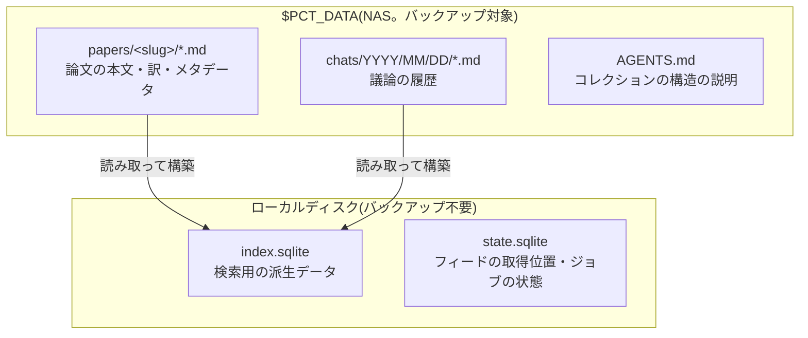

# 論文とチャットのデータ契約

- created: 2026-07-27
- status: approved
- implementation: not-started

## 解決したい問題

pct が保守されなくなった後も、収集した論文と AI との議論が、人間と他のツールにそのまま読める形で手元に残る。
同時に、数千本規模の論文に対する検索が待たされずに返る。

この 2 つは素朴には両立しない。
可読性を優先して全部をファイルに置くと、検索のたびに全走査することになる。
速度を優先してデータベースに入れると、pct が無い環境では中身を取り出せなくなる。
どちらを「正」とし、もう一方をどう位置づけるかを決めるのがこの doc である。

## 問題の背景

pct が保持するのは、ユーザーが今後の研究で参照し続ける論文の集合と、その論文についての議論である。
これらは、道具であるアプリケーションよりも寿命が長い。
保存先は NAS 上のディレクトリをマウントしたもので、NAS はクラウドストレージへバックアップされる。

このデータには、アプリケーションが生成したもの(本文の markdown、和訳、要約)と、ユーザーが自分で足したもの(タグ、学会名の訂正)が混ざる。
後者はユーザーの判断が入った情報であり、失われると再現できない。

論文はチャットから `@slug` という形で参照される。
この参照はチャットの markdown の中に文字列として残るため、slug は論文を指す永続的な名前として機能する。

## この文書では書かないこと

- ファイルがどの処理でどの順に作られるか(0004)。
- 索引をどう引くか、ベクトル検索の融合方法(0005)。
- ジョブキューの状態遷移(0003)。
- 画面上での表示形式。

## やらないこと

- **複数マシンからの同時書き込みを想定しない。** 書き込むのは 1 台の PC 上のサーバープロセスだけである。NAS を別のマシンからも書き換える運用は考えず、競合の検出や解決の仕組みを持たない。この前提は当面変わらない。
- **データの版管理を持たない。** 論文の markdown やチャットを git のような仕組みで履歴管理しない。編集の履歴を追う要求が今は無く、履歴管理を入れると「正」がファイルの内容なのかコミットなのかが曖昧になる。過去の状態が要るときはバックアップから取り出す。
- **論文本文を 1 つのファイルに英日併記しない。** 段落ごとに原文と訳を交互に置く形であり、「代替案」で詳しく述べる。言語ごとに索引を分ける設計(0005)を採る限り恒久的に採らない。

## 用語集

- **`$PCT_DATA`** — 論文とチャットを置くディレクトリ。NAS のマウント先を指す。
- **slug** — 論文を指す不変の識別子。ディレクトリ名であり、チャットからの参照名でもある。
- **索引** — 検索を速くするために markdown から作る派生データ。

## 概要

`$PCT_DATA` の下に、論文を `papers/<slug>/`、チャットを `chats/YYYY/MM/DD/` として置く。
すべてプレーンテキストの markdown で、メタデータは frontmatter に書く。
この frontmatter が「正」であり、タグも学会名も出版年もここを読めば分かる。

検索用の索引は SQLite に持つが、これは markdown から作られる派生物であって正ではない。
消しても markdown から作り直せる。
索引は NAS ではなくローカルディスクに置く。
SQLite のロックはネットワークファイルシステム上で信頼できず、また再構築できるものをバックアップの対象に含める必要がないからである。

書き込みの順序は「markdown を書いてから索引を更新する」に固定する。
途中で異常終了しても、正の側が失われない向きだからである。

ユーザーが markdown を直接編集することは想定内の使い方である。
そのためサーバーは、起動時の全走査と稼働中のファイル監視で外部からの編集を検知し、索引へ反映する。



図の読み方: 四角がファイルまたはファイル群、矢印は「元になるデータ → そこから作られるデータ」の向きを表す。
`state.sqlite` へ入る矢印が無いのは、その中身が markdown から作られる派生物ではないことを示す(後述)。

## シナリオ

5 年後、pct は保守されていない。
ユーザーは `$PCT_DATA` をそのまま別のツールに読ませたい。

`papers/` の下を見ると、論文ごとにディレクトリがあり、それぞれに `paper.md` がある。
先頭の frontmatter にタイトル、著者、学会名、出版年、自分で付けたタグが並んでいる。
本文は markdown で、図は同じディレクトリの画像を参照している。
日本語で読みたければ隣の `paper.ja.md` を開く。

`chats/` の下は日付でディレクトリが切られ、1 つの議論が 1 つのファイルになっている。
frontmatter に要約と、その議論で参照した論文の slug が並んでいる。
本文は発言者ごとの見出しで区切られており、そのまま読める。

移行のために何かを変換する必要はない。

## 詳細設計

以下では、ディレクトリの構成、論文の frontmatter が持つ情報、チャットの形式、slug の規則、削除の意味、索引の位置づけ、外部編集の検知を順に述べる。

### ディレクトリの構成

```
$PCT_DATA/
  AGENTS.md
  papers/
    mildenhall2020-nerf/
      paper.md          英語の本文。frontmatter に論文のメタデータ
      paper.ja.md       日本語訳の本文
      abstract.md       英語の abstract
      abstract.ja.md    日本語訳の abstract
      paper.raw.md      照合を行う前の変換結果
      verification.md   照合でページごとに何をどう変えたかの記録
      original.pdf      取得した原本
      assets/           本文から参照する図表の画像
      pages/            PDF を 1 ページずつ画像化したもの
  chats/
    2026/07/27/
      15-04-12-nerf-の位置エンコーディングについて.md
```

論文のメタデータを持つのは `paper.md` の frontmatter だけである。
`paper.ja.md`、`abstract.md`、`abstract.ja.md` は、そのファイルが何なのかを単体で判別できるように slug と言語だけを frontmatter に持ち、論文のメタデータは重複させない。
同じ情報を複数のファイルに置くと、片方だけ編集されたときにどちらが正か決められなくなるからである。

`paper.raw.md` と `verification.md` は、照合によって本文がどう変わったかをユーザーが確認するために残す。
照合はページ画像と変換結果を突き合わせる AI の判断であり、正しかった箇所を誤って書き換える可能性がある(0004)。
`paper.raw.md` との差分が「何が変わったか」を、`verification.md` が「なぜそう変えたか」を示す。
差分だけでは、変更が妥当な修正なのか AI の書き換えなのかを区別できない。

`verification.md` はページ単位で、変更の内容・その判断の根拠・どちらの情報源を採ったかを持つ。
変更点の多いページが分かる形にすることで、原本の PDF と突き合わせるべき箇所をユーザーが絞れる。

`pages/` は照合に使ったページ画像で、PDF の全ページぶんを持つ。
照合をやり直すときに PDF から作り直す必要が無くなる。

### 論文の frontmatter が持つ情報

`paper.md` の frontmatter は、次の情報を持つ。

| 項目 | 意味 | 誰が決めるか |
|---|---|---|
| `slug` | 論文の不変な識別子 | 取り込み時に生成し、以後変えない |
| `title` | 論文のタイトル | 取り込み時に抽出。ユーザーが訂正できる |
| `authors` | 著者名の並び。順序に意味がある | 同上 |
| `venue` | 学会名または雑誌名。不明なら空 | 同上 |
| `year` | 出版年。不明なら空 | 同上 |
| `arxiv_id` | arXiv の識別子。無ければ空 | 取り込み時に抽出 |
| `source_url` | ユーザーが指定した、またはフィードで得た URL | 取り込み時に記録 |
| `pdf_url` | 実際に取得した PDF の URL | 取り込み時に記録 |
| `tags` | ユーザーが自由に付ける分類 | ユーザーのみ |
| `added_at` | 取り込みを開始した日時 | 取り込み時に記録 |

`title`、`authors`、`venue`、`year` は自動抽出の結果を初期値とし、ユーザーが訂正できる。
自動抽出は arXiv 以外の出所では誤りうるため、訂正の余地を持たない設計は取れない。

`tags` はユーザーだけが決める。
アプリケーションが自動でタグを付けると、ユーザーが付けたタグとの区別がつかなくなり、ユーザーの分類意図が壊れる。

このうちアプリケーションが再現できないのは `tags` と、ユーザーが訂正した後の `title` 以下の値である。
これらが frontmatter にあることが、この設計の核心である。

### チャットの形式

チャットは 1 つの会話が 1 つのファイルに対応する。
ファイル名は `HH-MM-SS-<タイトル>.md` で、日付のディレクトリの下に置く。

frontmatter は次を持つ。

| 項目 | 意味 |
|---|---|
| `id` | 会話の不変な識別子。ファイル名はタイトル変更で変わりうるので、参照にはこちらを使う |
| `created` / `updated` | 作成日時と最終更新日時 |
| `title` | 会話のタイトル |
| `title_source` | タイトルを AI が付けたのかユーザーが書き換えたのか |
| `summary` | 会話の要約。一覧に出す |
| `archived` | アーカイブ状態 |
| `codex_thread_id` | 対応する Codex のスレッド識別子 |
| `model` / `effort` | 最後に使ったモデルと reasoning effort |
| `papers` | この会話で参照した論文の slug の集合 |
| `forked_from` | 分岐元の会話の識別子。分岐でなければ空 |

`title_source` を持つのは、ユーザーが書き換えたタイトルを AI が上書きしてはならないからである。
この区別が無いと、会話が更新されるたびにユーザーの命名が消える。

`papers` は、その会話を後から新しいスレッドへ読み込ませ直すときに、何を一緒に渡すべきかを決めるために使う。

本文は、発言者と時刻を含む見出しで区切った連なりとする。

```md
## user · 2026-07-27T15:04:12+09:00

位置エンコーディングが無いと何が起きるのか、@mildenhall2020-nerf を読んで説明して。

## assistant · 2026-07-27T15:04:40+09:00

(応答の本文)
```

記録するのはユーザーの発言とエージェントの最終的な応答だけである。
エージェントが途中で行ったファイルの読み取りや検索は記録しない。
これらは結論に至る過程であって、後から人間が読み返す対象ではない。
どの論文を参照したかという最も重要な過程の情報は、frontmatter の `papers` に残る。

### slug の規則

slug は `<筆頭著者の姓><出版年>-<タイトル由来の短い語>` の形とする。
姓は小文字の ASCII に正規化する。
タイトル由来の語は、論文に定着した略称があればそれを使い(`nerf`)、無ければタイトルの内容語を 1〜3 語つないだものにする。
この語は取り込み時のメタデータ抽出が提案する。

既存の slug と衝突した場合は末尾に連番を付ける。
著者や年が取れなかった場合は `unknown<年>-<短いハッシュ>` にフォールバックする。

slug を人間が読める形にするのは、チャットで `@` から手で打つためである。
補完は効かせるが、補完の候補を絞るには最初の数文字を思い出せる必要がある。

**slug は生成後に変えない。**
チャットの markdown に文字列として残った `@slug` は、後から一括で書き換えられる保証が無い。
そのため後でタイトルの誤りが判明しても slug は直さない。

### 論文の削除と、残された参照

論文の削除は、`papers/<slug>/` のディレクトリごと消し、索引からその論文を取り除く操作である。
ユーザーが一覧から明示的に選び、確認を経てから実行する。

**過去のチャットは書き換えない。**
削除した論文の slug は、それを参照した会話の markdown の中に `@slug` として残る。
この参照は解決できなくなるが、それでよい。
議論は起きたときのままの記録であり、後から書き換える対象ではないからである。
削除した論文を参照していた事実そのものが記録の一部である。

解決できない参照を pct がどう扱うかは、2 つの場所で決まる。
表示のうえでは、コレクションに存在しない slug への参照であることが分かる形にする。
エージェントへ渡すときは、ファイルの場所への展開ができないため、slug をそのまま渡す(0006)。

削除した論文をもう一度取り込んだ場合、slug の生成規則は同じ書誌情報から同じ結果を出すため、通常は以前と同じ slug になり、過去の参照が再び解決するようになる。
これは意図した挙動である。
同じ論文を指す名前が取り込み直しのたびに変わると、過去の参照が別の意味になってしまう。
ただし衝突による連番が絡む場合はこの限りではない(「落とし穴」)。

### 索引の位置づけ

索引は SQLite のファイルとして、`$PCT_DATA` ではなくローカルディスクに置く。
理由は 2 つある。
SQLite のファイルロックはネットワークファイルシステム上で正しく働かない場合があり、データベースの破損につながる。
また索引は markdown から作り直せるため、バックアップの対象に含める価値が無い。

索引のファイルは、中身の性質で 2 つに分ける。

**`index.sqlite`** は markdown から作られる派生データだけを持つ。
論文のメタデータ、全文検索のための本文、本文のチャンクとその埋め込みベクトル、チャットのメタデータと本文が入る。
いつ削除しても、`$PCT_DATA` を走査すれば同じ内容を作り直せる(埋め込みの再生成に GPU 時間はかかる)。

**`state.sqlite`** は markdown に対応物を持たない運用の状態を持つ。
arXiv フィードのどこまでを取得したかという位置、取得済みのフィード項目とその既読状態、ジョブキューの内容と進行状況が入る。
これらは論文やチャットから導けない。

この 2 つを分けるのは、「索引を作り直す」操作の意味を明確にするためである。
1 つのファイルに混ぜると、検索がおかしくなったときの再構築が、フィードの取得位置のリセットと未読の消失を巻き込む。
分けておけば、`index.sqlite` を消して作り直す操作が論文とチャット以外に何の影響も与えない。

`state.sqlite` を失った場合に起きるのは、フィードの取得位置が既定の遡り期間まで戻ることと、進行中だったジョブが失われることである。
論文と議論そのものは失われない。

### 書き込みの順序と外部編集の検知

書き込みは常に markdown を先に行い、その後で索引を更新する。
逆順にすると、索引にしか存在しないデータが生じる瞬間ができる。

ユーザーが markdown を直接編集することは、この設計が意図した使い方である。
アプリケーションを介さずタグを足したり、誤ったタイトルを直したりできることが、frontmatter を正にした理由そのものだからである。
そのためサーバーは 2 つの経路で外部編集を検知する。
1 つは起動時の全走査で、停止中に行われた編集を拾う。
もう 1 つは稼働中のファイル監視で、開いている間の編集を拾う。

検知したときの扱いは、変更されたのが frontmatter か本文かで分かれる。
frontmatter だけが変わった場合は、索引のメタデータを更新すれば足りる。
本文が変わった場合は、その論文のチャンクと埋め込みが古くなっているため、埋め込みの再生成をジョブとして積む。

## 落とし穴

- **正と索引の二重管理が残る。** 書き込みの途中で異常終了すると、markdown は新しく索引が古いという状態が生じる。この向きの不整合は再構築で必ず回復するが、次回の起動まで検索結果が古いままになる。
- **slug は不変なので、後から判明した誤りを反映できない。** 著者名を取り違えたまま生成された slug は、その論文を指す名前として残り続ける。
- **チャットの発言区切りは見出しで表現するため、原理的には衝突しうる。** エージェントの応答が発言区切りと同じ形の行を出力すると、読み取り側が発言の境界を誤る。時刻を含む厳密な形でのみ区切りと判定するため実際には起こりにくいが、可能性としては残る。
- **本文の外部編集を「意味のある変更」と区別できない。** 誤字を 1 つ直しただけでも埋め込みの再生成が走る。
- **`state.sqlite` はバックアップされない。** ローカルディスクが壊れると、未読の状態とフィードの取得位置は失われる。
- **論文を削除すると、過去のチャットに解決できない参照が残る。** これは意図した挙動だが、古い会話を読み返したときに参照先を開けない箇所が増えていく。
- **衝突で連番の付いた slug は、取り込み直しで同じ名前にならないことがある。** 衝突相手の論文が先に削除されていると、生成規則は連番のない slug を返す。同じ論文を指す名前が変わるため、過去の参照が解決できないままになる。

## 代替案

- **SQLite を正とし、markdown は本文だけを持つ。**

  タグ、学会名、出版年、著者といったメタデータをデータベースの列として持ち、markdown にはタイトルと本文だけを書く設計である。
  正が 1 箇所になるため二重管理の悩みが消え、外部編集の検知も要らなくなる。
  一方で、ユーザーが自分で付けたタグや訂正した学会名は、データベースを読み解かないと取り出せない。
  この情報はアプリケーションが再現できないものであり、pct が無いと読めない場所に置くのは、この doc の目的そのものを裏切る。

- **索引を持たず、検索のたびに markdown を全走査する。**

  ファイルだけを持ち、検索は起動時にすべて読み込んで行う設計である。
  依存が 1 つ減り、二重管理も外部編集の検知も不要になる。
  一方で、数千本の論文の全文検索とベクトル検索を毎回やり直すことになり、検索の応答が秒単位になる。
  検索は論文リストで文字を打つたびに走るものなので、この応答時間は使い勝手を損なう。

- **索引を `$PCT_DATA` に置く。**

  markdown と索引を同じディレクトリにまとめる設計である。
  データの置き場所が 1 つになり、バックアップも 1 つで済む。
  一方で、ネットワークファイルシステム上の SQLite はロックが正しく働かず破損しうる。
  また索引は作り直せるものなので、クラウドへ毎日転送する価値が無い。

- **論文の本文を 1 つのファイルに英日併記する。**

  段落ごとに原文と訳を交互に置く設計である。
  対応関係が明示され、訳の確認がしやすい。
  一方で、英語だけを読みたいときにも訳が視界に入る。
  また本文を検索の索引に入れるとき、英語と日本語が同じチャンクに混ざるため、言語ごとの索引を分けられなくなる(0005)。
  英語版と日本語版を別ファイルにすれば、表示の切り替えはファイルの切り替えで済み、索引も自然に分かれる。

- **slug に arXiv の識別子を使う。**

  `2003.08934` のような arXiv の識別子をそのまま slug にする設計である。
  一意性が保証され、生成の規則も要らず、元の論文をすぐ引ける。
  一方で数字の並びなので、チャットで `@` を打つときに記憶から引けない。
  さらに arXiv 以外から取り込んだ論文には別の体系が必要になり、slug の形が出所によって変わる。

- **チャットを 1 行 1 発言の機械向け形式で持つ。**

  会話を JSON Lines のような形式で保存する設計である。
  追記が安く、読み書きの実装も単純で、発言の境界が構造として保証される。
  一方でエディタで開いても読めず、「議論がそのまま読める形で残る」という目的を満たさない。

- **外部編集を検知しない。**

  markdown はアプリケーションだけが書くものとし、外部からの編集は索引に反映しない設計である。
  ファイル監視も起動時の全走査も要らなくなる。
  一方で、ユーザーが直接足したタグが検索に出ず、原因も分かりにくい。
  frontmatter を正にしておきながら、そこへの編集を無視するのは一貫しない。

## セキュリティ・プライバシー

`$PCT_DATA` はクラウドストレージへバックアップされるため、そこに置くものを選ぶ必要がある。
この設計が置くのは論文の本文と議論の履歴だけであり、認証情報や API のキーは含まない。
Codex の認証情報は Codex 自身が管理する既定の場所にあり、`$PCT_DATA` の外にある(0001)。

論文の本文には著作権のある PDF とその変換結果が含まれる。
これは個人の研究のための複製であり、pct はこれを外部へ公開しない。

## 法的考慮事項

論文の PDF とその変換結果を保存するため、著作権が関わる。
pct が行うのは、ユーザーが自分で読むための私的な複製であり、保存先も本人のみが到達できる範囲に限られる(0001)。
第三者への再配布や公開の機能は持たない。

## 負荷・コスト

想定する規模は論文が数百本から数千本、1 本あたりの markdown が数万文字である。
`$PCT_DATA` 全体は、PDF とページ画像を含めて論文 1 本あたり数 MB から数十 MB になる。
数千本で数十 GB の規模であり、NAS の容量とクラウドへのバックアップの両方で現実的な範囲に収まる。

起動時の全走査は、ファイルの更新時刻を見て変更のあったものだけを読み直す。
数千個のディレクトリの更新時刻を確認する処理であり、起動を待たせる規模にはならない。

ファイル監視は、`papers/` と `chats/` の配下を対象とする。
監視対象のディレクトリ数は論文数に比例して増えるが、数千の規模ではファイル監視の資源制限に収まる。

索引の大きさは、本文の全文とチャンクごとの埋め込みベクトルが支配する。
ベクトルの本数は「論文数 × 1 本あたりのチャンク数 × 2 言語」に比例する。
具体的な規模の見積もりは 0005 で扱う。
