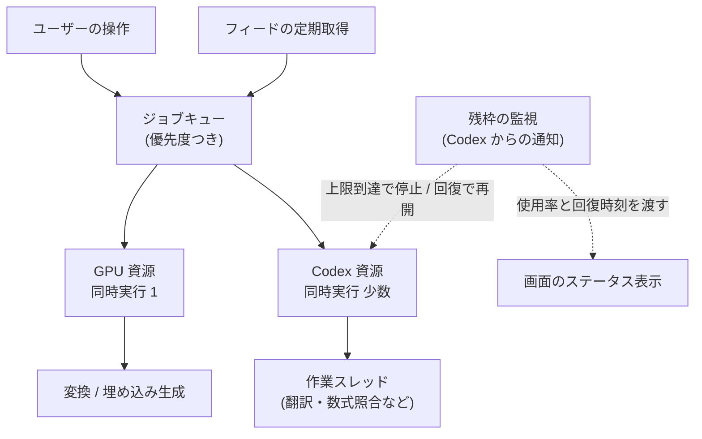

# Codex の使い分けとレート制限の運用

- created: 2026-07-27
- status: ready for review
- implementation: not-started

## 解決したい問題

翻訳、要約、数式の照合、そして論文についての議論という性質の違う仕事が、Codex という 1 つの資源を共有して走る。
この資源には契約プランごとの上限があり、背景で走る仕事が上限を食い潰すと、ユーザーが議論をしたいときに動かせなくなる。

この doc が目指すのは 2 つである。
背景の仕事が議論の枠を奪わないようにすること。
そして、いま取り込みに枠を使うか議論に残すかを、ユーザーが数字を見て判断できるようにすることである。

## 問題の背景

pct が AI に投げる仕事は、消費する量が桁違いに異なる。
arXiv の abstract の和訳は数百トークンで済む。
論文本文の全訳は入力と出力を合わせて数万トークンになる。
数式の照合はページ画像を送るため、1 本の論文で 1 万から 2 万トークンの入力になる。

Codex の消費は 2026 年 4 月からトークン量に基づくクレジット制になっており、入力・キャッシュ済み入力・出力それぞれに単価がある。
上限は 5 時間のローリング枠と、その上に重なる週次の枠の 2 段構えである。
公表されている「5 時間あたり何メッセージ」という値の幅が広いのは、1 メッセージの費用が中身によって桁で変わるためである。

この上限の残量は Codex 側から取得できる。
`codex app-server` は `account/rateLimits/read` で現在の残量を返し、`account/rateLimits/updated` の通知で変化を知らせる。
どちらも 5 時間枠と週次枠それぞれについて、使用率と回復時刻と枠の長さを持つ。
上限に到達した状態は専用の種別として区別されるため、待機に入るべきかどうかをエラー文字列の解釈ではなく型で判定できる。

Codex のスレッドは、開始時に作業ディレクトリ、モデル、サンドボックスの方針、基本指示を指定できる。
また使い捨てとして開始すれば、セッションの保存領域にファイルを残さない。
ターンごとにモデルと reasoning effort を上書きでき、JSON Schema を渡して応答の形を強制できる。

## この文書では書かないこと

- 取り込み処理が具体的にどの段階を持つか(0004)。
- MCP が公開するツールの内容(0005)。
- チャットの再開・分岐・アーカイブの意味論(0006)。
- チャットとジョブの表示形式。

## やらないこと

- **枯渇時にローカルモデルへ退避しない。** 理由は「代替案」に書く。
- **Codex 以外の AI バックエンドを持たない。** ChatGPT の契約に含まれる Codex だけを使い、API キーによる従量課金の経路を持たない。経路が 2 つあると、同じ操作の費用が設定によって変わり、残枠の表示も意味を失う。将来、枠の不足が慢性化しても、まず契約プランを上げることで対応する。
- **消費の内訳をジョブ種別ごとに集計しない。** どの機能がどれだけ枠を使ったかの分析画面は持たない。残量と回復時刻が分かれば「いま何をするか」の判断はできる。内訳が必要になるのは費用を最適化する段階であり、そこに至っていない。

## 用語集

- **枠** — Codex の契約プランに定められた利用上限。5 時間のローリング枠と週次の枠の 2 つがある。
- **ジョブ** — pct が非同期に実行する仕事の単位。AI を使うものと GPU を使うものがある。
- **会話スレッド / 作業スレッド** — Codex のスレッドの 2 つの使い方。後述する。

## 概要

pct は Codex のスレッドを 2 通りに使い分ける。
**会話スレッド**はユーザーとの議論そのもので、永続し、論文ディレクトリを読め、コレクションを検索する道具を持ち、モデルと reasoning effort をユーザーが選ぶ。
**作業スレッド**は翻訳や数式の照合といった 1 回きりの処理で、使い捨てとして開始し、指示と道具を最小限にして、応答の形を JSON Schema で固定する。
道具と指示は毎ターンの入力に載るため、作業スレッドを会話スレッドと同じ設定で回すと、翻訳する本文よりも固定費のほうが大きくなる。

AI と GPU を使う仕事はすべてジョブキューを通す。
キューは資源の種類ごとに並行度を持ち、GPU を使う仕事は同時に 1 つ、Codex を使う仕事は少数だけ並行させる。
ジョブには優先度があり、ユーザーが結果を待っている仕事が、背景で進む仕事より先に走る。

残枠は Codex からの通知を購読して常に保持する。
上限への到達を検知したらキューの Codex 側を止め、回復時刻まで待ってから再開する。
そして 5 時間枠と週次枠の使用率と回復時刻を、画面に常時表示する。

図の読み方: 角丸の四角が処理または状態を表す。
**実線の矢印は「仕事が流れる向き」**を表す。
**点線の矢印は「残枠の監視が他の要素に働きかける向き」**を表し、ラベルはその働きかけの内容である。

## シナリオ

ユーザーがフィードから論文を 5 本まとめて取り込む。
5 本ぶんの取り込みジョブがキューに積まれ、変換は GPU の枠が 1 つしかないので順に流れる。
変換が終わった論文から数式の照合と翻訳が始まり、これらは Codex の枠を使う。

3 本目の翻訳の途中で 5 時間枠が上限に達する。
キューは Codex を使う仕事を止め、画面のステータス表示が「5 時間枠 100%、回復まで 1 時間 20 分」に変わる。
論文リストには、3 本目以降が「枠の回復待ち」として並ぶ。

ユーザーはこの表示を見て、議論は後回しにしてよいと判断し、そのまま放置する。
1 時間 20 分後、Codex から残枠の更新が通知され、キューが自動的に再開する。
残りの 3 本の翻訳と索引への登録が進み、完了する。

## 詳細設計

以下では、スレッドの 2 種別、ジョブキューが持つ契約、残枠の監視と待機、承認要求の扱いを順に述べる。

### スレッドの 2 種別

**会話スレッド**は、ユーザーとの議論に 1 対 1 で対応する。
作業ディレクトリを `$PCT_DATA` に置き、サンドボックスは読み取り専用にする。
コレクションを検索する MCP の口を接続し(0005)、`$PCT_DATA/AGENTS.md` によってコレクションの構造を伝える。
モデルと reasoning effort はユーザーが画面で選び、ターンごとに指定する。
このスレッドは永続し、Codex 側のセッションとして保存される。

**作業スレッド**は、1 つのジョブに 1 つ対応する使い捨てのスレッドである。
使い捨てとして開始するため、Codex のセッション保存領域にファイルを残さない。
基本指示はそのジョブに必要なものだけに差し替え、MCP は接続しない。
応答は JSON Schema で形を固定し、reasoning effort は低く設定する。
サンドボックスは読み取り専用で、URL の解決を行うジョブだけ web 検索を有効にする。

この 2 種別を分ける根拠は、毎ターンの入力に載るものの量である。
会話スレッドの設定には、コレクションの説明と MCP のツール定義が含まれる。
abstract の和訳は本文が数百トークンしかないため、この固定費のほうが本文より大きくなる。
翻訳を何百件も回すと、固定費だけで枠を消費することになる。

作業スレッドを 1 ジョブごとに作り捨てるのは、ジョブ同士を独立させるためである。
ある論文の翻訳の結果が別の論文の翻訳の文脈に混ざらず、失敗したジョブの再試行も、他のジョブの状態を考えずに行える。

**1 つのジョブの中では、同じ作業スレッドで複数のターンを走らせてよい。**
たとえば本文の翻訳は見出しごとにターンを分けるが(0004)、それらは同じ論文についての連続した仕事なので 1 つのジョブであり、1 つの作業スレッドで処理する。
このとき前のターンの内容がスレッドに残るが、同じ論文の訳語を揃えるうえではむしろ利点になる。
独立させたいのはジョブ同士であって、1 つのジョブの中の手順ではない。

### ジョブキューの契約

すべての AI と GPU の仕事はジョブとしてキューを通る。
キューは `state.sqlite` に永続化し(0002)、サーバーの再起動をまたいで復元する。

ジョブが持つのは次の情報である。

| 項目 | 意味 |
|---|---|
| 種別 | 何をする仕事か(翻訳、数式照合、変換、埋め込み生成など) |
| 対象 | 何に対する仕事か(論文の slug、フィード項目、会話の識別子) |
| 資源クラス | GPU を使うか Codex を使うか |
| 優先度 | 前景か背景か |
| 状態 | 待機中 / 実行中 / 枠の回復待ち / 失敗 / 完了 |
| 試行回数 | 再試行の判断に使う |

**資源クラス**は同時実行数を決める。
GPU を使う仕事(PDF の変換、埋め込みの生成)は同時に 1 つに限る。
GPU は 1 枚しかなく、変換器も埋め込みモデルもそれぞれ数 GB の VRAM を要求するため、同時に走らせるとメモリが足りなくなる。
Codex を使う仕事は少数だけ並行させる。
並行させるのは待ち時間を隠すためだが、無制限に増やすと枠を一気に消費するため上限を設ける。

**優先度**は 2 段階である。
ユーザーが結果を待っている仕事(明示的に押した取り込み、開いているチャット)を前景とし、ユーザーの操作なしに発生する仕事(フィードの abstract 和訳、チャットの要約生成)を背景とする。
同じ資源クラスの中では前景が先に走る。

**状態**のうち「枠の回復待ち」を失敗と区別するのは、この 2 つで取るべき行動が違うからである。
枠の回復待ちは時間が経てば必ず解消し、再試行の回数を数える対象ではない。
失敗は原因を調べる必要があり、回数を超えたら諦める対象である。

ジョブの状態は変化するたびに WebSocket でクライアントへ push する(0001)。
これによりボタンの実行中表示とジョブ一覧の画面が、追加の問い合わせなしに追従する。

### 残枠の監視と待機

サーバーは起動時に Codex から現在の残枠を読み、以後は残枠の更新通知を購読して保持する。
保持するのは 5 時間枠と週次枠それぞれの使用率、回復時刻、枠の長さ、そして契約プランの種別である。

上限への到達は、Codex が返す到達種別によって判定する。
これを検知したら、Codex を資源クラスとする仕事の実行を止める。
GPU を資源クラスとする仕事は止めない。
変換や埋め込みの生成は Codex の枠を使わないため、止める理由がない。

再開は、保持している回復時刻に達したときと、残枠の更新通知で使用率の低下を知ったときの両方で行う。
時刻だけに頼らないのは、回復が通知で先に分かる場合があるためである。

会話スレッドのターンも同じ制限を受ける。
枠が尽きている間はユーザーが送った発言も投げられないため、チャット欄にその状態と回復時刻を表示し、送信を保留する。
発言を捨てはしない。

### 残枠の表示

画面には 5 時間枠と週次枠の使用率と回復までの時間を常時表示する。
ユーザーがこの数字を見て「いま 5 本取り込むか、議論に残すか」を判断できることが、この表示の目的である。

表示する値は Codex のアカウント全体のものである。
pct を通さずに端末から Codex を使った消費も、この数字に含まれる。
そのためこの表示は「pct がどれだけ使ったか」ではなく「アカウントの残りがどれだけか」を意味する。

### 承認要求の扱い

Codex はサンドボックスの外で何かを実行しようとするとき、クライアントへ承認を求める。
pct はこの要求を自動的に拒否し、拒否したことを会話に表示する。
ユーザーに承認を求める画面は出さない。

このアプリケーションでエージェントに期待するのは、論文を読み、検索し、議論することである。
サンドボックスの外でコマンドを実行する用途が無い。
承認の画面を作ると、内容を確かめずに許可する経路がそこに生まれる。
拒否したことを会話に見せるのは、エージェントが何かを試みて阻まれたという事実をユーザーが把握できるようにするためである。

## 落とし穴

- **残枠の表示はアカウント全体の値である。** pct 以外の Codex の利用も同じ枠を消費するため、表示された残量は pct が使える量とは限らない。
- **週次枠に到達すると待機が数日に及ぶ。** その間、背景のジョブは進まず、チャットも送れない。5 時間枠と違い、待てば済むという感覚が通用しない長さになる。
- **前景のジョブも枠の待機からは逃れられない。** 優先度は同じ資源クラスの中での順序であって、枠を確保する仕組みではない。ユーザーが急いでいても、枠が尽きていれば待つしかない。
- **作業スレッドを使い捨てるため、入力のキャッシュが効きにくい。** 同じ前置きを繰り返し送るぶんの費用は払う。基本指示を小さくすることで抑えるが、ゼロにはならない。
- **数式の照合と本文の全訳は、1 本あたりの消費が abstract の和訳の数十倍になる。** 取り込みを連続して行うと、フィードを何日ぶん眺めるよりも早く枠が減る。

## 代替案

- **会話も作業も同じ設定のスレッドで回す。**

  スレッドの種別を分けず、すべてのターンを同じ作業ディレクトリ・同じ道具・同じ基本指示のスレッドで実行する設計である。
  実装が 1 種類で済み、設定の分岐も要らない。
  一方で、翻訳や要約のたびにコレクションの説明と MCP のツール定義が入力に載る。
  abstract の和訳のように本文が数百トークンの仕事では、この固定費が本文の何倍にもなる。
  背景の仕事が枠を食い潰さないようにするという目的に対して、正面から反する。

- **作業スレッドを 1 本だけ作って使い回す。**

  翻訳などの仕事を、使い捨てにせず同じスレッドで連続して処理する設計である。
  同じ前置きが繰り返されるため入力のキャッシュが効き、その部分の単価が下がる。
  一方で、前の仕事の内容がスレッドの文脈として残り続けるため、入力量が単調に増えていく。
  一定量ごとにスレッドを作り直す判断が要り、その閾値の設計が新たな問題になる。
  さらに、前の翻訳が次の翻訳の文脈に混ざり、独立しているはずの仕事が互いに影響する。
  再試行のたびにスレッドの状態を考える必要も生じるため、独立性を取って使い捨てにする。

- **残枠を追わず、失敗したら指数バックオフで再試行する。**

  上限の状態を保持せず、Codex がエラーを返したら待ち時間を延ばしながら再試行する設計である。
  監視も状態管理も要らず、実装が最も小さい。
  一方で、いつ回復するかが分からないため、ユーザーに待ち時間を示せない。
  回復時刻が取得できるのにそれを使わないのは、ユーザーが判断するための材料を捨てることになる。

- **枠が尽きたらローカルモデルへ退避する。**

  翻訳や要約を、枠の枯渇時だけ手元の Ollama で処理する設計である。
  枠に関係なく処理が進み続ける。
  一方で、同じ論文でも取り込んだ時刻によって翻訳の質が変わる。
  和訳は検索の索引にも入るため(0005)、質のばらつきは検索結果のばらつきにもなる。
  枠の消費実績を見て契約プランを上げるほうが、結果の一貫性を保てる。

- **会話への同時入力を拒否する。**

  ターンが走っている間に届いた発言をエラーとして返す設計である。
  状態が単純になり、実装も小さい。
  一方で、ユーザーが書いた発言が失われる。
  走っているターンへ追記すれば、発言は届いてエージェントの応答に反映される。

## セキュリティ・プライバシー

Codex のエージェントは読み取り専用のサンドボックスで動き、サンドボックス外の実行要求は自動的に拒否する。
これによりエージェントはコレクションを書き換えられず、システムにも変更を加えられない。

pct が Codex へ送るのは、論文の本文とユーザーの発言である。
これは Codex を通じて OpenAI のサービスへ送信される。
ユーザーが自分の意思で AI と議論するためにこのアプリケーションを使っている以上、この送信は目的そのものである。

Codex の認証情報は Codex 自身が管理する場所にあり、pct は読み書きしない。

## 負荷・コスト

仕事の種類ごとの規模はおおよそ次のとおりである。
入力と出力の単価が異なる(出力のほうが数倍高い)ため、消費の大きさは出力量にも左右される。

| 仕事 | 入力 | 出力 | 発生頻度 |
|---|---|---|---|
| abstract の和訳 | 数百トークン | 数百トークン | フィードで表示された項目ごと |
| 本文の全訳 | 1 万トークン規模 | 1.5 万トークン規模 | 取り込み 1 本ごと |
| 数式の照合 | 1〜2 万トークン規模(画像) | 数百トークン | 取り込み 1 本ごと |
| 会話の 1 ターン | 数千〜数万トークン | 数千トークン | ユーザーの発言ごと |
| 会話の要約とタイトル生成 | 数千トークン | 数百トークン | 会話の更新ごと |

この表から読み取れるのは、枠を実際に消費するのは取り込みと会話であり、フィードの和訳ではないということである。
1 日 10 本から 20 本の abstract を訳す量は、会話 1 ターンぶんの規模に収まる。
一方で取り込みは 1 本で会話 2 ターンぶん程度を消費するため、まとめて取り込むと 5 時間枠に届く。

キュー自体の常時負荷は無視できる。
待機中のジョブは `state.sqlite` の行として存在するだけで、資源を占有しない。
状態変化のたびに WebSocket で push するが、変化の頻度はジョブの数に比例する程度で、1 秒あたり数件を超えない。
