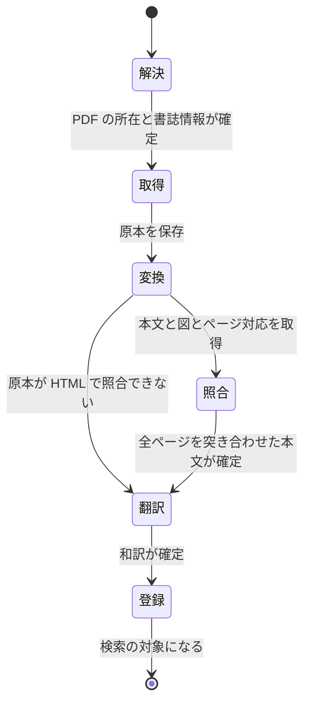

# 論文の取り込みと arXiv フィード

- created: 2026-07-27
- status: reviewing
- implementation: not-started

## 解決したい問題

論文の PDF が、数式・図表・本文の構造を保ったまま検索できる markdown になって手元に残る。
取り込むのはユーザーが選んだ論文だけであり、途中の処理が失敗しても最初からやり直しにならない。

そしてその論文の候補が、arXiv の特定カテゴリの新着として毎日流れてくる。
数日アプリケーションを止めていても、その間の投稿を取り逃さない。

## 問題の背景

PDF から markdown への変換は、**紙面の見た目の構造を、行と段落の並びへ落とす**処理である。
この落とし込みで壊れるものには共通の性質がある。
数式は記号の位置関係が意味を担うため、1 次元の文字列にすると添字や括弧の対応が失われる。
2 段組みは左右の段が交互に読まれ、本文が入れ替わる。
図表のキャプションは紙面上では図に属するのに、位置関係が失われて本文の段落に紛れ込む。
アルゴリズムの疑似コードは字下げが意味を持つのに、ただの行の並びになる。

いずれも「文字としては近いものが出てくるが、構造が違う」という形で壊れる。
そのため、変換結果だけを読んでいても壊れていることに気づきにくい。
コンピュータグラフィックスの論文は 2 段組みで、図と疑似コードが本文に入り組むものが多く、この種の崩れが起きやすい。

一方で、PDF の各ページを画像として見れば、紙面の構造はそのまま読み取れる。
Codex のスレッドはターンの入力に画像を渡せるため、変換結果とページ画像を突き合わせて食い違いを見つけられる。

ただし、変換器とページ画像の読み取りは得意な部分が違う。
一般に流通している論文の PDF は、紙面を走査した画像ではなく、文字が文字として埋め込まれたものである。
変換器はその文字を直接読むため、語や数値や著者名を**文字として正確に**取り出せる。
ページ画像からの読み取りは、字形を見て文字を当てる再構成なので、この点では変換器に劣る。
つまり、構造ではページ画像が、文字そのものでは変換結果が信頼できる。

論文の取り込みは、1 本あたり数分から十数分かかる処理の連なりである。
PDF の取得、GPU を使う変換、AI による照合、AI による翻訳、埋め込みの生成が順に走る。
このうち後半の 2 つは Codex の枠を消費するため、枠が尽きて中断されることがある(0003)。

arXiv には投稿を取得する API があり、カテゴリと投稿日時の範囲を指定して問い合わせられる。
公開されている RSS もあるが、そちらは当日の新規投稿しか含まない。

## この文書では書かないこと

- ファイルの置き場所と frontmatter の内容(0002)。
- ジョブキューの優先度・状態遷移・枠の待機(0003)。
- チャンクの切り方と埋め込みの索引(0005)。
- フィードと論文リストの画面構成。

## やらないこと

- **フィードにキーワードフィルタや除外条件を持たせない。** 購読するカテゴリの投稿数が 1 日 10 件から 20 件の規模であり、目視で流し読みできる。フィルタは、購読カテゴリを増やして 1 日 100 件を超えるようになったときに再検討する。
- **論文を自動で取り込まない。** 取り込みは常にユーザーが押して始める。取り込みは GPU と Codex の枠を消費する重い処理であり、読むかどうか分からない論文に費やす理由がない。この方針は当面変えない。
- **参考文献のグラフを構築しない。** 論文の引用関係を辿って関連論文を自動収集する機能は持たない。関連論文への到達は、コレクション内のセマンティック検索(0005)で行う。引用グラフは外部のデータベースへの依存を増やすため、検索で足りないと分かってから検討する。
- **変換結果の品質を自動で採点しない。** 変換がどれだけ正しくできたかを数値で評価する仕組みは持たない。照合の段階で AI がページ画像と突き合わせて食い違いを直すが、その結果が正しいかどうかを機械的に確かめる手段は持たず、人が読んで気づく前提とする。採点には正解となる markdown が要るが、それは存在しない。

## 概要

取り込みは、成果物を段階的に積み上げていく状態機械として表す。
段階は「解決 → 取得 → 変換 → 照合 → 翻訳 → 登録」であり、各段階は前の段階の成果物ファイルを入力として、自分の成果物ファイルを作る。
段階が完了したかどうかは成果物の存在で判定できるため、途中で失敗しても完了済みの段階をやり直さずに再開できる。

**解決**は、渡された URL から PDF の所在と書誌情報を確定する。
既知のドメインは規則で解決し、それ以外は Codex の作業スレッドに web 検索を許して委ねる。

**照合**は、変換結果を PDF の全ページの画像と突き合わせて直す段階である。
数式に限らず、読み順・キャプションの帰属・表の構造・疑似コードの字下げ・記号の種別まで、変換で崩れうるものすべてを対象にする。
食い違いを見つけたとき、どちらを採るかには**向きを与える**。
文字そのものは変換結果を、紙面の構造はページ画像を優先させる。
両者は得意な部分が違うので、無条件にどちらかを正とすると、得意なほうが不得意なほうに置き換わる。

**翻訳**は本文を見出し単位に分けて訳す。
数式・図の参照・リンクをそのまま保つことを契約とする。

**登録**は索引への追加で、すべての段階が成功した後にだけ行う。
訳や数式が未完成の論文が検索に混ざらないようにするためである。

フィードは arXiv の API を定期的に叩く。
最後に取得した投稿時刻を記録し、次回はそこから現在までを日付範囲で取得するため、アプリケーションを止めていた期間の投稿も埋まる。

図の読み方: 四角が取り込みの段階、矢印は段階の遷移で、ラベルはその遷移が起きる条件である。
`変換` から出る 2 本は排他で、原本が PDF なら `照合` へ、HTML なら `照合` を飛ばして `翻訳` へ進む。

## シナリオ

フィードに並んだ論文の 1 本に目が留まり、取り込みボタンを押す。
ボタンは実行中の表示に変わり、二度押しできなくなる。

**解決**の段階で arXiv の URL だと判定され、規則で PDF の所在と書誌情報が確定する。
著者と年とタイトルから slug が `mildenhall2020-nerf` に決まり、論文のディレクトリが作られる。

**取得**で PDF が保存され、**変換**で本文の markdown と 12 枚の図の画像、そして本文の各部分がどのページ由来かの対応が得られる。

**照合**では、12 ページすべてについて、ページ画像とそのページの markdown が順に Codex へ送られる。
4 ページ目では、図 3 のキャプションが直前の段落の末尾に続けて取り込まれていたことが分かり、キャプションとして切り出される。
7 ページ目では、2 段組みの右段の 1 文が左段の途中に紛れており、読み順が直される。
9 ページ目では、積分記号の添字が 2 箇所欠けており、LaTeX が直される。
一方で、6 ページ目の参考文献の著者名は、画像から読むと一部の綴りが曖昧だったが、変換結果の文字をそのまま採る。

照合前の内容は別ファイルとして残り、ページごとの変更点とその理由も記録される。

**翻訳**で本文と abstract の和訳ができ、**登録**でチャンクに分割されて埋め込みが作られ、索引に載る。

論文リストにその論文が現れ、検索で引けるようになる。
ユーザーは `paper.raw.md` との差分を開き、修正された 3 箇所が妥当であることを確認する。

## 詳細設計

以下では、段階と再試行の契約、URL の解決、変換器との出力契約、照合の入出力契約、翻訳の分割、フィードの取得と未読を順に述べる。

### 段階と再試行の契約

取り込みの各段階は、次の性質を満たすものとして設計する。

- 入力は前の段階の成果物ファイルと、`state.sqlite` に持つ取り込みの記録である。
- 出力は `papers/<slug>/` の下のファイルである。
- 成果物ファイルが揃っていれば、その段階は完了しているとみなせる。
- 同じ段階を再実行しても、結果は同じ場所に上書きされるだけで副作用が残らない。

この性質により、失敗からの再開は「どの段階から始めるか」を成果物の存在から決められる。
中断の理由が枠の枯渇であれ、変換器の異常終了であれ、サーバーの再起動であれ、扱いは同じになる。

段階ごとに再試行の回数を数え、上限に達したらその論文の取り込みを失敗として止める。
失敗した論文は論文リストに失敗の状態で残る。
自動では消さない。
どの段階で何が起きたかをユーザーが確認してから、再試行するか削除するかを決められるようにするためである。

原本が HTML の場合、ページ画像を作れないため照合の段階を飛ばす。
HTML には元から構造化された数式が含まれており、変換で壊れる余地が PDF より小さい。

### URL の解決

解決の段階は、ユーザーまたはフィードから渡された 1 つの URL を入力に取り、次を確定して返す。

| 出力 | 意味 |
|---|---|
| 原本の URL と種別 | 取得すべき PDF または HTML の場所 |
| タイトル・著者・出版年・学会名 | frontmatter の初期値になる書誌情報 |
| abstract | 英語の abstract |
| arXiv の識別子 | arXiv 由来なら記録する |
| slug の語幹の候補 | slug のタイトル由来の部分(0002) |

解決は 2 段構えにする。
まず既知のドメインに対する規則を当てる。
arXiv のように URL の形から原本の場所が確定し、書誌情報を返す API を持つ出所では、規則だけで完結する。
これは決定的で速く、Codex の枠も使わない。
日常の取り込みの大半はこの経路を通る。

規則に当たらない URL は、Codex の作業スレッドに委ねる。
このスレッドには web 検索を許し、上表の形を JSON Schema として渡して構造化された応答を強制する。
プロジェクトページや論文の紹介ページのように、原本へのリンクがページ内にあるとは限らない場合でも、タイトルで検索して原本を見つけられる。

この 2 段構えを取るのは、規則の網羅と柔軟性のどちらか一方では足りないからである。
規則だけでは未知の出所で必ず失敗する。
すべてを AI に委ねると、arXiv の 1 本を足すだけでも枠を消費し、同じ URL でも結果が揺れる。

解決した結果は、既にコレクションにある論文と照合する。
arXiv の識別子か原本の URL が既存の論文と一致した場合、取り込みを進めず、その既存の論文を結果として返す。
同じ論文をフィードから 1 度、後で URL を貼って 1 度取り込むことは十分起こりうる。
照合しなければ、同じ論文が別の slug で 2 つ並び、どちらにタグを付けたか分からなくなる。

書誌情報だけが一致して識別子と URL が違う場合(プレプリントと会議版など)は、別の論文として扱う。
これらは本文が異なるため、まとめると議論の対象があいまいになる。

### 変換器との出力契約

変換器に求めるのは次の 3 つである。

- **本文の markdown。** 見出しの階層を保ち、数式は LaTeX として表現する。
- **図表の画像と、それぞれのキャプション。** 本文からは画像とキャプションを組にした形で参照し、キャプションの文を本文の地の文に混ぜない。
- **本文の各部分がどのページ由来かの対応。** 照合の段階で、ページ画像と markdown の断片を組にするために要る。

pct が変換器に依存するのはこの 3 つだけとし、変換器固有の出力形式には依存しない。
当面は Marker を使う。

この境界を契約として切るのは、変換器の選択が実際の論文で試すまで確定しないからである。
数式と図表の再現性は論文のレイアウトに強く依存し、どの実装が自分の読む論文に合うかは、benchmark の数値だけでは決められない。
契約を固定しておけば、品質に不満が出たときに変換器だけを差し替えられる。

キャプションを本文の地の文に混ぜないことを契約に含めるのは、混ざると検索の索引が汚れるためである。
図の説明文が本文の段落の途中に紛れ込むと、その段落を含むチャンクの意味がずれる。

### 照合の入出力契約

照合は PDF の**すべてのページ**を対象とする。
そのため取得した PDF は全ページを画像化する。

1 回の要求で送るのは、1 ページぶんのページ画像と、変換器がそのページから作った markdown の断片である。
AI に求めるのは、ページ画像を読んだうえで変換結果と突き合わせ、食い違う箇所を解決して、そのページの markdown を確定することである。
対象は数式に限らない。
段組みの読み順、図表のキャプションの帰属、表の行と列、疑似コードの字下げ、特殊な記号や書体の区別、そして丸ごと落ちている本文まで含む。

#### 食い違いを解決する向き

「どちらが正しいか」を無条件に判断させるのではなく、食い違いの種類ごとにどちらを優先するかを指示する。

| 食い違いの種類 | 採用する側 | 理由 |
|---|---|---|
| 語・数値・固有名詞・引用番号といった**文字そのもの** | 変換結果 | 論文の PDF には文字が文字として埋め込まれており、変換器はそれを直接読む。ページ画像からの読み取りは字形からの再構成なので、ここで置き換えると誤りを持ち込む側になる |
| 読み順、段組みの結合、キャプションの帰属、表の行と列、数式の LaTeX、疑似コードの字下げ、記号の種別といった**紙面の構造** | ページ画像 | 変換で壊れるのはこの側であり、紙面を見れば正しい形が分かる |
| 変換結果に**対応する内容が無い** | ページ画像 | 欠落は変換器の失敗なので、画像から補う |

この向きを与えることが、この段階の設計の要である。
向きを与えずに「どちらが正しいか」だけを問うと、AI は自分がページ画像から読み取った文字列を正しいものとして扱いやすい。
そうすると、変換器が正確に取れていた著者名や数値や引用番号が、字形の読み違いによって置き換わる。
変換器が壊すのは構造であって文字ではないので、文字まで置き換える権限を与える理由がない。

文字が埋め込まれていない PDF(紙面を走査したもの)では、変換結果自体が画像からの読み取りになる。
この場合、上の表の 1 行目に賭ける根拠が無くなるため、判断はページ画像を優先する側へ自然に倒れる。

図の画像そのものは触らせない。
本文中の画像への参照はそのまま残し、図の中身を文字に起こさせない。

#### 出力

出力は、そのページの確定した markdown と、変更点の一覧である。

| 項目 | 意味 |
|---|---|
| 確定した markdown | そのページぶんの本文 |
| 変更点の一覧 | 何をどう変えたか、上の表のどの種類に当たると判断したか、その理由 |

**ページ全体の markdown を返させる。**
直す対象が構造を含むからである。
キャプションを本文から切り離す、2 段組みの読み順を入れ替える、落ちていた段落を補うといった修正は、置換の一覧としては表現できない。

その代償として、変換器が正しく出していた本文が AI の再生成で置き換わる余地が生まれる。
これは受け入れる。
崩れた構造を直せる利益のほうが、正しかった箇所を書き換えられる損失より大きいと判断する。
議論の対象となる論文の内容が構造ごと壊れていることのほうが、細部が 1 箇所書き換わることより重い。

そのうえで、気づくための手段を 2 つ持つ。
照合前の markdown を残し(0002)、差分で何が変わったかを見られるようにする。
そして変更点の一覧を理由つきで記録し、変更の多いページが分かるようにする(0002)。
読んでいて違和感を覚えたときに、原本の PDF と突き合わせて人が判断できる状態を保つことが、この段階の安全網である。

### 翻訳の分割

翻訳は本文を見出し単位に分けて要求する。
1 本の論文を 1 回の要求で訳すと、長い論文で出力が上限に達し、途中で切れたときにどこから続ければよいか決められない。
見出し単位なら、失敗した部分だけを再要求できる。

分割した要求は、1 本の論文につき 1 つの作業スレッドの中で順に行う(0003)。
同じスレッドに前の見出しの訳が残るため、専門用語の訳が論文の中で揃う。
各要求には論文のタイトルと abstract も添える。
論文が何についてのものかを示さないと、最初の見出しの時点で訳語が定まらない。

翻訳に課す契約は次のとおりである。

- 数式は変更しない。
- 図の参照、リンク、脚注の参照は変更しない。
- 見出しの階層を保つ。

これらは訳す対象ではなく、原文と訳文で同一であるべきものである。
翻訳の過程で LaTeX が壊れると、照合の段階で直した意味が失われる。

### フィードの取得と未読

フィードは arXiv の API を、設定されたカテゴリごとに定期的に叩く。
`state.sqlite` に、そのカテゴリについて最後に取得した投稿時刻を保持する。
次の取得では、その時刻から現在までを投稿日時の範囲として問い合わせる。

この形にすると、アプリケーションを何日止めていても、次に動いたときにその期間の投稿がまとめて入る。
初回や記録が失われた場合は、既定の遡り期間から始める。

取得した項目は arXiv の識別子で一意とし、既に持っている識別子は無視する。
論文の版が上がっても新しい項目としては扱わない。
同じ論文が版ごとにフィードへ何度も現れるのは、読み手にとって新着ではないからである。

項目は取得された時点で未読として作られ、フィード画面に表示された時点で既読になる。
フィードのアイコンに出す通知の数は、この未読の数である。

abstract の和訳は、取得の時点で背景のジョブとして積む。
背景のジョブはユーザーが待っている仕事に順番を譲るため(0003)、議論の妨げにならない。
表示されたときに訳し始める形も取れるが、1 日 10 件から 20 件の規模では取得時にまとめて訳しても消費は会話 1 ターンぶんに収まり、スクロール時の待ちが無くなるぶん取得時に訳すほうがよい。

## 落とし穴

- **照合は正しかった箇所を壊しうる。** ページ全体の markdown を返させる以上、変換器が正確に出していた本文が AI の再生成で置き換わることがある。食い違いの解決に向きを与えることでこれを減らすが、無くせはしない。照合前のファイルとの差分と変更点の記録で気づけるようにするだけで、自動での検出はできない。
- **照合の結果が正しいことを確かめる手段がない。** 変更点の一覧に書かれた理由は AI 自身の説明であり、その判断が妥当だったかを機械的に検証できない。理由が筋の通ったものに見えても誤っていることはありうる。
- **照合の費用は論文のページ数に比例する。** すべてのページに画像を送るため、長い論文ほど枠を消費する。付録の長い論文では本編の 2 倍以上のページを照合することになる。
- **照合はページ対応を出せる変換器を前提にしている。** 本文のどの部分がどのページ由来かを変換器が返せない場合、ページ画像と markdown の断片を組にできない。その場合の照合は、論文全体の markdown と全ページの画像を一度に渡す形にせざるを得ず、入力が大きくなり精度も落ちる。変換器を差し替えるときはこの契約を満たせるかを最初に確かめる必要がある。
- **arXiv の API には呼び出し間隔の制約がある。** 遡る期間が長いと複数回に分けた取得が必要になり、その間は間隔を空けることになる。長期間止めた後の初回取得は時間がかかる。
- **購読カテゴリを増やすと取得時の一括和訳の前提が崩れる。** 1 日 100 件を超えるカテゴリを足すと、読まれない abstract の和訳に枠を払うことになる。その時点で、表示された項目だけを訳す形へ変える必要がある。
- **失敗した論文はディレクトリを残したまま論文リストに並ぶ。** 中途半端な成果物が `$PCT_DATA` に残るため、ユーザーが削除するまで容量を占める。
- **解決を AI に委ねた場合、書誌情報が誤ることがある。** 学会名や出版年を取り違えたまま slug が決まると、slug は不変なので直せない(0002)。

## 代替案

- **取り込みを段階に分けず、単一の不可分な処理にする。**

  取得から索引への登録までを 1 つの処理として扱い、途中で失敗したら成果物を捨てて最初からやり直す設計である。
  状態が「実行中か、成功か、失敗か」の 3 つだけになり、再開の判定も要らない。
  一方で、照合だけが枠の枯渇で止まった場合にも、PDF の再取得と GPU を使う再変換からやり直すことになる。
  取り込みは 1 本あたり数分から十数分かかるため、この作り直しの費用は大きい。

- **照合を数式の修正だけに絞る。**

  数式を含むページにだけ画像を送り、返させるのは修正すべき数式の一覧に限る設計である。
  pct が本文へ適用する範囲が数式だけに閉じるため、変換器が出した本文が AI の再生成で置き換わることが原理的に起こらない。
  数式のないページに画像のトークンを払わずに済むため、費用も論文 1 本あたり半分以下になる。
  一方で、変換で壊れるものは数式だけではない。
  2 段組みの読み順の入れ替わり、本文に紛れ込んだ図表のキャプション、字下げの失われた疑似コードは、この設計では直らない。
  コンピュータグラフィックスの論文はこれらが起きやすい形をしており、直せないまま索引と議論の対象になる。
  取り込んだ内容の正しさを費用より優先する判断として、この案は採らない。

- **食い違いの解決に向きを与えず、AI にどちらが正しいかを判断させる。**

  ページ画像と変換結果を渡し、種類による優先を指示せずに、文脈から正しいほうを選ばせる設計である。
  指示が単純になり、こちらが立てた分類に当てはまらない食い違いにも対応できる。
  一方で、AI はページ画像から自分で読み取った文字列を正しいものとして扱いやすい。
  その結果、変換器が文字として正確に取れていた著者名・数値・引用番号が、字形の読み違いで置き換わる。
  変換器が壊すのは構造であって文字ではないので、文字まで置き換える余地を残す理由がない。

- **翻訳を 1 回の要求で丸ごと行う。**

  論文全体を 1 つの入力として渡し、訳文全体を受け取る設計である。
  分割による文脈の切れ目が無いため、用語の訳が一貫しやすい。
  一方で、長い論文では出力が上限に達する。
  途中で切れた場合、どこまでが正しく訳されたかの判定と続きの要求を組み立てる処理が必要になり、分割して訳すより複雑になる。

- **フィードを RSS で取得する。**

  arXiv が公開している RSS を読む設計である。
  実装が単純で、arXiv 側への負荷も小さい。
  一方で RSS に含まれるのは当日の新規投稿だけである。
  数日アプリケーションを止めると、その期間の投稿は取得できない。
  「取り逃さない」という要求を満たせない。

- **複数の変換器を常に走らせ、良いほうを採用する。**

  同じ PDF に対して複数の実装を走らせ、結果を比較して選ぶ設計である。
  どれか 1 つが苦手とするレイアウトでも、他方が拾える可能性がある。
  一方で GPU の時間が実装の数だけかかる。
  さらに「どちらの結果が良いか」を機械的に判定する手段がなく、判定を AI に委ねれば枠を追加で消費する。

## セキュリティ・プライバシー

取り込みは外部の URL を取得する処理を含むため、ユーザーが指定した任意の URL へアクセスする。
取得するのはファイルの内容であり、実行はしない。

URL の解決を AI に委ねる経路では、web 検索の結果として得られた内容が Codex のスレッドに入る。
このスレッドは読み取り専用のサンドボックスで動き、応答は JSON Schema で形が固定されているため(0003)、外部のページの内容が pct の動作を変える経路にはならない。
ただし、返される書誌情報そのものは外部のページに由来するため、内容の正しさは保証されない。
これは書誌情報をユーザーが訂正できることで受ける(0002)。

## 負荷・コスト

取り込み 1 本あたりの資源の使い方は次のとおりである。

| 段階 | 主に使う資源 | 規模 |
|---|---|---|
| 解決 | ネットワーク、または Codex | 既知ドメインなら数百ミリ秒。AI に委ねると数十秒 |
| 取得 | ネットワーク | 数 MB から数十 MB のダウンロード |
| 変換 | GPU | 1 本あたり数分。VRAM を数 GB 占有 |
| 照合 | Codex | 全ページ数 ×(画像 1000〜2000 トークン + そのページの markdown)の入力と、ページごとの markdown の出力 |
| 翻訳 | Codex | 入力 1 万トークン規模、出力 1.5 万トークン規模 |
| 登録 | GPU | チャンク数に比例した埋め込みの生成 |

照合が Codex の枠を最も使う段階である。
12 ページの論文なら、入力はページ画像で 1.2 万から 2.4 万トークン、それに各ページの markdown が加わって合計 3 万トークン規模になる。
出力はページごとの markdown なので、本文の分量とほぼ同じ 1 万トークン規模である。
入力より出力の単価が数倍高いことを考えると、照合 1 回の重みは翻訳 1 本とおおむね同じ桁に収まる。
つまり取り込み 1 本は、会話の 2 ターンから 3 ターンぶんを消費する。

この規模は、1 日に数本を取り込む使い方なら 5 時間枠の中に収まる。
一方で 10 本をまとめて取り込むと枠に届く。
枠に届いたときはキューが待機に入るため取り込みが失われることはないが(0003)、その間は議論もできない。
残枠の表示は、この判断のためにある。

GPU を使う段階が 2 つあり、どちらも同時実行数 1 の制約を受ける(0003)。
そのため複数本を同時に取り込んでも、変換と埋め込みの生成は順番に流れる。
取り込みの所要時間は、本数に対しておおむね線形に伸びる。

`$PCT_DATA` の容量は、原本の PDF とページ画像が支配する。
ページ画像は全ページぶんを、照合をやり直せるように残すため、1 本あたり数 MB から数十 MB になる。

フィードの取得は、カテゴリごとに数時間に 1 回の HTTP 要求である。
取得した項目は `state.sqlite` に行として溜まるが、1 日 10 件から 20 件の規模では容量の問題にならない。
