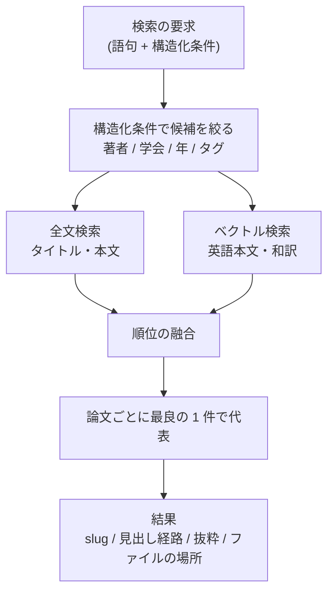

# 検索とエージェントへのコレクションの公開

- created: 2026-07-27
- status: reviewing
- implementation: not-started

## 解決したい問題

言葉が一致していなくても、意味の近い論文に辿り着ける。
そしてその同じ検索を、ユーザーだけでなく議論中の AI エージェント自身が使える。

後者がこのアプリケーションの中心にある。
これまで論文について AI と議論するには、関連しそうな論文をユーザーが自分で探し、すべて手元に集めて与える必要があった。
エージェントがコレクションを自分で検索できれば、この作業がなくなる。

## 問題の背景

論文の本文は英語で、和訳も持っている(0002)。
一方でユーザーが検索するときの言葉は日本語であることが多い。
語をそのまま突き合わせる検索では、この段差を越えられない。

論文リストの検索に求められているのは、単一の検索方法ではなく組み合わせである。
タイトルの部分一致、著者、学会名、出版年、ユーザーが付けたタグ、そして本文の意味による検索を、掛け合わせて絞り込む。
このうち前 5 つは値の一致や範囲で表せる条件であり、最後の 1 つだけが性質が違う。

エージェント側の事情もある。
Codex の会話スレッドは作業ディレクトリを `$PCT_DATA` に置いて読み取り専用で動くため、論文の markdown をファイルとして読むことはできる(0003)。
しかし埋め込みによる検索は pct のサーバーの中にしかないため、エージェントに使わせるには何らかの口が要る。
Codex は MCP のサーバーを接続でき、コマンドで起動する形式に加えて HTTP の URL を指定する形式にも対応している。

## この文書では書かないこと

- 索引をどのファイルに置くか、何を持つか(0002)。
- いつ索引に登録されるか(0004)。
- チャットで `@slug` をどう補完・展開するか、チャットを対象とした検索(0006)。
- 検索欄と検索結果の画面構成。

## やらないこと

- **検索結果の再ランキングを行わない。** 取得した候補を専用のモデルで並べ替える段階は持たない。モデルを 1 つ増やすぶん GPU を占有し、応答も遅くなる。融合した順位で不足だと分かってから検討する。
- **引用関係に基づく検索を持たない。** ある論文を引用している論文、されている論文を辿る機能は持たない。引用の情報は論文の本文だけからは正確に取れず、外部データベースへの依存が要る。関連論文への到達は意味による検索で行う。外部データベースへの依存を受け入れる判断をしない限り、恒久的に持たない。
- **MCP から書き込みを公開しない。** タグ付けや取り込みをエージェントから実行できるようにする設計であり、「詳細設計」と「代替案」で詳しく述べる。コレクションをユーザーの管理下に置く方針を変えない限り恒久的に採らない。
- **エージェントに論文の本文を MCP 経由で返さない。** 検索の結果として本文そのものを返す設計であり、「詳細設計」と「代替案」で詳しく述べる。エージェントがファイルを直接読める限り恒久的に採らない。

## 用語集

- **チャンク** — 本文を検索の単位に切り分けたひとかたまり。埋め込みはチャンクごとに作る。
- **見出し経路** — チャンクが本文のどの見出しの下にあるかを、上位の見出しから順に並べたもの。

## 概要

検索は 3 つの経路の組み合わせで行う。
著者・学会名・出版年・タグによる**構造化条件**、タイトルと本文に対する**全文検索**、そして本文の意味による**ベクトル検索**である。

構造化条件が候補の集合を決め、全文検索とベクトル検索がその候補の中で順位を出す。
2 つの順位は、順位そのものを使って融合する。
スコアの絶対値は経路ごとに尺度が違って比較できないため、順位に落としてから混ぜる。

ベクトルは英語の本文と和訳の両方について作る。
同じ論文が両方から当たることがあるので、論文ごとに最も良い 1 件で代表させる。
チャンクは見出しを単位に切り、長すぎるものは分割して隣と少し重ねる。
チャンクは自分の見出し経路を持ち、検索結果は「どの節の記述が当たったか」を示せる。

エージェントへの公開は、pct のサーバー自身が持つ MCP の口で行う。
会話スレッドだけがこれを接続する。
公開するのは検索とタグの一覧という読み取りの操作だけで、本文は返さない。
本文はエージェントが自分のファイル読み取りで読む。

図の読み方: 四角が処理または値、矢印は「処理の流れ」を表す。
`構造化条件で候補を絞る` から 2 本出ているのは、同じ候補集合に対して 2 つの検索を並行して行うことを示す。

## シナリオ

ユーザーがチャットでエージェントに問う。

> この手法はカメラの内部パラメータが既知である前提を置いているけれど、その前提を外した先行研究はコレクションにある?

エージェントは MCP の検索を呼ぶ。
語句は「カメラの内部パラメータを推定しながら復元する」といった内容で、構造化条件は付けない。

pct は日本語のその語句をそのまま埋め込みにして、英語の本文と和訳の両方のベクトルを引く。
英語の本文には `self-calibration` や `unknown intrinsics` という語が出てくるが、語としては一致しない。
それでも多言語の埋め込みモデルは日本語の問い合わせと英語の文書を同じ空間に置くため、これらのチャンクが上位に来る。

結果として 3 本の論文が、それぞれ当たった節の見出し経路と抜粋つきで返る。
エージェントはそのうち 2 本のファイルを自分で開いて該当箇所を読み、ユーザーに説明する。

ユーザーは自分で論文を探して与えていない。

## 詳細設計

以下では、検索の 3 経路と融合、チャンクの単位、埋め込みと索引の形、MCP の公開範囲を順に述べる。

### 検索の 3 経路と融合

**構造化条件**は、著者・学会名・出版年・タグによる絞り込みである。
これらは値の一致や範囲で表せるため、候補の集合を決める前段として働く。
条件が指定されなければ候補はコレクション全体になる。

**全文検索**は、タイトルと本文に対する語句の検索である。
日本語を扱うため、語の区切りに依存しない 3 文字単位の索引を使う。
日本語は空白で語が区切られないため、空白を区切りとする索引では和訳の本文もタイトルの日本語も検索できない。
3 文字単位の索引は語の切り出しを必要とせず、部分一致の要求にもそのまま応えられる。

**ベクトル検索**は、問い合わせの文を埋め込みにして、チャンクの埋め込みと近いものを探す。
語の一致を必要としないため、言い回しや言語が違っても意味が近ければ当たる。

融合は順位で行う。
全文検索が返すスコアとベクトル検索が返す距離は尺度が異なり、そのまま足し合わせても意味を持たない。
どちらも「上位から何番目か」に落とせば比較できる。
両方の経路で上位に来たものが最終的にも上位に来る性質があり、片方の経路にしか現れないものも順位に応じて拾われる。

### チャンクの単位

チャンクは本文の見出しを単位に切る。
見出しは著者が意味のまとまりとして付けた区切りなので、埋め込みが表す意味も自然にまとまる。

見出しの下が長すぎる場合は、上限の長さで分割し、隣り合うチャンク同士を少し重ねる。
重ねるのは、文の途中や論の展開の途中で切れたときに、どちらのチャンクからも文脈が失われるのを防ぐためである。

チャンクは自分の見出し経路を保持する。
これにより検索結果は「この論文のこの節が当たった」という形で返せる。
エージェントにとっては、その節だけをファイルから読めばよいと分かる情報になる。
ユーザーにとっては、なぜその論文が出てきたのかの説明になる。

### 埋め込みと索引の形

埋め込みは Ollama で動かす多言語のモデルで生成する。
日本語の問い合わせと英語の文書を同じ空間に置けることが要件であり、これを満たすモデルを使う。

英語の本文と和訳の両方を索引に入れる。
多言語のモデルは言語をまたいだ検索ができるが、同じ言語同士のほうが近さの判定は安定する。
日本語で問い合わせたときに和訳のチャンクが素直に当たる経路を持たせておくほうが、取りこぼしが減る。

同じ論文の英語版と和訳版の両方が上位に来ることがある。
また 1 本の論文の複数のチャンクが当たることもある。
検索結果は論文を単位とするため、論文ごとに最も順位の高い 1 件を代表として選び、その見出し経路と抜粋を示す。

索引には、埋め込みを生成したモデルの名前と次元を記録する。
モデルを変えると既存のベクトルとは比較できなくなるため、記録と一致しないときは索引を作り直す必要があると判定できる。
ベクトルは markdown から作り直せるため(0002)、作り直しは GPU 時間だけの問題になる。

ベクトルは索引の SQLite の中に置く。
構造化条件による絞り込みとベクトルの比較を、同じ問い合わせの中で結合できるためである。
候補を絞ってからベクトルを引く順序が、データベースの外側で候補の集合を持ち回ることなく表現できる。

### MCP の公開範囲

pct のサーバーは、自身の HTTP のサーバー上に MCP の口を持つ。
Codex の会話スレッドはこの URL を MCP のサーバーとして接続する。
作業スレッドは接続しない(0003)。

公開する操作は 2 つである。

| 操作 | 入力 | 出力 |
|---|---|---|
| 論文を検索する | 語句と構造化条件 | 論文ごとの slug、タイトル、見出し経路、抜粋、ファイルの場所 |
| タグの一覧を得る | なし | 使われているタグとそれぞれの論文数 |

**本文を返す操作は公開しない。**
本文はエージェントが自分のファイル読み取りで読む。
検索結果にファイルの場所を含めるのはこのためである。
本文を MCP で返すと、返した全文がそのまま会話の文脈に載る。
論文 1 本は数万トークンあるため、数本を返しただけで文脈が埋まる。
エージェントが自分でファイルを読むなら、必要な節だけを読み、足りなければ読み足すという判断ができる。
これはエージェントが元から持っている能力であり、pct が肩代わりする理由がない。

タグの一覧を公開するのは、エージェントがコレクションの分類を把握できるようにするためである。
どんなタグが使われているか分からなければ、タグによる絞り込みを提案できない。

**書き込みの操作は公開しない。**
議論の流れでエージェントがタグを付けたり論文を取り込んだりできると、ユーザーが指示していない変更がコレクションに入る。
コレクションはユーザーの研究の蓄積であり(0002)、何が起きたかをユーザーが把握できない変更が入る余地を作らない。
エージェントが提案することは自然言語でできるので、実行までを与える必要がない。

## 落とし穴

- **和訳の誤りが索引に伝わる。** 訳が間違っている箇所は、間違った意味のベクトルになる。日本語で検索したときに、その論文が出てくるべき場面で出てこないことがある。
- **順位の融合の重みは経験的に決めるしかない。** 全文検索とベクトル検索のどちらをどれだけ重く見るかに、理論的な正解はない。実際に使いながら調整する対象として残る。
- **エージェントが検索を使うかはモデルの判断による。** 道具を与えても、エージェントが使わずに自分の知識だけで答えることがある。`$PCT_DATA/AGENTS.md` で使い方を伝えるが(0002)、使用を強制はできない。
- **3 文字単位の全文検索は索引が大きくなる。** 語を単位とする索引に比べ、本文の長さに対する索引の膨らみが大きい。また 3 文字未満の語では機能しない。
- **チャンクの重なりのぶん、埋め込みの数と生成時間が増える。** 重なりを大きくするほど文脈の切断は減るが、ベクトルの本数に比例して索引の容量と生成の時間が増える。

## 代替案

- **全文検索だけにして、ベクトル検索を持たない。**

  語句の一致だけで検索する設計である。
  Ollama への依存が消え、埋め込みの生成に GPU を使う段階も要らなくなり、取り込みが速くなる。
  一方で、同じ概念を別の言葉で書いている論文に辿り着けない。
  「関連する論文を自分で探して与える手間をなくす」というこのアプリケーションの目的が達成されない。

- **ベクトルをすべてメモリに載せ、総当たりで比較する。**

  索引の起動時にすべての埋め込みを読み込み、問い合わせのたびに全件と比較する設計である。
  データベースのベクトル拡張への依存が消える。
  数千本の規模ならベクトルの本数は十数万で、総当たりでも応答は十分速い。
  一方で、構造化条件で絞った候補との突き合わせを自分で書くことになる。
  データベースの中に置けば、絞り込みとベクトルの比較を 1 つの問い合わせとして表現でき、候補の集合をプロセスの中で持ち回る必要がない。

- **英語の本文だけを索引し、多言語モデルの言語をまたいだ検索に任せる。**

  和訳を索引に入れず、日本語の問い合わせは多言語モデルの性質だけで英語の本文に当てる設計である。
  索引の容量とベクトルの生成時間が半分になり、和訳の質が検索に影響しなくなる。
  一方で、言語をまたいだ検索は同じ言語同士の検索より近さの判定が不安定になる。
  日本語で検索することが多い以上、和訳の索引を持つほうが取りこぼしが減る。

- **エージェントには MCP ではなくコマンドラインを叩かせる。**

  検索を行うコマンドを用意し、エージェントに shell から実行させる設計である。
  MCP の口を持つ必要がなく、人間も端末から同じコマンドで検索できる。
  一方で、道具としての定義がないため、エージェントは使い方を説明文から推測することになる。
  引数の形を間違えたときの回復もエージェントの試行錯誤に頼る。
  MCP なら入力の形が定義として渡るため、この不確かさが消える。

- **MCP で論文の本文も返す。**

  検索の結果として本文そのものを返す設計である。
  エージェントがファイルを読む往復が減り、応答が速くなる。
  一方で、返した本文はすべて会話の文脈に載る。
  論文 1 本が数万トークンあるため、複数本を返すと文脈が本文で埋まり、議論の余地が減る。

- **MCP に書き込みの操作も公開する。**

  タグ付けや取り込みをエージェントから実行できるようにする設計である。
  議論の流れでコレクションを整理でき、ユーザーの操作が減る。
  一方で、ユーザーが指示していない変更がコレクションに入る。
  変更はファイルとして残るため後から追えるが、いつ何が変わったかをユーザーが把握できないまま蓄積する。

## セキュリティ・プライバシー

MCP の口は pct の HTTP サーバー上にあり、サーバーと同じ範囲にしか公開されない(0001)。
公開する操作は読み取りだけなので、この口を通じてコレクションが変更されることはない。

エージェントに渡すのは検索の結果とファイルの場所であり、エージェントはサンドボックスの読み取り権限の範囲でファイルを読む(0003)。
サンドボックスの範囲は `$PCT_DATA` に限られるため、この口がコレクションの外への到達手段になることはない。

## 負荷・コスト

ベクトルの本数は「論文数 × 1 本あたりのチャンク数 × 2 言語」に比例する。
論文 1 本の本文が数万文字で、チャンクの上限を数百トークンとすると、1 本あたり数十チャンクになる。
論文 3000 本なら十数万本のベクトルであり、1024 次元の単精度浮動小数点で数百 MB の規模に収まる。

埋め込みの生成は取り込みの最後の段階で行い、GPU を使う(0004)。
1 本あたり数十チャンク × 2 言語ぶんの生成であり、数十秒の規模である。
生成は取り込みのときだけで、検索のたびには発生しない。

検索 1 回で発生するのは、問い合わせの文 1 つぶんの埋め込みの生成と、絞り込み後の候補に対する比較である。
問い合わせの埋め込みは短いテキスト 1 つなので、Ollama への往復を含めて数十ミリ秒から数百ミリ秒である。
これは検索欄に文字を打つたびに走るには重いため、入力が落ち着いてから実行する。

全文検索の索引は、3 文字単位で作るぶん語を単位とする索引より大きくなる。
本文の全文と合わせて、論文 1 本あたり数百 KB の規模を見込む。
