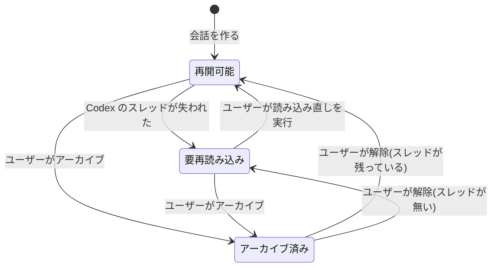

# チャットのライフサイクル

- created: 2026-07-27
- status: reviewing
- implementation: not-started

## 解決したい問題

論文についての議論を、始め、中断し、後から続け、必要なら別の筋へ分岐させ、終わったものを片付けられる。
そして議論の記録が、実行基盤の都合とは無関係に残り続ける。

ここには 1 つの段差がある。
議論の記録は markdown ファイルとして NAS に残るが、「続きを話す」ために必要な実行状態は Codex が自分の領域に持っており、これはバックアップされない。
記録が残っていても続きが話せない状態が起こりうる。
これを黙って取り繕わず、ユーザーに見える形で扱うのがこの doc の主題である。

## 問題の背景

pct のチャットは Codex のスレッドの上で動く(0003)。
Codex はスレッドの内容を自分のセッション保存領域にファイルとして持ち、そのファイルを再生することで会話を再開する。
この保存領域は Codex の認証情報と同じ場所にあるため、`$PCT_DATA` には置かない(0001)。
認証情報はトークンの更新で書き換わるものであり、クラウドへバックアップされるディレクトリに置かないためである。

その結果、議論の記録である markdown はバックアップされ、再開に必要な Codex 側の状態はバックアップされない、という非対称が生じる。
マシンを組み直したり、Codex の保存領域を掃除したりすると、記録は残っているのに再開できない会話が生まれる。

Codex 側には、この doc が使う操作が揃っている。
スレッドの再開、より前のユーザー発言からの分岐、名前の設定、そしてターンごとのモデルと reasoning effort の指定である。

## この文書では書かないこと

- チャットの markdown の書式と frontmatter の項目(0002)。
- スレッドの設定、枠の待機、承認要求の扱い(0003)。
- 検索の 3 経路と順位の融合の仕組み(0005)。
- チャット欄と一覧の画面構成。

## やらないこと

- **会話の削除機能を持たない。** アーカイブはあるが削除はない。議論は研究の記録であり、消す操作を用意する理由がない。不要になった会話はアーカイブで視界から外す。ファイルを消したければファイルシステム上で消せる。
- **Codex 側の状態を `$PCT_DATA` へ複製しない。** スレッドの状態ファイルだけをバックアップ対象へ複製する設計であり、「代替案」で詳しく述べる。Codex の内部形式への依存を受け入れる判断をしない限り、恒久的に採らない。
- **会話をまたいだ文脈の共有を行わない。** ある会話でエージェントが得た理解を別の会話へ引き継ぐ仕組みは持たない。会話は独立した単位とし、必要な文脈は都度渡す。会話をまたぐ知識の蓄積は、論文コレクションそのものが担う。

## 概要

pct のチャットは `chats/` の markdown ファイルを正とし、Codex のスレッドはそれに付随する実行状態として扱う。
記録はファイルにあり、Codex のスレッドは「続きを話すための手段」である。

会話には**再開可能**と**要再読み込み**の 2 つの状態がある。
対応する Codex のスレッドが残っていれば再開可能で、そのまま続きを話せる。
残っていなければ要再読み込みとなり、一覧とチャット欄にその旨を表示する。
ユーザーが読み込み直しを実行すると、markdown の全文を新しいスレッドの最初の入力として渡し、そのスレッドで続きを話す。
黙って新しいスレッドを作ることはしない。

分岐は、選んだ発言より前の状態から新しい会話を作る操作である。
Codex 側の分岐を使い、新しい会話ファイルには分岐点までの発言を書き写す。
各ファイルが単体で読めることを保つためである。

アーカイブは pct 側の状態として frontmatter に持つ。
アーカイブされた会話は発言を送れず、解除するまで読み取り専用になる。

タイトルと要約は AI が生成し、会話が落ち着いたところで背景の仕事として更新する。
ユーザーがタイトルを書き換えたら、以後 AI は上書きしない。

図の読み方: 四角が会話の状態、矢印は状態の遷移で、ラベルはその遷移を起こす出来事である。
発言を送れるのは `再開可能` の状態だけである。

## シナリオ

半年前に読んだ論文について議論した会話を、チャット一覧から開く。
チャット欄に過去のやりとりが表示されるが、上部に「この会話の実行状態は残っていません。続けるには内容を読み込み直してください」という表示と、読み込み直しのボタンが出ている。

その間、マシンは一度組み直されており、Codex の保存領域は空になっていた。
記録そのものは NAS からバックアップされていたので失われていない。

ボタンを押すと、この会話の markdown の全文と、frontmatter に記録されていた参照論文の slug が、新しいスレッドの最初の入力として渡される。
エージェントは過去の議論を読み、続きを話せる状態になる。
表示が消え、発言を送れるようになる。

会話ファイルは同じものが使われ続ける。
新しいファイルは作られず、本文にも読み込み直しの痕跡は残らない。

## 詳細設計

以下では、markdown と Codex スレッドの関係、再開の判定と読み込み直し、分岐、アーカイブ、タイトルと要約の生成、`@slug` の扱い、チャットの検索を順に述べる。

### markdown と Codex スレッドの関係

会話の正は `chats/` の markdown ファイルである(0002)。
ユーザーの発言とエージェントの応答は、ターンが完了するたびにこのファイルへ追記する。

Codex のスレッドは、この会話の続きを話すための実行状態として付随する。
対応関係は frontmatter の `codex_thread_id` が持つ。

この関係を一方向にするのは、寿命が違うからである。
markdown は NAS 上にあってバックアップされ、ユーザーが意図的に消さない限り残る。
Codex のスレッドはローカルの保存領域にあり、マシンの入れ替えや保存領域の掃除で失われる。
短命なほうを正にすると、記録がその都合に引きずられる。

### 再開の判定と読み込み直し

会話を開くとき、pct は `codex_thread_id` に対応するスレッドが Codex 側に存在するかを確認する。
存在すればそのまま続きを話せる。

存在しなければ、その会話を要再読み込みとして扱う。
チャット一覧とチャット欄の両方にその状態を表示し、読み込み直しのボタンを出す。

**読み込み直しはユーザーが実行したときにだけ起きる。**
自動で新しいスレッドを用意してしまうと、ユーザーは過去のやりとりを踏まえた応答が返ると期待するのに、エージェントは何も知らない状態で答えることになる。
会話がどちらの状態にあるかをユーザーが知っていることが、返ってきた応答をどう受け取るかの前提になる。

読み込み直しを実行すると、次を新しいスレッドの最初の入力として渡す。

- この会話の markdown の全文。
- frontmatter の `papers` に記録された論文の slug の一覧。

そして新しいスレッドの識別子を `codex_thread_id` に書き戻す。

会話ファイルは同じものを使い続け、本文には読み込み直しの痕跡を残さない。
markdown から見れば議論は連続しているからである。
読み込み直しで失われるのは、元のスレッドでエージェントが読んだファイルの内容や検索の結果といった中間状態だけであり、これらは元から markdown に記録していない(0002)。

`papers` の slug を一緒に渡すのは、エージェントが必要に応じてそれらの論文を読み直せるようにするためである。
本文そのものは渡さない。
論文の全文を最初の入力に含めると文脈が埋まるため、場所だけを示してエージェントに判断させる(0005 と同じ方針)。

### 分岐

分岐は、会話の途中から別の筋を試す操作である。
ユーザーが選んだ発言を指定すると、その発言より前の状態から新しい会話を作る。

Codex 側の分岐を使って新しいスレッドを作り、新しい会話ファイルを作る。
新しいファイルには、分岐点までの発言を書き写す。
frontmatter の `forked_from` に分岐元の会話の識別子を記録する。

発言を書き写すのは、各会話ファイルが単体で読めることを保つためである。
分岐元へのリンクだけを置く形にすると、分岐した会話を読むために別のファイルを開くことになり、しかも分岐元が後から編集されると意味が変わる。
`forked_from` は、由来を辿りたいときの手がかりとして持つのであって、本文の理解に必要なものにはしない。

### アーカイブ

アーカイブは pct 側の状態として frontmatter に持つ。
Codex 側にも同名の操作があるが、それは使わない。

理由は 2 つある。
第一に、アーカイブはユーザーが「この議論はもう活発ではない」と整理するための概念であり、Codex 側の一覧の状態とは目的が違う。
第二に、Codex の保存領域は失われうるため(前述)、そこに置いた状態はバックアップされない。
frontmatter にあれば、記録と一緒に残る。

アーカイブされた会話は読み取り専用になり、発言を送れない。
チャット欄にはアーカイブ中である旨と解除のボタンを出す。
解除してから続きを話す、という手順を踏ませる。

一覧では、アーカイブされていない会話を先に、アーカイブ済みを後に並べ、それぞれの中では時系列とする。
アーカイブ済みは薄く表示して区別する。

### タイトルと要約の生成

タイトルと要約は AI が生成し、frontmatter に持つ(0002)。
生成は背景の仕事としてジョブキューに積む(0003)。

ターンが完了するたびに生成すると、会話が進むほど生成の回数が増える。
そのため、ターンの完了後に一定時間だけ次の発言を待ち、会話が落ち着いてから 1 回だけ生成する。

要約の生成では、既存の要約と直近のやりとりを入力として、要約を更新させる。
会話の全文を毎回入力にすると、会話が伸びるほど入力量が増え続ける。
既存の要約を起点にすれば、入力量は会話の長さによらず一定に保てる。

タイトルは `title_source` がユーザーであるときは更新しない(0002)。
ユーザーが付けた名前を AI が上書きすると、整理のために付けた名前が消える。

### `@slug` の扱い

チャット欄で `@` を打つと、コレクション内の slug を候補として補完する。
slug は人間が読める形をしているため(0002)、著者名や略称の断片から絞り込める。

送信するとき、`@slug` はエージェントへの入力の中でだけ、論文のファイルの場所を伴う形に展開する。
markdown に保存するのは元の `@slug` の表記のままである。
記録に残すのは人が読む形であり、ファイルの場所はディレクトリの規則から導ける(0002)。
規則が将来変わったときに、過去の記録に埋め込まれたパスが古くなることも避けられる。

言及された slug は frontmatter の `papers` に追加する。
エージェントが検索を通じて自分で見つけた論文についても、応答の中で言及された slug を同様に追加する。
この一覧が、読み込み直しのときにエージェントへ渡す論文の集合になる。

参照先の論文が後で削除された場合、その `@slug` は解決できなくなる(0002)。
このとき pct は、チャットの markdown を書き換えない。
表示では、コレクションに存在しない slug への参照であることが分かる形にする。
エージェントへ渡すときは、ファイルの場所へ展開せず slug をそのまま渡す。
展開できないことをエージェント側で判断させるより、参照が解決しないという事実をそのまま伝えるほうが、エージェントが存在しないファイルを探し続けずに済む。

読み込み直しのときに `papers` へ渡す一覧からも、削除済みの slug は除く。
存在しない論文を読むよう促す意味がないからである。

### チャットの検索

チャット一覧の検索は、論文の検索と同じ 3 経路の仕組みを使う(0005)。
構造化条件はアーカイブ状態と日付の範囲、全文検索とベクトル検索の対象は発言の本文である。

チャンクの単位は発言 1 つとする。
発言は話題のまとまりとして自然な区切りであり、論文の見出しに相当する。

検索の結果は会話を単位として返し、どの発言が当たったかを抜粋として示す。

## 落とし穴

- **要約の増分更新は少しずつずれる。** 既存の要約を起点に更新を重ねると、初期の話題の比重が実際より大きいまま残ったり、細部が落ちたまま復元されなかったりする。会話が長く続くほどこのずれは蓄積する。
- **読み込み直しの入力量は会話の長さに比例する。** 長い会話を読み込み直すと、最初の 1 ターンで会話の全文ぶんの入力を払う。数十往復の会話では数万トークンの規模になる。
- **分岐で発言を書き写すため、分岐点までの内容が複数のファイルに重複する。** 分岐を繰り返すと同じ内容が何度も保存される。容量としては小さいが、検索では同じ内容が複数の会話から当たる。
- **アーカイブ済みの会話も Codex のスレッドを保持し続ける。** アーカイブは Codex 側に何も伝えないため、保存領域は減らない。
- **`@slug` の補完はコレクションにある論文しか出せない。** まだ取り込んでいない論文には言及できず、先に取り込む必要がある。

## 代替案

- **Codex のスレッドを常に新規に作り、markdown を毎回読み込ませる。**

  スレッドの再開を使わず、会話を開くたびに新しいスレッドへ markdown の全文を渡す設計である。
  再開できるかどうかの判定が不要になり、状態が 1 つ減る。
  マシンを移してもふるまいが変わらない。
  一方で、会話を開くたびに会話の全文ぶんの入力を払う。
  数十往復の会話を何度も開くと、その都度数万トークンを消費する。
  Codex 側に状態が残っているなら、それを使うほうが安い。

- **Codex の保存領域を `$PCT_DATA` の下に置く。**

  Codex の保存領域ごとバックアップ対象のディレクトリに移し、スレッドが失われないようにする設計である。
  再開できない状態そのものが無くなり、この doc の主要な複雑さが消える。
  一方で、Codex の認証情報も同じ領域にあるため、アクセストークンがクラウドストレージへバックアップされることになる。
  トークンの更新のたびに書き換わるものを NAS 越しに扱うことにもなる。
  再開できない場合をユーザーに見せて対処させるほうが、認証情報の置き場所を動かすより影響が小さい。

- **Codex の保存領域から、スレッドの内容だけを `$PCT_DATA` へ複製する。**

  認証情報は動かさず、スレッドの状態ファイルだけをバックアップ対象へ複製する設計である。
  認証情報を NAS に出さずに再開性を保てる。
  一方で、複製の同期を自分で持つことになり、Codex 側のファイル形式に依存する。
  この形式は Codex の内部のものであり、更新で変わりうる。
  依存すると Codex の更新のたびに追随が要る。

- **要約を毎回会話の全文から作り直す。**

  既存の要約を使わず、会話の全体を入力にして要約を生成し直す設計である。
  増分更新によるずれが起きない。
  一方で、会話が伸びるほど入力量が増える。
  要約は会話が更新されるたびに走るため、長い会話では 1 回の生成が会話 1 ターンぶんに匹敵する消費になる。

- **アーカイブに Codex の同名の操作を使う。**

  pct のアーカイブ操作を Codex 側のスレッドのアーカイブに対応させる設計である。
  状態を 1 箇所で持てる。
  一方で、Codex の保存領域は失われうるため、アーカイブの状態もそれと一緒に失われる。
  ユーザーが整理した結果が実行基盤の都合で消えることになる。

- **分岐した会話に分岐元へのリンクだけを置く。**

  分岐点までの発言を書き写さず、分岐元の会話の識別子だけを持つ設計である。
  内容の重複が無くなり、容量も検索結果の重複も避けられる。
  一方で、分岐した会話を読むには分岐元のファイルも開く必要がある。
  さらに分岐元が後から続いた場合、どこまでが分岐点だったのかをファイル単体では判断できない。

## セキュリティ・プライバシー

この設計が新たに扱う機微なデータはない。
会話の内容は 0002 の定めるとおり `$PCT_DATA` に保存され、Codex へ送られる内容の扱いは 0003 に従う。

読み込み直しでは会話の全文を Codex へ送るが、これは元の会話でも同じ内容が送られている。
新たな送信先や新たな種類のデータが増えるわけではない。

## 負荷・コスト

会話ごとに常時かかる負荷はない。
ターンが走っている間だけ、Codex からのイベントを受けて WebSocket へ push する(0001)。

タイトルと要約の生成は、会話が落ち着くたびに 1 回発生する。
入力は既存の要約と直近のやりとりで、数千トークンの規模に収まる。
出力は数百トークンである。
連続して発言している間は生成が走らないため、1 回の議論あたりの発生回数は往復の数より少ない。

読み込み直しは、会話の長さに比例した入力を 1 回だけ払う。
数十往復の会話で数万トークンの規模になるが、発生するのは Codex のスレッドが失われたときだけである。

チャットの検索のための埋め込みは、ターンが完了するたびにその発言のぶんだけ生成する。
1 発言は数百トークンなので、生成は数百ミリ秒の規模で済む。
