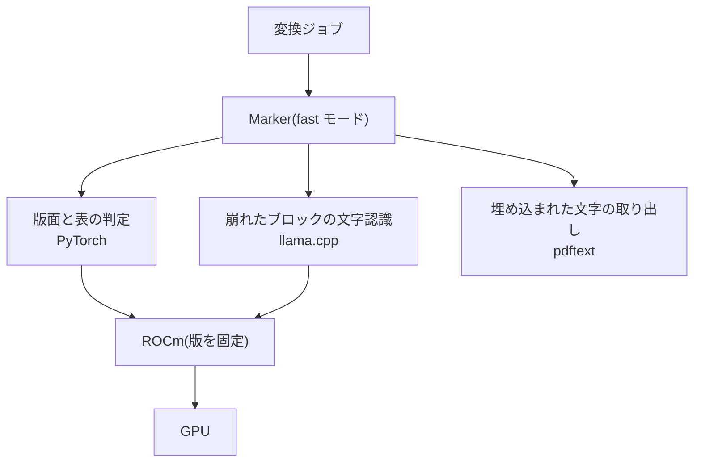

# 論文の変換に使う実装と実行環境

- created: 2026-07-28
- status: ready for review
- implementation: not-started

## 解決したい問題

論文の PDF が、本文・数式・図表・ページ対応を保った markdown になり、1 本あたり数分で終わる。
どの実装をどの環境で走らせるかが、実測に基づいて確定している。

## 問題の背景

0004 は取り込みの変換の段階について、変換器に求める出力を 3 つの契約として固定した。
本文の markdown、図表の画像とキャプション(キャプションを本文の地の文に混ぜない)、そして本文の各部分がどのページ由来かの対応である。
そのうえで、この契約を満たす実装として当面 Marker を使うこと、変換を GPU を使う段階として扱い GPU を使う仕事の同時実行を 1 に制限すること(0003)を決めた。

GPU を前提にしたのは、この種の変換器が紙面の版面解析・数式の認識・文字の認識にそれぞれ視覚モデルを使い、いずれも GPU 上で動かすものとして配布されているからである。
実装の選択を「当面」としたのは、数式と図表の再現性が論文のレイアウトに強く依存し、どの実装が手元の論文に合うかは公開されている benchmark の数値だけでは決められないためである。

この前提を実機で確かめた。
確かめたのは Ryzen 9 9900X(12 コア 24 スレッド)と RX 9060 XT 16GB(gfx1200)を積んだ 1 台で、GPU は ROCm で駆動する。
結果として、実装の選定に必要な事実が 4 つ得られた。

**Marker には CPU 向けに最適化された動作モードがある。**
`fast` は紙面の版面と表の判定に軽量な検出器を使い、文字は PDF に埋め込まれたものを使って、内容が崩れているブロックだけを文字認識にかける。
もう一方の `balanced` は版面の判定に視覚言語モデルを使い、全ページを文字認識にかける。
既定は装置によって決まり、GPU では `balanced`、CPU では `fast` になる。

**Marker の既定の推論バックエンドは、この機械では起動しない。**
文字認識を担う surya は、既定で vLLM の docker image を起動しようとする。
その image は NVIDIA の GPU を要求するもので、docker が GPU の種別を判定できずに失敗する。
surya には llama.cpp を使うバックエンドがあり、環境変数で選べる。

**ROCm の版によって、視覚モデルの出力が壊れることがある。**
比較のために MinerU を同じ論文で走らせたところ、公式配布の ROCm 7.2 向けビルドでは GPU 上の出力が崩壊した(本文が 165,719 文字から 61,682 文字へ減り、見出しがすべて空になり、数式が同じ記号の反復になった)。
同じ入力を CPU に切り替えると正しい本文が出るため、原因は実装の設定ではなく GPU 上の数値計算にある。
gfx1200 に的を絞ってビルドされた ROCm 7.13 の開発版に替えると、この崩壊は起きない。
つまり、変換の正しさは ROCm のどの版を使うかに依存する。

**PDF から文字を取り出す経路には、文字を失うものがある。**
PDF の文字を扱う方法には、ページ全体を 1 つの文字列として取り出す経路と、1 文字ずつ位置情報つきで取り出す経路がある。
変換器は文字を紙面上の位置と結びつける必要があるため後者を使うが、この経路は基本多言語面の外にある文字を扱えない。
数式用の斜体(`𝑀` は U+1D440 など)がこれに当たり、置換文字になるか無言で消える。
同じページを文字列として取り出す経路では正しく取れる。

## この文書では書かないこと

- 変換器に求める出力の契約(0004)。この文書が決めるのは、その契約をどの実装がどの環境で満たすかであって、契約そのものは変えない。
- 照合で文字の正をどこに置くか(0009)。上に挙げた文字の欠落への対処はそちらで決める。
- 照合・翻訳・登録の各段階と、PDF のページ画像化(0004)。
- ジョブキューの状態遷移・優先度・再試行の扱い(0003)。

## やらないこと

- **変換器を設定で切り替えられるようにしない。** 実装は 1 つに固定する。0004 が出力の契約を固定しているので、品質に不満が出たときは実装を差し替えればよく、両方を同時に持って選ばせる必要がない。選べるようにすると、どちらで変換した論文なのかが取り込みごとに変わり、出力の違いを追う手間がコレクション全体に広がる。
- **動作モードを設定で切り替えられるようにしない。** `balanced` を選べるようにはしない。実測では `balanced` は所要時間が 1.5 倍になったうえ、図表のブロックとキャプションの分類が失われ、0004 の契約を満たさなくなった。速度と品質のどちらの軸でも劣るため、選択肢として残す理由がない。
- **CPU で変換する経路を残さない。** GPU が使えないときに CPU へ落ちる仕組みは持たない。CPU 実行は同じ論文で 8 倍以上の時間がかかり、1 本の取り込みが 30 分規模になる。GPU が使えない状態は環境の設定が壊れていることを意味するので、黙って遅い経路へ落ちるより、変換の失敗として扱ってユーザーに見せるほうがよい。
- **ROCm を自動更新に任せない。** 版は固定し、更新は人が判断して行う。変換の正しさが特定の版の数値計算に依存することは上に述べたとおりで、自動更新に任せると、ある日から論文が静かに壊れて取り込まれる。
- **文字を失う取り出し経路の問題を、変換器側で直さない。** この欠落は変換器 2 つに共通して存在し、共有している下位の実装に由来する。上流の修正を待つことも、こちらで手を入れた版を持つこともしない。手を入れた版を抱えると、その版の保守が変換器の更新のたびに発生する。対処は照合の段階で行う(0009)。

## 概要

変換は Marker を `fast` モードで、GPU 上で走らせる。

推論バックエンドには llama.cpp を明示して選ぶ。
GPU を駆動する ROCm は、安定版を版で固定して使う。
変換の正しさが版に依存する以上、どの版で動かしているかが決まっていなければ、出力が正しいことを主張できない。

変換器の出力は、ブロックの一覧を持つ構造化された形で受け取る。
各ブロックは種別(本文・見出し・キャプション・図・表・数式など)と紙面上の位置とページ番号を持つ。
0004 が求める 3 つの契約は、この形からそのまま満たせる。
キャプションは本文とは別の種別として得られるため、本文の地の文に混ざらない。

変換は引き続き GPU を使うので、0003 が定めた資源クラスの割り当ては変えない。
変換と埋め込みの生成は、これまでどおり GPU の資源クラスで同時実行 1 として順に流れる。

図の読み方: 四角は処理または実行環境で、矢印はすべて「上のものが下のものを使う」ことを表す。
`pdftext` は GPU を使わないため、ROCm へ向かう矢印を持たない。

## シナリオ

ユーザーがフィードの論文の取り込みを押す。
解決と取得の段階を経て PDF が保存され、変換のジョブがキューに積まれる。
GPU の資源クラスは同時実行 1 なので、埋め込みの生成が走っていれば、それが終わるまで待つ。

変換が始まると、Marker がページごとに版面を判定し、本文・見出し・キャプション・図・表・数式のブロックに分ける。
本文の文字は PDF に埋め込まれたものをそのまま使う。
紙面を走査しただけのページや、埋め込まれた文字が崩れているブロックに限って、文字認識にかける。

14 ページで図の多い論文なら 3 分から 5 分、18 ページで図の少ない論文なら 20 秒ほどで終わる。

得られたブロックの一覧から、本文の markdown、図の画像とそのキャプション、各ブロックのページ番号が取り出される。
これが 0004 の照合の段階への入力になる。

その論文の付録には擬似コードが載っており、変換結果では字下げが失われ、変数名が置換文字になっている。
これらは照合の段階で、ページ画像と PDF の文字層から直される(0009)。

## 詳細設計

以下では、実装と動作モードの選定、実行環境の固定、出力の受け取り方を順に述べる。

### 実装と動作モードの選定

Marker を `fast` モードで使う。

選定は、コンピュータグラフィックスの論文 9 本での実測に基づく。
判断に使った軸は、文字が原文どおり取れるか、0004 の契約(本文・図表とキャプション・ページ対応)を満たすか、そして所要時間である。

**文字の正しさで Marker が MinerU を上回る。**
MinerU は ACM TOG の組版(LinBiolinum)を使う論文で、本文の文字を落とす。
`Fig. 1. ... with quality that equals the previous method with the best quality` が `Fi . 1. ... with ualit that e uals the revious method with the best ualit` になり、下部に伸びる字が脱落した。
あわせて、本来は添字でない字が添字として扱われ、1 本の論文に 7,104 個の偽の添字が入った。
これは行の高さに対する各部分の高さの比で添字を判定する処理に由来し、装置(CPU / GPU)にも動作モードにも依存しない。
Springer LNCS の組版を使う論文では起きないため、組版に依存する。
購読するカテゴリが cs.GR である以上、壊れる側の組版が主戦場になる。

Marker には同じ壊れ方がない。
ACM TOG の 3 本を含む 9 本すべてで、本文の語は原文どおり取れた。

**0004 の契約も Marker のほうがよく満たす。**
Marker はキャプションを本文とは別の種別として返し、図とキャプションを組にした単位も返す。
MinerU もキャプションを本文と分けて持つが、図とキャプションを組にする単位は持たない。

**`balanced` は速度でも品質でも `fast` に劣る。**
同じ論文で `fast` が 208 秒のところ `balanced` は 402 秒かかり、そのうえ 460 のブロックのうち 434 が種別のない本文になった。
キャプション・図・表の分類がすべて失われ、キャプションが本文の地の文に混ざる。
`balanced` が版面の判定に使う視覚言語モデルを、この機械の構成で動かした結果である。

**`fast` の設計は 0004 の前提と噛み合う。**
0004 は照合の設計を「変換器は埋め込まれた文字を正確に取り出し、変換で壊れるのは紙面の構造である」という前提のうえに組み立てた。
`fast` は埋め込まれた文字を使い、崩れているブロックだけを文字認識にかけるので、この前提に沿う。
`balanced` は全ページを文字認識にかけるため、変換結果もページ画像も同じ字形からの再構成になり、前提が成り立たない。

実測で見つかった Marker の欠点は、見出しの階層が崩れること、擬似コードの字下げが失われること、一部のページのフッターと表の見出しが取れないことである。
いずれも紙面の構造の側の崩れであり、0004 の照合がページ画像から直す対象に当たる。

### 実行環境の固定

**装置は GPU とする。**
Marker は CPU でも正しく動くが、同じ論文で 1,865 秒かかり、GPU の 208 秒に対して 9 倍である。
取り込みはユーザーが押して始めるものなので、1 本に 30 分かかる状態では読みたい論文を気軽に入れられない。

装置の選択が実装ごとに逆転する点は注意を要する。
MinerU では CPU が 174 秒、GPU が 271 秒で CPU のほうが速い。
GPU が常に速いわけではなく、実装が使う演算とその実装の成熟度で決まる。

**推論バックエンドは llama.cpp を明示して選ぶ。**
既定のままでは vLLM の docker image を取得しようとして失敗する。
その image は 23GB あり、この機械では起動できないまま容量だけを占める。

**ROCm は安定版を版で固定する。**
安定版と開発版を 5 本の論文で対にして測ったところ、所要時間の比は 0.98 から 1.06 に収まり、出力は本文も構造の分類も完全に一致した。
開発版を選ぶ利益が測定で確認できない以上、日々更新されるビルドに変換の正しさを預ける理由がない。

版を固定すること自体は、どちらを選んでも必要である。
MinerU が ROCm 7.2 で崩壊したことが示すとおり、視覚モデルの出力の正しさは版に依存する。
固定しなければ、環境の更新によって、それまで正しく取り込めていた論文が壊れる状態へ移りうる。
更新するときは、更新の前後で同じ論文を変換し、出力が一致することを確かめる。

なお、変換の所要時間は同じ入力・同じ設定でも実行ごとに変動する。
最も重い論文では 208 秒と 317 秒(52% 差)の開きが出た。
時間の測定値を版の比較に使うときは、1 回の測定で判断してはならない。

### 出力の受け取り方

変換器からは、ブロックの一覧を持つ構造化された形で受け取る。
各ブロックが持つのは、種別、紙面上の位置、ページ番号を含む識別子、そして内容である。
種別には本文・見出し・キャプション・図・表・数式・ページ番号・ヘッダー・フッターがある。

0004 の 3 つの契約は、この形から次のように満たす。

| 0004 の契約 | 受け取り方 |
|---|---|
| 本文の markdown | 本文・見出し・箇条書きの種別のブロックを、ページ番号の順に連ねる |
| 図表の画像とキャプション | 図の種別のブロックが画像を、キャプションの種別のブロックが説明文を持つ。両者を組にした単位も返る |
| 本文の各部分のページ由来 | すべてのブロックがページ番号を持つ |

pct が依存するのはこの形までとし、変換器が出力する markdown の書き方には依存しない。
0004 が契約を切った狙いは、品質に不満が出たときに変換器だけを差し替えられることであり、ブロックの一覧という形は他の実装でも一般的に得られる。

ページ番号を持つことは、照合の段階でページ画像とブロックを組にするために要る。
紙面上の位置を持つことは、そのブロックに対応する PDF の文字層を領域で引くために要る(0009)。
0004 はページ番号までを契約としていたが、紙面上の位置も同じ出力に含まれるため、これを使う。

## 落とし穴

- **擬似コードの字下げが失われる。** アルゴリズムの記述が 1 行ずつ独立した本文のブロックになり、入れ子の深さが表せない。擬似コードのための種別も持たないため、変換結果だけでは字下げを復元できない。照合でページ画像から直す(0009)。
- **数式用の文字が失われる。** 基本多言語面の外にある文字が、置換文字になるか無言で消える。検証した 9 本のうち 5 本で起きた。1 本では文字層にある 655 文字がすべて失われ、本文が `the directions ����,��,�� are sampled` のようになる。この欠陥は Marker と MinerU の両方に同じ形で存在し、共有している下位の実装に由来する。文字層を文字列として取り出す経路では正しく取れるため、照合で補う(0009)。
- **語の単位で測ると、この欠落を見落とす。** 失われるのは 1 文字の変数名なので、単語を単位にした照合では検出されない。実際、単語の照合では 9 本すべてで欠落率が 1.10% から 4.60% に収まり、その大半は行末のハイフンで分割された断片という測定上の作り物だった。品質を測るときは文字の単位でも見る必要がある。
- **所要時間が実行ごとに大きく変動する。** 同じ入力・同じ設定で 52% の開きが出た。ユーザーに残り時間を示すことはできない。
- **図の多い論文が遅い。** 所要時間を決めるのは、ページ数でも数式の密度でもなく、図の枚数と解像度である。図の多い論文で 15 から 23 秒/ページ、図の少ない論文で 0.8 から 1.3 秒/ページと、20 倍の開きがある。
- **ROCm の版を固定するため、更新は人の作業になる。** 版を上げるときは同じ論文で出力が変わらないことを確かめる必要があり、その手間が更新のたびに発生する。確かめずに上げると、崩壊に気づかないまま論文が取り込まれる。
- **検証した論文の分野が偏っている。** 9 本はいずれも放射輝度場・3D 再構成・レンダリングの分野である。同じコンピュータグラフィックスでも、幾何処理・シミュレーション・アニメーションの論文は含まれていない。図の多い論文が遅いという傾向は、これらの分野でも当てはまるとは限らない。

## 代替案

- **MinerU を使う。**

  もう一方の候補で、0004 の 3 つの契約を満たし、CPU で 174 秒と速い。
  一方で ACM TOG の組版で本文の文字を落とす。
  文字の欠落は照合でも直しにくい。
  0004 の照合は文字については変換結果を信頼する設計であり、その前提を満たさない実装を選ぶと、照合が破損を保護する側に回る。
  取り込んだ内容の正しさを速度より優先する判断として採らない。

- **Marker を `balanced` モードで使う。**

  版面の判定に視覚言語モデルを使い、全ページを文字認識にかけるモードである。
  紙面を走査しただけの PDF では、埋め込まれた文字が無いためこちらが要る。
  一方で実測では所要時間が 1.5 倍になり、キャプション・図・表の分類が失われた。
  埋め込まれた文字を持つ論文では選ぶ理由がない。
  走査された PDF を扱う必要が出たときに、その論文に限って使う形を再検討する。

- **変換を CPU で行う。**

  GPU を使わない構成で、環境の構築が単純になり、ROCm の版に依存しなくなる。
  実測でも出力は GPU と同等で、文字も構造も正しく取れる。
  一方で所要時間が 9 倍になり、1 本の取り込みが 30 分規模になる。
  ユーザーが押して始める処理としては長すぎる。

- **ROCm の開発版を使う。**

  gfx1200 に的を絞ってビルドされた版で、公式の安定版より新しい。
  演算の実装が進んでいれば速くなる可能性がある。
  実測では 5 本の論文で所要時間の比が 0.98 から 1.06 に収まり、出力も一致した。
  利益が確認できないため、日々更新されるビルドに依存する代償を払う理由がない。
  安定版で正しく動かなくなったとき、または明確な速度差が測定できたときに選び直す。

- **複数の変換器を走らせて良いほうを採る。**

  同じ PDF に複数の実装をかけ、結果を比べて選ぶ設計である。
  一方が苦手とする組版でも、他方が拾える可能性がある。
  実際、MinerU が壊す組版を Marker は壊さない。
  一方で GPU の時間が実装の数だけかかる。
  さらに、どちらの結果が良いかを機械的に判定する手段がない。
  判定を AI に委ねれば Codex の枠を追加で消費する。

## 法的考慮事項

Marker と、それが使う surya・pdftext はいずれも Apache License 2.0 で配布されている。
実行時に取得する模型は配布元の `datalab-to` の公開リポジトリから取る。
pct は個人が自分の論文を読むために使うもので、第三者へサービスを提供しない(0007)。

## 負荷・コスト

変換 1 本の負荷は、コンピュータグラフィックスの論文 9 本で測った次の値を目安とする。
いずれも Marker を `fast` モードで GPU 上で走らせたときの、変換そのものに要した時間である。

| 論文の性格 | ページ | 所要時間 | 秒/ページ |
|---|---|---|---|
| 図が多い(24MB、ACM TOG) | 14 | 208〜317 秒 | 15〜23 |
| 図が多い(46MB、ACM TOG) | 13 | 88 秒 | 6.8 |
| 標準的(17MB、ACM TOG) | 15 | 57 秒 | 3.8 |
| 数式が多い(7MB、数式 40 個) | 19 | 39 秒 | 2.1 |
| 数式が多い(10MB、数式 48 個) | 15 | 20 秒 | 1.3 |
| 図が少ない(11MB) | 18 | 20 秒 | 1.1 |

所要時間を決めるのは図の枚数と解像度である。
ページ数にも数式の密度にも比例しない。
数式が 40 個から 48 個ある論文がむしろ速い部類に入る。

これに加えて、プロセスの起動と模型の読み込みに毎回 17 秒ほどかかる。
連続して複数の論文を変換する場合も、変換器を 1 本ごとに起動する限りこの時間は本数だけかかる。

GPU のメモリは、変換の間だけ数 GB を占有する。
0003 が定めた GPU の資源クラス(同時実行 1)により、埋め込みの生成と同時には走らない。

変換は取り込みのたびに 1 回だけ走る処理であり、繰り返し呼ばれる経路には入らない。
この設計がサーバーの応答の速さに与える影響は無い。
