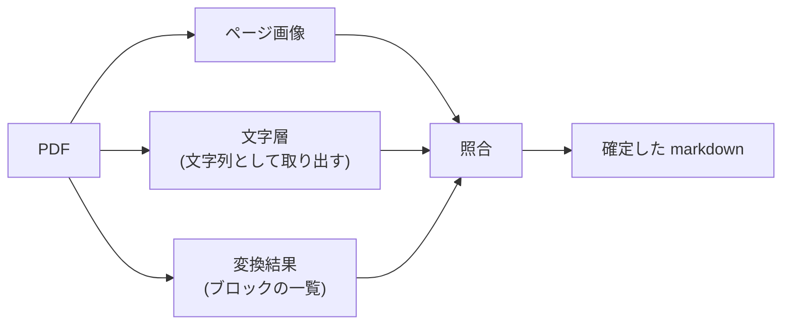

# 照合で文字の正をどこに置くか

- created: 2026-07-28
- status: ready for review
- implementation: not-started

## 解決したい問題

変換された論文の本文で、語・数値・固有名詞・引用番号・数式の変数名が、原文の綴りどおりになっている。
変換器が文字を落としても、照合の段階でそれが検出され、直される。

## 問題の背景

0004 は、変換結果を PDF のページ画像と突き合わせて直す照合の段階を設計した。
その中心にあるのが、食い違いを解決する**向き**である。
「どちらが正しいか」を無条件に AI へ判断させるのではなく、食い違いの種類ごとにどちらを採るかを指示する。

| 食い違いの種類 | 0004 が採るとした側 |
|---|---|
| 語・数値・固有名詞・引用番号といった文字そのもの | 変換結果 |
| 読み順・キャプションの帰属・表の構造・数式・字下げといった紙面の構造 | ページ画像 |
| 変換結果に対応する内容が無い | ページ画像 |

向きを与えたのは、無条件に判断させると AI が自分でページ画像から読み取った文字列を正しいものとして扱いやすく、変換器が正確に取れていた著者名・数値・引用番号が字形の読み違いで置き換わるからである。
そして文字について変換結果を採るとした根拠は、**一般に流通している論文の PDF は文字が文字として埋め込まれており、変換器はそれを直接読むので、字形からの再構成であるページ画像の読み取りより正確である**という点にあった。

この根拠が、実装を実機で検証する過程で成り立たないと分かった。
成り立たないのは前提の前半ではなく後半である。
PDF に文字が埋め込まれていることは正しい。
しかし**変換器がその文字を正しく出力するとは限らない**。

PDF の文字を扱う方法には 2 つの経路がある。
ページ全体を 1 つの文字列として取り出す経路と、1 文字ずつ紙面上の位置つきで取り出す経路である。
変換器は文字を版面の判定と結びつける必要があるため後者を使う。
この経路には、基本多言語面の外にある文字を扱えないという欠陥がある。
数式用の斜体(`𝑀` は U+1D440 など)がこれに当たり、置換文字になるか無言で消える。

同じ PDF の同じページで、2 つの経路はこう違う。

```
ページ全体を文字列として取り出す経路:
  function Rasterize(𝑤, ℎ, 𝑀, 𝑆, 𝐶, 𝐴, 𝑉 )

1 文字ずつ位置つきで取り出す経路:
  function Rasterize(�, ℎ, �, �, �, �, � )
```

この欠陥は、検討した変換器 2 つの両方に同じ形で存在する。
共有している下位の実装に由来するためである。
コンピュータグラフィックスの論文 9 本で測ったところ、5 本で発生し、そのうち 1 本では文字層にある 655 文字がすべて失われた。
本文が `the directions ����,��,�� are sampled using BSDF and emitter sampling` のようになる。

変換器が文字を落とすのはこの経路の問題だけではない。
別の変換器では、行の高さに対する各部分の高さの比で添字を判定する処理が、特定の組版で誤作動し、`quality` を `ualit` に、`Fig.` を `Fi ` にした。

つまり、変換器の出力を文字の正とする設計では、ページ画像に正しい文字が写っていて AI がそれを読めている場面でも、向きの指示に従って壊れた文字が残る。
向きが破損を保護する側に回る。

## この文書では書かないこと

- どの変換器をどの環境で使うか(0008)。この文書は、どの変換器を使う場合にも成り立つ照合の判断基準を決める。
- 照合の段階そのものの構成、ページ画像の作り方、変更点の記録のしかた(0004)。この文書が変えるのは、食い違いを解決する向きの表と、照合へ渡す入力である。
- 翻訳・登録の段階(0004)、ジョブキューの扱い(0003)。

## やらないこと

- **文字層をそのまま本文として採用しない。** 文字層は文字の正であって、本文そのものではない。文字層の読み順は紙面の構造を反映せず、2 段組みでは左右の段が混ざり、擬似コードでは字下げが失われ、行が意図しない位置で切れる。本文の構造は引き続き変換結果とページ画像から決める。
- **文字層と変換結果の差を自動で修正しない。** 差の検出は機械的に行うが、どちらをどう採るかの判断は照合の段階に委ねる。差には、変換器が文字を落とした場合だけでなく、変換器が正しく直した場合(行末のハイフンで分割された語の結合など)も含まれる。機械的に文字層で置き換えると、後者を壊す。
- **文字層を持たない PDF のために別の照合を設計しない。** 紙面を走査しただけの PDF では文字層が無いか、あっても文字認識の結果である。この場合の扱いは 0004 のままとし、判断はページ画像を優先する側へ倒れる。そうした PDF を実際に取り込む必要が出てから、専用の設計を検討する。
- **文字の正しさを数値で採点しない。** 検出するのは「文字層にあって変換結果に無い」という 1 つの事象に限る。変換の品質を総合的に評価する仕組みは持たない(0004)。

## 概要

照合における**文字の正を、変換器の出力から PDF の文字層へ移す**。

文字層は、ページ全体を文字列として取り出す経路で得る。
この経路は字形からの再構成を伴わず、変換器の版面の判定より上流にあり、実測でも正確だった。
変換器を差し替えても、この経路から得られる文字は変わらない。

照合へ渡す入力は 2 つから 3 つになる。
ページ画像が紙面の構造の正、文字層が文字の正、変換結果が構造の出発点である。

向きの表は次のように変わる。

| 食い違いの種類 | 採用する側 |
|---|---|
| 語・数値・固有名詞・引用番号・擬似コードの識別子と変数名といった**文字そのもの** | **PDF の文字層** |
| 読み順・キャプションの帰属・表の行と列・数式の LaTeX・擬似コードの字下げ・記号の種別といった**紙面の構造** | ページ画像 |
| 変換結果にも文字層にも対応する内容が無い | ページ画像 |

あわせて、文字層と変換結果の差を AI に渡す前に機械的に取る。
文字層にあって変換結果に無い文字が多いページは、変換器が文字を落としたページであり、照合で重点的に見る対象になる。



図の読み方: 四角はデータで、矢印は「左のものから右のものが作られる」ことを表す。

## シナリオ

14 ページの論文の照合が始まる。
6 ページ目では、変換結果と文字層の差が小さく、変更は 2 段組みの読み順の入れ替えだけで済む。

13 ページ目は付録で、擬似コードのアルゴリズムが載っている。
機械的に取った差で、このページは文字層にある文字の多くが変換結果に無いと分かる。

照合へ送られるのは、このページの画像、変換結果のブロック、そして文字層である。
変換結果ではアルゴリズムがこうなっている。

```
CullGaussian(��, �� ) ⊲ Frustum Culling
, ��′ ← ScreenspaceGaussians(��, ��, �� ) ⊲ Transform
```

1 行ずつ独立したブロックに分かれ、字下げが無く、変数名が置換文字になり、行の先頭が失われている。

同じ領域の文字層はこうなっている。

```
CullGaussian(𝑝, 𝑉 ) ⊲ Frustum Culling
𝑀′
, 𝑆′ ← ScreenspaceGaussians(𝑀, 𝑆, 𝑉 ) ⊲ Transform
```

変数名は正しいが、字下げが無く、`𝑀′` が独立した行に切れている。

ページ画像には、字下げされたアルゴリズムの枠が写っている。
AI は、変数名を文字層から、字下げと行の区切りをページ画像から採り、アルゴリズムを組み直す。

一方、同じページの参考文献の著者名は、画像から読むと綴りが曖昧だったが、文字層の綴りをそのまま採る。

変更点の一覧には、変数名を文字層から補ったこと、字下げをページ画像から復元したことが、それぞれの理由とともに記録される。

## 詳細設計

以下では、文字の正を文字層へ移す根拠、照合へ渡す文字層の粒度、機械的な差の検出、そして向きが決まらない場合の扱いを述べる。

### 文字の正を文字層へ移す

0004 が文字について変換結果を採るとしたのは、変換器が埋め込まれた文字を直接読むからであった。
この根拠は、変換器の**内部**では成り立つ。
変換器が文字を取り出す段階では、綴りは正しい。
成り立たないのは変換器の**出力**である。
版面の判定と結びつけ、markdown へ組み立てる過程で、文字が落ちる。

文字層をこの位置に据えるのは、次の 3 つの性質を同時に満たすからである。

**字形からの再構成を伴わない。**
PDF に埋め込まれた文字をそのまま読むので、ページ画像の読み取りが持つ誤りの余地が無い。
0004 が文字についてページ画像を採らないと決めた理由は、そのまま文字層を採る理由になる。

**変換器の後処理より上流にある。**
変換器が文字を落とすのは組み立ての過程であり、文字層はその前にある。
上に挙げた 2 つの欠落は、どちらも文字層では起きない。

**変換器の選択から独立している。**
文字層は PDF から直接得るので、どの変換器を使っていても同じものが得られる。
0004 が変換器との境界を契約として切った狙いは、品質に不満が出たときに変換器だけを差し替えられることだった。
文字の正を変換器の出力に置くと、差し替えのたびに文字の正しさを賭け直すことになり、その狙いが貫かれない。
文字層に置けば、変換器の選定と照合の正しさが切り離せる。

### 照合へ渡す文字層の粒度

文字層は、**ブロックの領域ごと**に渡す。
変換器が返すブロックは紙面上の位置を持つので(0008)、その位置で文字層を引くと、そのブロックに対応する文字が得られる。

ページ全体をまとめて渡す形も取れるが、領域ごとにする。
ページ全体で渡すと、AI は変換結果のどの部分が文字層のどの部分に対応するかを自分で見つけることになる。
2 段組みの紙面では文字層の読み順が段をまたいで混ざるため、この対応づけ自体が誤りうる。
領域で引けば対応が最初から決まっているので、AI に残るのは綴りの比較だけになる。

領域で引けない場合(変換器がブロックを作れなかった箇所、ページ全体が 1 つのブロックになった場合)は、ページ全体の文字層を添える。
このとき対応づけの誤りが起こりうることは受け入れる。

### 機械的な差の検出

照合へ送る前に、ブロックごとに文字層と変換結果の差を取る。
見るのは「文字層にあって変換結果に無い文字」の量である。

この検出には 2 つの用途がある。

**照合で重点的に見るページを決める。**
差の大きいページは変換器が文字を落としたページなので、AI に対してそのページで文字の欠落を疑うよう指示を強められる。

**照合を経ても直らなかった欠落を、ユーザーに示す。**
照合の後にも同じ検出を行い、差が残るブロックを記録する。
0004 は照合の結果が正しいことを機械的に確かめる手段が無いと述べたが、文字の欠落という 1 つの事象に限れば確かめられる。

差の量を測るときは、**文字を単位にする**。
語を単位にすると、1 文字の変数名の欠落が検出されない。
実測でも、語を単位にした照合では 9 本すべてで欠落率が 1.10% から 4.60% に収まり、その大半は行末のハイフンで分割された断片という測定上の作り物だった。
一方で同じ論文の一部では、文字層にある数式用の文字 655 個がすべて失われていた。

差がゼロでないこと自体は異常ではない。
変換器は行末のハイフンで分割された語を結合し、ページ番号やヘッダーを本文から分けるので、文字層と一致しないのが正常である。
したがって差の量は、そのまま品質の点数として扱わず、照合で見る箇所を絞るための手がかりとして使う。

### 向きが決まらない場合

向きの表は、食い違いを「文字そのもの」と「紙面の構造」に分けることを前提としている。
この分類に当てはまらない食い違いもある。

数式は文字と構造の両方の性質を持つ。
記号の綴りは文字だが、添字の位置・括弧の対応・分数の構造は紙面の構造である。
数式については構造の側として扱い、ページ画像を優先する。
数式の中の記号は文字層でも独立した文字として並ぶだけで、その配置の情報を持たないためである。

擬似コードも両方の性質を持つが、こちらは分けられる。
識別子と変数名は文字なので文字層を、字下げと行の区切りは構造なのでページ画像を採る。
両者は同じ表の別の行として扱えるので、擬似コードのための特別な規則は設けない。

どちらとも決めがたい食い違いに出会った場合は、変更を加えずに変更点の一覧へ記録する。
判断できないものを推測で直すより、直っていないことが分かる形で残すほうがよい。

## 落とし穴

- **文字層を持たない PDF では、この設計の利益が無い。** 紙面を走査しただけの PDF には埋め込まれた文字が無いか、あっても文字認識の結果である。この場合は 0004 のままの扱いになり、判断はページ画像を優先する側へ倒れる。
- **文字層が正しいことを確かめる手段がない。** PDF の作成側が誤った文字を埋め込んでいる場合(記号を別の文字に割り当てた組版など)、文字層はその誤りをそのまま持つ。この設計はその誤りを検出できず、むしろ正として採用する。
- **照合の入力が増え、消費する枠も増える。** ページ画像と変換結果に加えて文字層を送るので、1 ページあたりの入力が増える。増加分は本文の分量と同じ程度である。
- **差の検出は欠落しか見つけられない。** 文字が別の文字に置き換わった場合(綴りは残っているが誤っている場合)は、文字層にある文字が変換結果にも存在するため、差として現れない。検出できるのは、文字が消えた場合に限る。
- **AI が向きの指示に従うことを前提にしている。** 表で示した優先を AI が守らなければ、この設計は働かない。守られたかどうかは変更点の一覧に書かれた理由から推測するしかなく、機械的には確かめられない。これは 0004 が向きを導入した時点からある性質で、この文書はそれを変えない。
- **領域で引いた文字層が、そのブロックの内容と一致しない場合がある。** 変換器が返す領域が実際の文字の範囲とずれていると、隣接するブロックの文字が混ざるか、末尾が欠ける。ずれの検出はしない。

## 代替案

- **0004 の向きをそのまま残す(文字の正を変換器の出力に置く)。**

  照合へ渡す入力を 2 つのままに保つ設計である。
  実装が単純で、消費する枠も増えない。
  一方で、変換器が文字を落とした箇所は直らない。
  ページ画像に正しい文字が写っていても、向きの指示によって壊れた文字が残る。
  実測では、この欠落が検証した論文の半数を超える割合で発生した。

- **向きをやめ、どちらが正しいかを AI に判断させる。**

  種類による優先を指示せず、文脈から正しいほうを選ばせる設計である。
  指示が単純になり、こちらが立てた分類に当てはまらない食い違いにも対応できる。
  一方で、AI はページ画像から自分で読み取った文字列を正しいものとして扱いやすい。
  その結果、正確に取れていた著者名・数値・引用番号が字形の読み違いで置き換わる。
  変換器の出力に問題があると分かったことは、ページ画像の読み取りが文字に強いことを意味しない。

- **文字層を本文の出発点にし、変換結果を構造の注釈として使う。**

  文字層から本文を組み立て、変換器の出力はブロックの区切りと種別を与えるためだけに使う設計である。
  文字の欠落が原理的に起こらない。
  一方で、文字層の読み順は紙面の構造を反映しないため、2 段組みでは段が混ざり、擬似コードでは行が意図しない位置で切れる。
  組み立て直す仕事が照合にすべて乗ることになり、AI が返す本文の量も増える。
  変換器が正しく組み立てられている大多数の箇所まで作り直すことになる。

- **文字層と変換結果の差を機械的に修正する。**

  文字層にあって変換結果に無い文字を、位置を頼りに機械的に差し込む設計である。
  AI を通さないので枠を消費せず、結果も決定的になる。
  一方で、差には変換器が正しく直した箇所(行末のハイフンで分割された語の結合、ページ番号やヘッダーの分離)も含まれる。
  これらを区別する規則を書き切ることは難しく、誤って差し込めば本文が壊れる。

- **文字を失う取り出し経路の問題を、変換器側で直す。**

  変換器が使う下位の実装に手を入れ、基本多言語面の外の文字を扱えるようにする設計である。
  問題の根を絶てるので、照合で補う必要が無くなる。
  一方で、手を入れた版を抱えると、その保守が変換器の更新のたびに発生する。
  また、これで直るのは 2 つある欠落のうち 1 つだけで、組版によって添字の判定が誤作動するもう 1 つは残る。
  変換器の出力を文字の正とする設計そのものの危うさは変わらない。

## 負荷・コスト

文字層の取り出しは PDF の読み込みだけで済み、GPU も AI も使わない。
1 ページあたり数ミリ秒である。

差の検出は、ブロックごとの文字の集合の比較である。
1 本の論文で数百のブロックがあるが、いずれも文字列の処理なので、変換や照合に比べて無視できる。

照合へ送る入力は、ページ画像と変換結果に文字層が加わるぶん増える。
文字層はそのページの本文とほぼ同じ分量なので、1 ページあたりの入力は 0004 の見積もりに本文 1 つぶんが上乗せされる。
0004 は 12 ページの論文で入力が 3 万トークン規模と見積もっており、そこに 1 万トークン規模が加わる。
入力より出力の単価が高いため、照合 1 回の重みが桁として変わることはない。

この設計は取り込みのときだけ動き、検索や表示の経路には入らない。
