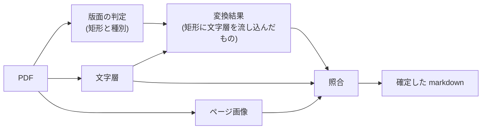

# 変換から文字の読み取りを外し、照合に任せる

- created: 2026-07-29
- status: ready for review
- implementation: not-started

## 解決したい問題

論文 1 本の変換が数分ではなく十数秒で終わる。
それでいて、本文の文字と数式は少なくとも今と同じ正確さを保つ。

## 問題の背景

0008 は、変換に Marker の fast モードを GPU で使うことを実測に基づいて決めた。
この変換器は紙面の版面の判定・文字の認識・数式の認識にそれぞれ視覚モデルを使う。
版面の判定は紙面のどこが本文でどこが図表かを矩形で返す処理で、文字の認識と数式の認識は、その矩形の中身を画像から読んで文字列にする処理である。

0009 は、照合における文字の正を変換器の出力から PDF の文字層へ移した。
文字層とは、PDF に埋め込まれた文字をページ全体の文字列として取り出したものである。
移した理由は、変換器が使う「1 文字ずつ位置つきで取り出す経路」が基本多言語面の外にある文字を扱えず、数式用の斜体を置換文字にするか無言で消すからだった。
同時に、読み順・キャプションの帰属・表の行と列・数式の LaTeX といった紙面の構造については、ページ画像を正とすることを確認した。

この 2 つの決定を並べると、変換器の文字の認識と数式の認識が、どちらの正でもなくなっている。
文字は文字層が正であり、構造はページ画像が正である。
変換器がそれらの矩形の中身を読んで作った文字列は、照合の入力のうち「構造の出発点」としてしか使われない。

実測すると、変換の時間はほぼすべてこの認識に使われていた。
15 ページの論文(`wang2023-adaptive-shells`)で変換が 139.9 秒かかるうち、PDF を開いてページを描き起こす処理は 1.3 秒、文字層を取り出す処理は 0.5 秒である。
26 ページの論文(`kerbl2023-3d-gaussian-splatting`)では変換が 333.1 秒かかった。
つまり 1 本あたり 2 分から 6 分を、照合で正として採らない文字列を作るために使っている。

一方、照合はページごとに独立した要求として Codex へ送り、複数ページを同時に走らせられる。
15 ページの照合は 97.3 秒で、ページ数が増えても同時実行の数までは時間が伸びない。
論文全体を 1 つずつ順に処理する変換器と違い、待ち時間がページ数に比例しない。

## この文書では書かないこと

- どの変換器をどの環境で使うか(0008)。この文書は、変換器に何をさせるかの範囲を変える。
- 照合の段階そのものの構成、ページ画像の作り方、変更点の記録のしかた(0004)。
- 翻訳と登録の段階(0004、0011)。
- 文字層をどう取り出すか、変換結果との差をどう測るか(0009)。

## やらないこと

- **変換器を差し替えない。** 版面の判定は引き続き Marker に任せる。この文書が変えるのは、変換器に走らせる処理の範囲だけである。判定の精度に不満が出たときは 0008 の枠組みで実装の比較をやり直す。
- **文字層をそのまま本文にしない。** 文字層は文字の正であって本文ではない(0009)。文字層は紙面上の並びを持たず、2 段組みでは左右の段が混ざり、擬似コードでは字下げが失われる。本文の構造は引き続き版面の判定とページ画像から決める。
- **書き起こしたページの正確さを数値で採点しない。** 紙面の画像だけから起こした本文がどれだけ原文に近いかを機械的に測る手立ては無い。照合の記録にどのページが書き起こしかを残すにとどめ、読者が原本の PDF を開いて確かめられる状態を保つ。
- **紙面を走査した論文のために取り込みの経路を分けない。** 文字層の有無はページ単位で判定し、同じ 6 段階の中で扱う。取り込みの入り口で PDF の種類を見分けて別の経路へ振り分けると、判定を誤ったときに丸ごと失敗する。

## 概要

変換と照合の責務の境界を、**変換は紙面の版面、照合は紙面の文字**に引き直す。

変換器には版面の判定だけを走らせ、文字の認識と数式の認識は走らせない。
変換の結果として得られるのは、紙面のどこが見出しでどこが図表かという矩形の一覧と、そこへ文字層から流し込んだ文字である。
数式のように文字層が保持できない箇所は、置換文字の並びのまま照合へ渡る。

照合は、その置換文字の並びをページ画像から読み直して LaTeX で書き直す。
これは 0009 が定めた向きの表で「変換結果にも文字層にも対応する内容が無い」に当たり、ページ画像が正になる場合である。

文字層も版面の文字も空のページは、突き合わせる相手が無いので照合が成り立たない。
このページは**書き起こし**として扱い、紙面の画像から markdown を起こす専用の指示を与える。
書き起こしたページは照合の記録に残し、そのページの本文が紙面の読み取りだけに拠ることを読者が知れるようにする。



図の読み方: 四角はデータまたは処理で、矢印は「左のものから右のものが作られる」ことを表す。
文字層はページの並びを持たないため、変換結果を作るときと照合のときの両方へ渡る。

## シナリオ

### 数式を含むページ

15 ページの論文の 4 ページ目に、体積レンダリングの式が 3 つ並んでいる。

版面の判定は、このページに本文の段落・数式のブロック・図とキャプションがどう配置されているかを矩形で返す。
数式のブロックには文字層から文字を流し込むが、数式用の斜体は文字層でも壊れているため、こうなる。

```
c(r) = ∫ ���� ���� exp h ∫ �� ���� −��(r(��))����i ��(r(��))c(r(��), d)���� , (1)
```

照合はこのページの画像とともにこの文字列を受け取る。
置換文字を含む数式は、文字層にも対応する文字が無い箇所なので、ページ画像から読み直す。

```
$$
\mathbf{c}(\mathbf{r})=\int_{\tau_n}^{\tau_f}\exp\left[\int_{\tau_n}^{\tau}-\sigma(\mathbf{r}(z))\,dz\right]\sigma(\mathbf{r}(\tau))\mathbf{c}(\mathbf{r}(\tau),\mathbf{d})\,d\tau
$$
```

同じページの本文の段落は、文字層から流し込んだ文字がそのまま残る。
照合が変えるのは、読み順・キャプションの帰属といった構造と、この数式のように文字層が保持できなかった箇所である。

### 文字を持たない PDF

紙面を走査しただけの PDF が取り込まれる。
版面の判定は紙面の画像から働くので、このような PDF でも見出し・本文・図・表・数式の矩形を返す。
しかし文字層が空なので、どの矩形にも流し込む文字が無い。

照合はこのページを書き起こしとして扱う。
渡すのはページ画像だけで、突き合わせる変換結果も文字層も無いことを指示に明示する。
返ってくるのは、紙面に見えるとおりの読み順・見出しの階層・表の行と列を持つ markdown である。

この論文の本文には、文字の正を持つ箇所が 1 つも無い。
照合の記録には、どのページが書き起こしだったかが残る。

## 詳細設計

### 変換器に走らせる処理の範囲

変換器には版面の判定だけを走らせる。

版面の判定を残すのは、照合がページ 1 枚ずつ独立して走るためである。
照合は紙面全体を見渡さないので、どの矩形が図でどの矩形が表かという判定を自前で持てない。
また図の画像は矩形が決まって初めて切り出せる。
実測では、文字を 1 文字も持たない PDF に対しても版面の判定は働き、15 ページで 191 個の矩形を正しい種別(見出し 29・本文 97・図 14・表 4・数式 12・キャプション 18)とともに 7.9 秒で返した。

文字の認識と数式の認識を外す根拠は、その出力が照合の正として採られないことにある。
0009 の向きの表では、文字は文字層が正であり、紙面の構造はページ画像が正である。
変換器がこの 2 つの認識で作る文字列は、照合が構造を組み直すときの出発点にしかならない。
出発点としての価値は、矩形の並びと種別があれば足りる。

実測は次のとおりである(15 ページの `wang2023-adaptive-shells`)。

| | 変換 | 照合 | 合計 |
|---|---|---|---|
| 認識を走らせる | 139.9 秒 | 97.3 秒 | 237.2 秒 |
| 認識を走らせない | 12.3 秒 | 98.9 秒 | 111.2 秒 |

照合の時間がほとんど変わらないのは、照合の待ち時間がページごとの応答の往復に支配されており、1 ページで直す量には支配されないためである。

### 数式の扱い

数式は照合が紙面の画像から LaTeX で書き直す。

変換器の認識を外すと、数式のブロックには文字層から流し込んだ文字が入る。
文字層は数式用の斜体を保持できないので(0009)、この文字列は置換文字と記号の並びになる。
これは 0009 の向きの表の 3 行目「変換結果にも文字層にも対応する内容が無い」に当たる。
照合はページ画像を正として、その箇所を読み直す。

照合の指示には、数式を書き直す条件を明示する。
置換文字を含む・数学用の Unicode 文字が並んでいる・分数や積分が記号を横に並べただけになっている、のいずれかである。
条件を明示するのは、置換文字が無くても壊れている数式があるためである。

実測では、12 個の数式ブロックがすべて LaTeX に戻り、置換文字は 0 になった。
そのうち 1 つは、変換器の認識を走らせたときよりも正確だった。
紙面の `dΦ_s/dτ` を変換器は `\frac{d\Phi_s}{dt}` と読み違え、括弧の対応も崩していたが、照合は `\frac{d\Phi_s}{d\tau}` と正しく読んだ。
これは 0009 の想定どおりの結果である。
数式は文字ではなく構造として扱われ、構造の正はページ画像にある。

### 文字を持たないページの書き起こし

文字層も変換結果の文字も空のページは、照合ではなく書き起こしとして扱う。

照合の指示は向きの表を中心に組み立てられており、突き合わせる相手が 2 つある前提に立つ。
相手が無いページにこの指示を与えると、比べるものが無い状態で「どちらを採るか」を問うことになる。

書き起こしの指示は、紙面の画像だけが手がかりであることを述べたうえで、照合と同じ構造の要件を課す。
読み順・見出しの階層・キャプションの独立・表の行と列・数式の LaTeX・擬似コードの字下げである。
加えて、紙面に見えないものを補わないこと、読めない箇所は読めるところまでにとどめて記録に残すことを課す。
文字の正が無い以上、書き起こしが誤る余地は照合より大きく、誤りを埋めるより空けておくほうが読者にとって害が小さい。

判定はページ単位で行う。
論文の一部だけが走査された紙面である場合や、図版のページだけ文字を持たない場合があるためである。

実測では、15 ページの論文をページ画像だけの PDF に作り直して書き起こした結果、文字層のある版と比べて地の文の語の 96.4% が一致し、見出しは 29 個で完全に一致し、図の参照 14 個と表の構造も一致した。
表は 24 個の数値と 2 段の見出しが紙面どおりだった。
残った差は表記のゆれ(`NeRF-Synthetic` と `NeRFSynthetic`)と、固有名詞の読み違い(`Junli` を `Junhi`)である。

### 書き起こしの記録

書き起こしたページは照合の記録に残す。

書き起こしたページの本文には文字の正が無く、固有名詞・数値・引用番号が字形の読み違いで置き換わりうる。
0009 が向きの表で防ごうとしたのは、まさにこの置き換わりである。
文字層が無い以上その防ぎ方は使えないので、防げないことを記録に出す。

記録に残すのはページの一覧と、そのページで読み取れなかった箇所である。
どの語が誤っているかは分からないので、そこまでは書けない。
読者は原本の PDF を開いて確かめられる(0002)。

## 落とし穴

- **書き起こしたページは文字の正を持たない。** 固有名詞や数値の読み違いが残り、検出もできない。記録でページを示すにとどまる。
- **版面の判定を誤ると照合も引きずる。** 変換器が段落を figure と判定すればその領域は図として切り出され、照合はページ 1 枚の中でしか直せないので、紙面全体を見た判定のやり直しはできない。判定の精度は 0008 の枠組みで実装を選ぶときの評価項目に残る。
- **文字層があっても壊れているページは書き起こしにならない。** 判定は「空かどうか」で行うので、文字層に少しでも文字があれば照合として扱う。壊れた文字が多いページは 0009 の機械的な差の検出で重点的に見る対象になるが、書き起こしには切り替わらない。

## 代替案

- 変換器の数式のブロックの認識だけを外し、文字の認識は残す。

  変換器には、数式のブロックを認識するかどうかを個別に切り替える設定がある。
  これを使えば、文字層を持たない PDF でも変換器が本文の文字を返すので、書き起こしの仕組みを持たずに済む。
  一方で、速度の改善は数式のぶんに限られる。
  そして 0009 の下では、変換器が読んだ文字は照合の正として採られないため、その計算は結果に反映されないまま残る。
  書き起こしを持つなら文字の認識を残す理由が無いので採らない。

- PDF に埋め込まれた画像を縮小してから変換器へ渡す。

  グラフィックスの論文には解像度の高い画像が埋め込まれている(実測で 922〜1447 ppi、PDF 全体で 88.5 MB)。
  これを縮小すれば変換器の負担が減るという見立てで、Ghostscript による縮小を測った。
  変換は 139.9 秒から 25.6 秒になったが、原因は画像ではなかった。
  縮小せずに同じ道具で PDF を書き直しただけの版(254 MB)でも 29.0 秒になり、どちらも数式が LaTeX にならず生の Unicode のまま残った。
  書き直しでフォントの符号化が変わり、変換器が数式と判定しなくなるためである。
  合字も壊れ、`field` が `eld` になった。
  速度の改善が劣化と不可分なので採らない。

- 変換を今のままにする。

  変換器の認識を走らせ続ければ、文字層を持たない PDF でも本文が得られ、実装に手を入れずに済む。
  しかし 1 本あたり 2 分から 6 分を、照合で正として採らない文字列を作るために使い続けることになる。
  取り込み全体の待ち時間のうち最も大きい部分がここなので採らない。

## セキュリティ・プライバシー

この文書が変えるのは変換器に走らせる処理の範囲と照合への指示であり、扱うデータの範囲・保存先・外部への送信先はいずれも変わらない。
照合がページ画像を Codex へ送ることは 0004 で決まっており、この文書はその量も宛先も変えない。

## 負荷・コスト

変換の段階が使う GPU の時間が、1 本あたり 2 分から 6 分の規模で減る。
減るのは視覚モデルの推論であり、GPU を使う仕事の同時実行を 1 に制限している(0003)ため、この時間はそのまま他の GPU の仕事の待ち時間でもある。

照合が Codex へ送る要求の数と大きさは変わらない。
ページ 1 枚につき画像 1 枚とテキストという構成は同じで、変わるのはテキストの中身だけである。
応答の出力は増える。
数式を書き直すページと書き起こしのページで、返す markdown の量が増えるためである。
実測では 15 ページの照合が 97.3 秒から 98.9 秒になった。

文字を持たない PDF では、照合の出力がページ全体の本文になる。
実測で 15 ページの書き起こしが 108.6 秒だった。
ページ数に対しては、同時に走らせる数までは一定で、それを超えると比例して伸びる。
