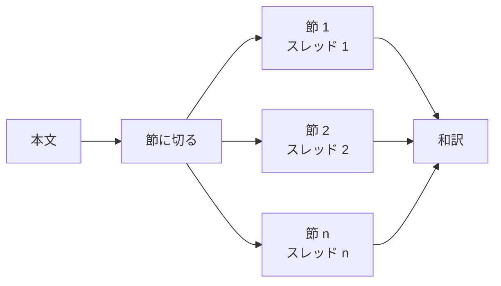

# 翻訳を節ごとに並べて走らせる

- created: 2026-07-29
- status: approved
- implementation: in-progress

## 解決したい問題

論文 1 本の和訳が数分の一の待ち時間で仕上がる。

## 問題の背景

0004 は翻訳の段階を、本文を節に切って 1 節ずつ Codex に訳させる形で設計した。
そのとき、節を 1 つの作業スレッドの中で順に訳すことを決めた。
同じスレッドに前の節の訳が残るので、専門用語の訳語が論文全体で揃うためである。

実装して実測すると、この逐次の処理にかかる時間が想定より長かった。
15 ページの論文(`wang2023-adaptive-shells`、29 節)の翻訳が 600.4 秒、26 ページの論文(`kerbl2023-3d-gaussian-splatting`)が 447.2 秒である。
Codex の service tier を priority(公称 1.5 倍の速度、利用量が増える)にしても 422.4 秒だった。

設計時に見積もっていたのは、節ごとの応答が短く、順に流しても全体で 1〜2 分という規模だった。
実際には 1 節あたり 15 秒から 20 秒かかり、それが節の数だけ積み上がる。
取り込みの他の段階を短くしていくと、翻訳が最も長い段階になる。

訳語を揃える価値は、pct で和訳が置かれている位置から測り直せる。
0004 は和訳を原文と並べて保存し、画面は同じ論文の英語と日本語を切り替えて読める形にした。
和訳は原文の代わりではなく、原文へいつでも戻れる状態での読む助けである。

## この文書では書かないこと

- 本文を節に切る規則と、訳が守るべき契約(数式・画像・リンク・見出しの数)の確認(0004)。この文書は節の作り方も契約も変えない。
- Codex を使う仕事の同時実行の上限(0003)。
- 変換と照合の段階(0008、0009、0010)。
- 和訳をどう保存し画面でどう出すか(0002、0004)。

## やらないこと

- **訳語の対応表を先に作らない。** 論文全体から専門用語と訳語の組を 1 回抽出し、それを各節の指示に入れれば、並列にしたまま訳語が揃う。しかしこの文書は訳語の揺れを受け入れる立場を採るので、揺れを消すためだけに段階を 1 つ増やす見返りが無い。揺れが実際に読む妨げになると分かったときに再検討する。
- **訳し終えた本文を通しで整える段階を足さない。** 並列に訳してから全体を読み直して訳語を統一する案は、整える段階が訳文全体を出力し直すため、出力の量が翻訳そのものと同じになる。実測の和訳は 4.9 万字あり 1 回の応答に収まらないので、結局節ごとに分けて順に処理することになり、いま解こうとしている待ち時間の問題がそのまま残る。
- **翻訳の品質を数値で採点しない。** 訳語の揺れがどれだけ読む妨げになるかを機械的に測る手立ては無い。契約の確認(0004)は数式・画像・リンク・見出しの数が保たれているかを見るもので、訳の質を測るものではない。この区別は変えない。

## 概要

節ごとに独立した作業スレッドを立て、決まった数ずつ並べて訳す。

揃える対象を「論文の中の訳語」から「節の中の訳語」へ下げる。
節をまたぐと、同じ語が別の訳語で現れることがある。
実測では「ボリューム」42 回に対し「体積」10 回、「狭帯域」12 回に対し「ナローバンド」3 回が混在した。
どちらも誤訳ではなく言い換えであり、原文へ切り替えれば同じ語だと分かる。

abstract も本文の節と同じ並びに入れる。
本文で使った訳語を引き継ぐために最後へ置く理由が無くなるためである。

契約の確認とやり直しは節の中で閉じているので、並べても効き方は変わらない。
実測で 422.4 秒が 169.7 秒になり、契約に反した節は 0 だった。

図の読み方: 四角はデータまたは処理で、矢印は「左のものから右のものが作られる」ことを表す。
節ごとのスレッドは互いに文脈を共有しない。

## 詳細設計

### 節ごとに独立したスレッドを立てる

1 つのスレッドは同時に 1 つの要求しか処理できないので、並べるにはスレッドを分けるほかない。
節ごとに使い捨てのスレッドを立て、決まった数ずつまとめて走らせる。

各節へ渡す情報は今までと同じで、論文の題・abstract・その節の markdown・全体の中で何番目かである。
題と abstract を渡すのは、節だけを見ても論文が何の話かが分かるようにするためで、これは逐次のときからの設計である。
前の節の訳を渡さないことが、逐次との唯一の違いになる。

契約の確認は節ごとに閉じている。
数式・画像・リンク・見出しの数が原文と訳で一致するかを見て、反していれば何が変わったかを添えて 1 度だけやり直す(0004)。
この処理は他の節の結果を必要としないので、並べても判定も再試行も変わらない。

### 訳語の揺れを受け入れる

節をまたいだ訳語は揃わなくなる。
これを受け入れる根拠は、和訳が原文の代わりではないことにある。

pct は英語の本文と和訳を同じ論文の下に並べて持ち、画面は 1 つの切り替えで行き来できる(0004)。
読者が和訳で意味を取りにくいと感じた箇所は、その場で原文を見られる。
節をまたいで「ボリューム」が「体積」になっても、指しているものは変わらず、原文はどちらも `volumetric` である。
これは誤訳ではなく言い換えであり、読者が原文へ戻る必要が生じる種類の問題ではない。

一方で待ち時間は、読者が論文を読み始められるまでの時間そのものである。
取り込みの他の段階を短くしていくと翻訳が最も長い段階になり、待ち時間の大半を占める。
揺れの害と待ち時間の害を比べて、待ち時間を取る。

### 並列度と速度の関係

並列度を上げても、速度はその倍数までは伸びない。

節の大きさが偏っているためである。
実測した論文では、最も大きい節が 15,986 字、中央値が 1,980 字だった。
まとめて走らせる各回の時間は、その回に入った最も大きい節に決まる。
8 並列で測った結果は 422.4 秒に対し 169.7 秒で、2.5 倍である。

この偏りは論文の構造に由来する。
参考文献の節と実験の節が長く、導入や結論が短い。
節をさらに細かく切れば偏りは減るが、切る単位は見出しであり(0004)、見出しより細かく切ると訳が段落の途中で分断される。
並列度は、伸びが頭打ちになることを承知のうえで、Codex を使う仕事の同時実行の上限(0003)に収まる値を選ぶ。

## 落とし穴

- **節をまたいだ訳語が揃わない。** 同じ原語が節ごとに別の訳語で現れる。読者が原文へ戻れることを前提に受け入れる。
- **並列度を上げても頭打ちになる。** 節の大きさの偏りで、各回は最も大きい節に律速される。並列度を 2 倍にしても速度は 2 倍にならない。
- **1 つの節が失敗すると、その回の他の節の結果を待ってから止まる。** まとめて走らせる単位で結果を集めるため、失敗の検出が最も遅い節に引きずられる。

## 代替案

- 訳語の対応表を先に作り、それを各節へ渡して並列に訳す。

  論文全体から専門用語と訳語の組を 1 回だけ抽出する段階を足す。
  出力は用語の一覧なので短く、数十秒で終わる。
  その一覧を各節の指示に入れれば、並列にしたまま論文全体で訳語が揃う。
  揃うのは一覧に載った語だけで、文体や、一覧に載らない言い回しの揺れは残る。
  また対応表の質が訳全体の質を決めるので、抽出を誤ると論文全体に同じ誤訳が広がるという新しい失敗の道筋ができる。
  訳語の揺れの害が小さいと判断した以上、段階を 1 つ増やしてこの道筋を抱える見返りが釣り合わないので採らない。
  揺れが読む妨げになると分かったときは、この案が最初の候補になる。

- 並列に訳してから、通しで訳語を整える段階を足す。

  節を並列に訳し、その後で全体を読み直して訳語を統一する。
  訳語も文体も揃うので、逐次と同じ結果に近づく。
  しかし整える段階は訳文全体を出力し直すことになり、出力の量が翻訳そのものと同じになる。
  応答の待ち時間は出力の量に支配されるので、この段階は翻訳と同じだけの時間を要する。
  さらに実測の和訳は 4.9 万字あって 1 回の応答に収まらず、節ごとに分けて順に処理する必要がある。
  並列にした分を整える段階で使い切るので採らない。

- 逐次のまま Codex の service tier を priority にする。

  priority は公称 1.5 倍の速度で走る代わりに利用量が増える。
  訳語が揃ったまま速くなるので、揺れを受け入れずに済む。
  実測では 600.4 秒が 422.4 秒で 1.4 倍にとどまり、並列の 2.5 倍に届かない。
  利用量も増えるので採らない。
  なお並列と併用はできるので、この文書は priority を使わないと決めるものではない。

## セキュリティ・プライバシー

この文書が変えるのは翻訳の要求を並べる形だけで、送るデータの中身・宛先・量はいずれも変わらない。
翻訳が Codex へ送るのは英語の本文のテキストであり、PDF もページ画像も送らない(0004)。

## 負荷・コスト

Codex へ送る要求の総量は変わらない。
節の数だけ要求を出すことも、各要求で送るテキストの量も、逐次のときと同じである。
変わるのは同時に走る要求の数で、並列度のぶんだけ増える。

作業スレッドは節ごとに立てて捨てるので、スレッドの数が節の数だけ増える。
スレッドは使い捨てで、1 つの要求を処理したら破棄されるため、同時に存在する数は並列度で頭打ちになる。

手元の資源はほとんど使わない。
翻訳の段階が待つのは Codex の応答であり、本文を節に切る処理と契約の確認は文字列の操作に閉じている。
