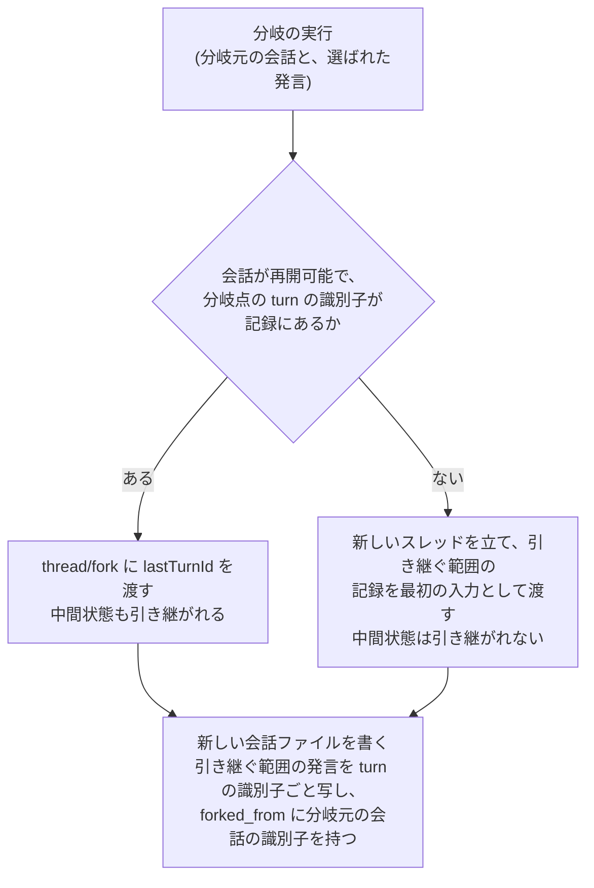

# 会話の分岐に turn の識別子を持たせる

- created: 2026-07-30
- status: ready for review
- implementation: not-started

## 解決したい問題

会話の途中から別の筋を試したとき、分岐先のエージェントが分岐点より後の議論を知らない状態で始まる。
分岐先の記録に書かれていない議論を踏まえた応答が返ることがない。

## 問題の背景

0006 は分岐を「選んだ発言より前の状態から新しい会話を作る」操作と定め、新しい会話ファイルには分岐点までの発言を書き写すと決めた。
各ファイルが単体で読めることを保つためである。

この形が成り立つのは、Codex 側のスレッドも同じ地点で切られている場合だけである。
pct のチャットは Codex のスレッドの上で動き(0003)、エージェントが何を覚えているかはスレッドが決める。
記録は分岐点で切れているのにスレッドが切れていなければ、エージェントは新しいファイルに書かれていない議論を踏まえて答える。
読み返したときに、その応答がどこから来たのか記録の中に見つからない。

Codex 側には turn の単位で切る手段がある。
`thread/fork` は分岐元のスレッドの識別子と、任意の `lastTurnId` を受け取る。
`lastTurnId` を渡すと、その turn までを含めて分岐し、それより後の turn は分岐先から落ちる。
渡さなければスレッド全体がそのまま複製される。

ここに 1 つ足りないものがある。
**会話の記録は turn の識別子を持っていない。**
0002 が定めるチャットの本文は、発言者と時刻を含む見出しで区切った連なりであり、turn を指す情報はない。
`turn/started` の通知には識別子が載るが、記録していない。
そのため分岐点を Codex へ伝える手段がなく、分岐だけが実装できない状態にある。

## この文書では書かないこと

- 分岐を起こす画面の操作と、分岐先へ移る動き。
- 会話の他の状態遷移(再開の判定、アーカイブ、削除)と、読み込み直しの入力の組み立て(0006)。
- Codex のスレッドの設定と枠の待機(0003)。
- チャットの検索(0005、0006)。

## やらないこと

- **分岐の木をアプリで見せない。** どの会話がどこから分かれたかを図にしたり、分岐先を分岐元の子として一覧に入れ子にしたりしない。分岐した会話は独立した 1 つの会話として並ぶ。分岐元を辿る手がかりは frontmatter の `forked_from` だけで足り、本文の理解には要らない(0006)。将来、分岐を多用する使い方が定着したら見直す余地はあるが、当面は入れない。
- **分岐元の続きを分岐先へ追随させない。** 分岐した後に分岐元で議論が進んでも、分岐先の記録は変わらない。分岐は「そこから別の筋を試す」操作であり、2 つの会話はその時点で独立する。
- **turn の中間状態を記録に残さない。** エージェントが読んだファイルの内容や検索の結果は、分岐したスレッドには引き継がれるが、markdown には書かない。これらは結論に至る過程であって読み返す対象ではないという 0002 の判断を変えない。
- **`forked_from` 以外の分岐の情報を frontmatter に足さない。** 分岐点がどこだったかを別の項目として持たない。引き継いだ範囲は本文の末尾がそのまま示す(後述)。

## 概要

記録の正は markdown、Codex のスレッドはそれに付随する実行状態という関係(0006)は変えない。
そこへ、分岐点を指すためだけの情報を記録側に足す。

**分岐は turn の境界で行う。**
turn はユーザーの発言 1 つとそれに対するエージェントの応答の対であり、Codex が切れる最小の単位である。
ユーザーが選んだ発言が属する turn の 1 つ前までを、新しい会話が引き継ぐ。

**turn の識別子は、エージェントの応答の見出しに書く。**
`## assistant · 2026-07-30T08:25:10+09:00 · turn 019fb103-f2e8-7ce3-98dd-43fcda467f7e` の形である。
記録された識別子は、常に frontmatter の `codex_thread_id` が指すスレッドに属する。
読み込み直しでスレッドが替わるときには、古い識別子を落とす。

**分岐の経路は 2 つある。**
会話が再開可能で、分岐点の turn の識別子が記録にあれば、`thread/fork` に `lastTurnId` を渡す。
エージェントが読んだファイルや検索の結果といった中間状態も引き継がれる。
そうでなければ、引き継ぐ範囲の記録を最初の入力として新しいスレッドを立てる。
どちらの経路でも、できあがる会話ファイルの内容は同じである。



図の読み方: 上から下へ 1 回の分岐の処理が進む。
菱形が経路の分かれ目で、2 本の矢印のラベルがその判定の結果である。
2 つの経路は最後の四角で合流し、そこから先は経路によらず同じ内容のファイルができる。

## シナリオ

ある論文について 5 往復議論した会話がある。
4 往復目でユーザーは実装の詳細を聞いたが、そこから話が細部に寄りすぎたと感じている。
4 往復目の自分の発言を選び、分岐を実行する。

新しい会話ファイルができ、3 往復目までの発言が書き写されている。
frontmatter の `forked_from` に元の会話の識別子が入っている。
分岐先で「さっき話した実装の詳細だけど」と聞くと、エージェントは何の話か分からないと答える。
4 往復目以降は Codex 側のスレッドからも落ちているからである。

一方で、3 往復目までにエージェントが読んだ論文の本文は覚えている。
`thread/fork` で分岐したため、そこまでの中間状態が引き継がれている。

半年前の会話から分岐するときは、動きが少し変わる。
マシンを組み直した後で Codex の保存領域が空になっており、その会話は一度読み込み直されている。
読み込み直しの時点で古い turn の識別子は落ちているため、分岐は記録から立て直す経路になる。
引き継ぐ範囲の発言が新しいスレッドの最初の入力として渡され、続きを話せる状態になる。
このとき引き継がれないのは中間状態だけで、記録の内容と `forked_from` は先の例と同じである。

## 詳細設計

以下では、分岐点をどこに取るか、記録の書式、識別子の有効範囲、2 つの経路、分岐先のファイルの内容を順に述べる。

### 分岐点は turn の境界に取る

分岐点は turn の境界とし、ユーザーが選んだ発言が属する turn の 1 つ前の turn までを引き継ぐ。

turn の途中で切る形は Codex 側にない。
`lastTurnId` はその turn までを含めて分岐する指定であり、turn の中のどこかを指す手段はない。
turn の境界に揃えなければ、記録の切り口とスレッドの切り口がずれる。

境界に揃えると、引き継ぐ記録が必ずエージェントの応答で終わる。
ユーザーの発言だけが末尾に残ることがないため、分岐先は最初の発言をユーザーから始められる。

会話の最初の turn は分岐点にしない。
引き継ぐものが無く、新しい会話を始めるのと変わらないからである。

### 記録の書式

turn の識別子は、エージェントの応答の見出しに、時刻に続けて書く。

```md
## user · 2026-07-30T08:24:40+09:00

位置エンコーディングが無いと何が起きるのか、@mildenhall2020-nerf を読んで説明して。

## assistant · 2026-07-30T08:25:10+09:00 · turn 019fb103-f2e8-7ce3-98dd-43fcda467f7e

(応答の本文)
```

識別子を応答の側に書くのは、turn が完了した時点の情報だからである。
`lastTurnId` は進行中の turn を受け付けない。
また pct はユーザーの発言をターンの開始前に記録へ書く一方、識別子が分かるのは `turn/started` を受けた後である。
ユーザーの発言の見出しに書く形にすると、後からその行を書き換えることになる。

応答が残らずに終わった turn には識別子が付かない。
その turn は分岐点にならない。

見出しに置くのは、識別子が指す発言のすぐ隣に値があるようにするためである。
ユーザーが markdown を直接編集することは想定内の使い方であり(0002)、発言の追加や削除で位置が動く。
発言と識別子の対応を位置で持つ形は、この編集に耐えられない。

**turn の識別子は書式の上で任意とする。**
識別子の無い応答の見出しも記録として妥当であり、読み取れる。
手で書いた会話、読み込み直しを経た会話(後述)、失敗した turn がこれに当たる。

### 識別子の有効範囲

**記録に書かれた turn の識別子は、常に frontmatter の `codex_thread_id` が指すスレッドに属する。**
これを不変条件として保つ。

この条件を崩しうるのは、スレッドが入れ替わる操作である。
入れ替わるのは、分岐と読み込み直しの 2 つだけである。

分岐では崩れない。
`thread/fork` で作られたスレッドは、引き継いだ turn の識別子をそのまま有効に保つ。
実測で確かめた `thread/fork` のふるまいは次のとおりである。

| 確かめたこと | 結果 |
|---|---|
| `turn/started` が渡す識別子 | `thread/resume` の応答が返す turn の一覧と一致する(UUIDv7) |
| `lastTurnId` を渡した分岐 | 分岐先には指定した turn までが残り、それより後の turn は落ちる。落ちた turn の内容はエージェントの記憶にも残らない |
| 引き継いだ識別子での再分岐 | 分岐先のスレッドに対して、引き継いだ turn の識別子で再び分岐できる |
| 落ちた turn の識別子での分岐 | `lastTurnId '...' was not found in the source thread` として失敗する |

読み込み直しでは崩れる。
読み込み直しは記録の全文を最初の入力として新しいスレッドを立て、`codex_thread_id` を書き戻す操作である(0006)。
新しいスレッドはそれまでの turn を含まないため、記録に残った識別子はどれもそのスレッドに存在しない。
そこで、**読み込み直しのときに本文から turn の識別子を落とす。**

落とすのは識別子だけで、発言の本文と時刻は変えない。
0006 は読み込み直しの痕跡を本文に残さないと決めており、識別子はその会話が今どのスレッドに載っているかを示す値なので、スレッドが替わったときに古い値を残さないほうがこの決定と揃う。
読み込み直しは元から会話ファイル全体を書き戻すため、書き込みの回数は増えない。

不変条件を保つ利点は、分岐のときに識別子の有効性を確かめる必要がなくなることである。
記録に識別子があれば、それは現在のスレッドの turn を指している。

### 2 つの経路

分岐は次の 2 つの条件が揃ったときに `thread/fork` を使う。

- 会話が再開可能である。すなわち `codex_thread_id` の指すスレッドが Codex 側に残っている(0006)。
- 分岐点の turn の識別子が記録にある。

揃っていなければ、引き継ぐ範囲の記録を最初の入力として新しいスレッドを立てる。
渡す内容の組み立ては読み込み直しと同じで、渡す範囲が分岐点までになるだけである。

再開可能かどうかを条件に入れるのは、識別子があってもスレッドが無ければ分岐できないからである。
記録の識別子は現在のスレッドの turn を指すが、そのスレッドそのものが失われている場合がある。
このとき記録の識別子は、まだ落とされていないだけの古い値になっている。

どちらの経路を通ったかは記録に残さない。
2 つの経路の違いは中間状態を引き継ぐかどうかだけで、記録の内容には現れない。

分岐先のスレッドは、分岐元の frontmatter に記録されたモデルで立てる。
分岐した後にユーザーが変えられる(0003)。

### 分岐先のファイルの内容

分岐先の会話ファイルは、経路によらず同じ内容を持つ。

- 引き継ぐ範囲の発言を、turn の識別子ごと書き写す。
- `forked_from` に分岐元の会話の識別子を持つ。
- `codex_thread_id` は新しく作られたスレッドの識別子である。
- `papers` は分岐元から引き継ぐ。書き写した範囲で言及された slug がそこに含まれるからである。

識別子ごと書き写すのは、`thread/fork` で分岐したスレッドがそれらの turn の識別子を有効に保つためである(前述の実測)。
そのため分岐先の会話からさらに分岐でき、そのときも `thread/fork` の経路を通れる。

記録から立て直した経路では、新しいスレッドに古い turn は存在しない。
この場合は識別子を書き写さない。
識別子を持たない発言として写すことで、識別子の有効範囲の不変条件が分岐先でも保たれる。

## 落とし穴

- **人が読む markdown の見出しに 36 文字の識別子が並ぶ。** 発言の区切りを目で追うときの雑音になる。pct の画面では表示しない。
- **読み込み直しを経た会話は、中間状態を引き継いだ分岐ができない。** その会話のどの地点から分岐しても、記録から立て直す経路になる。Codex 側にその状態が残っていないため、pct 側で補う手段はない。
- **要再読み込みの会話から分岐すると、識別子が記録にあっても使われない。** スレッドが失われているためで、分岐そのものは記録から立て直す経路で行える。
- **見出しの書式を手で崩すと、その turn は分岐点として使えなくなる。** 分岐自体は記録から立て直す経路で行えるため、操作が塞がることはない。
- **分岐先から分岐元を辿る手がかりは `forked_from` だけである。** 分岐元が削除されると辿れなくなる(0006)。

## 代替案

- **`lastTurnId` を渡さず、スレッド全体を分岐する。**

  記録に turn の識別子を持たせず、`thread/fork` に分岐元のスレッドの識別子だけを渡す設計である。
  記録の書式が変わらず、実装がすぐできる。
  一方で、分岐先のスレッドは分岐点より後のやりとりも覚えている。
  新しい会話ファイルには書かれていない議論を踏まえた応答が返り、読み返したときにその出所が記録の中に無い。
  分岐で発言を書き写して各ファイルを単体で読める形に保つという 0006 の判断が、実行状態の側から崩れる。

- **分岐を記録から立て直す経路だけで行う。**

  `thread/fork` を使わず、分岐点までの発言を渡して新しいスレッドを立てる形に一本化する設計である。
  turn の識別子が要らず、記録の書式も変わらない。
  一方で、エージェントがそこまでに読んだ論文の内容や検索の結果を毎回捨てることになり、分岐のたびに引き継ぐ範囲ぶんの入力を払う。
  Codex 側に turn の単位で切る手段があるのに使わない形であり、分岐が読み込み直しと同じ重さの操作になる。

- **turn の識別子を frontmatter の対応表に持つ。**

  本文の見出しは変えず、何番目の発言がどの turn かを frontmatter の表で持つ設計である。
  人が読む本文に機械のための値が出ない。
  一方で、発言と識別子の対応を位置で持つことになる。
  ユーザーが markdown を直接編集して発言を足したり削ったりすると、対応が黙ってずれる。
  この編集は 0002 が想定内としている使い方であり、ずれても検出できない形は採れない。

- **識別子を HTML コメントとして発言の直後に置く。**

  `<!-- turn: ... -->` のように、表示されない形で本文に埋める設計である。
  見出しが短いまま保たれ、識別子は発言に隣接する。
  一方で、pct が無い環境で markdown を開いたときに、その値が何なのかを読み取れない。
  記録が単体で読めることを重視する 0002 の方針では、見えない情報を本文に持つより、見出しに値として書くほうが揃う。

- **読み込み直しで識別子を落とさず、分岐で `thread/fork` を試して失敗したら経路を切り替える。**

  記録には識別子を残したまま、実際に分岐できるかを Codex に問う設計である。
  読み込み直しが本文を書き直さずに済む。
  一方で、経路の選択が Codex のエラーの文面に依存する。
  識別子が見つからない失敗と、それ以外の失敗を区別する必要があり、その区別はエラーの文言を読むことになる。
  さらに記録に無効な識別子が残るため、記録された識別子が現在のスレッドの turn を指すという不変条件が失われる。

## セキュリティ・プライバシー

この設計が新たに扱う機微なデータはない。
turn の識別子は Codex が振る UUIDv7 で、会話の内容を含まない。

識別子はバックアップされる markdown に入る。
値そのものから Codex の保存領域の中身を引く経路はなく、スレッドの識別子を frontmatter に持っているのと同じ性質のものである(0002)。

## 負荷・コスト

`thread/fork` の経路は、Codex への JSON-RPC 呼び出し 1 回で済む。
エージェントへの入力は発生しないため、トークンの消費はない。

記録から立て直す経路は、引き継ぐ範囲に比例した入力を 1 回払う。
読み込み直しと同じ規模で、数十往復の会話の後半から分岐すると数万トークンになる(0006)。
発生するのは分岐の操作 1 回につき 1 度だけである。

記録への追記は、turn 1 つあたり見出しに 40 文字ほど増える。
読み込み直しでの識別子の削除は、元からファイル全体を書き戻す操作の中で行うため、書き込みの回数を増やさない。
