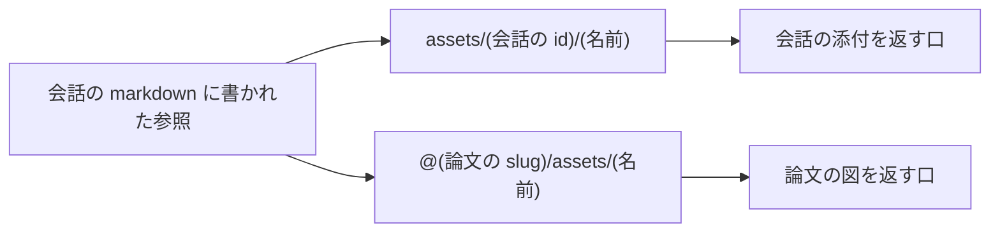

# チャットで画像を扱う

- created: 2026-07-30
- status: ready for review
- implementation: not-started

## 解決したい問題

チャットで画像をやりとりできるようにする。
解決するのは次の 2 つである。

- ユーザーが手元の画像を発言に添えて尋ねられる。図やスクリーンショットを見せて「これは何をしているのか」と聞く形の議論が、いまはできない。
- エージェントが論文の図を指した応答が、画面で図として出る。

添えた画像は議論の記録の一部として残る。
会話を開き直しても、サーバーを入れ替えても、同じ画像が同じ場所に出る。

## 問題の背景

いまチャットの markdown に画像を載せる道が無い。

論文の本文では、変換器が出した `` という相対の参照を、画面が論文の slug と組み合わせて図を返す口へ書き換えて表示している。
チャット欄はこの書き換えを持たないので、エージェントが同じ形で図を指しても、参照は画面の場所を基準に解決され、図は出ない。

会話ファイルの名前も、この問題に噛み合っている。
いまの名前は `chats/YYYY/MM/DD/HH-MM-SS-<タイトル>.md` で、タイトルが決まると名前が変わる(0002)。
名前を人が読める形にしたのは、論文の slug を人が読める形にしたのと同じ理由である。
pct を通さずにエディタで `chats/` を開いたとき、どのファイルが何の議論かをファイル名で見分けられるようにするためである。

タイトルは会話が進むたびに AI が付け直す(0006)。
そのためファイル名は会話の一生の間に何度か変わる。
添付した画像の実体を会話に紐づけて置くには、変わらない名前が要る。
名前が変わるたびに画像のディレクトリも動かすと、markdown に残った参照を書き換えて回ることになり、記録を後から書き換えないという契約(0002)と衝突する。

会話には作成時に決まる不変の識別子 `id` が既にあり、frontmatter が持っている(0002)。
参照に使うべきものとして定義済みで、索引もこれで会話を引く。

## この文書では書かないこと

- 画像を選ぶ・落とす・貼り付ける画面の作り。ボタンの位置、ドロップを受け付ける見せ方、`Ctrl+V` の受け方は実装で決める。
- 表示の大きさを抑える指定の書き方。
- Electron の窓に固有の扱い。画面のコードは Web と同じものを使う(0001)。

## やらないこと

- **画像以外の添付を扱わない。** PDF や CSV を添えたい要求は考えられるが、Codex の入力として画像だけが直接読める形を持ち、それ以外はエージェントがファイルを開く道具立ての話になる。両者は必要な仕組みが違うので、まとめて設計しない。画像で必要が満たせなかった時点で別の doc として検討する。
- **画像そのものを検索の対象にしない。** 検索は本文の文字とその埋め込みで行う(0005)。画像から説明文を作って索引に載せる案は、生成の費用が会話の数だけ増え、検索の質が上がる確証も無い。
- **画像の編集や注釈を持たない。** 切り抜きや書き込みは画像を扱う別の道具の仕事である。
- **外部の URL の画像を読み込まない。** 応答に `https://...` の画像が出ても、画面は取りに行かない(「セキュリティ・プライバシー」)。
- **既に置かれている会話ファイルの名前を一括で付け直さない。** 読み取りはファイル名に依存しないので、古い名前のファイルもそのまま読める(「落とし穴」)。

## 概要

画像を**記録の一部**として扱う。
実体は `$PCT_DATA` の中に置き、markdown には参照だけが残り、画面と Codex はその参照から実体へたどる。

決めることは 4 つである。

1. **会話ファイルの名前を `chats/YYYY/MM/DD/<id>.md` にする。** タイトルではなく会話の識別子を名前にして、会話の一生の間で名前が変わらないようにする。これは 0002 のファイル名の規則を置き換える。
2. **添付の実体を会話ごとのディレクトリに置く。** `chats/YYYY/MM/DD/assets/<id>/<名前>` とし、名前は中身のハッシュにする。
3. **markdown に残る画像の参照を 2 種類だけにする。** 添付は会話ファイルからの相対 `assets/<id>/<名前>`、論文の図は `@<slug>/assets/<名前>`。後者は、論文を指す永続的な名前として既にある `@slug` の表記(0002)を図にも使う形である。
4. **Codex には実体を渡す。** 参照の文字列ではなく画像そのものを、ターンの入力に載せる。

```
$PCT_DATA/chats/2026/07/30/
  20260730T230016-3a8e0b.md      会話。本文に assets/... と @slug/... の参照が残る
  assets/
    20260730T230016-3a8e0b/      その会話に添えた画像
      3f9c1a2b8d04.png
```

参照から実体への解決は、次の 2 経路だけである。



図の読み方: 左は markdown に書かれた画像の参照、中央はその 2 つの形、右は画面がそれを読み替える先の HTTP の口である。
矢印は「この形になりうる」および「この口へ読み替える」を表す。

## シナリオ

ユーザーが図のスクリーンショットを貼り付けて「この図の縦軸は何を表しているのか」と送る。

1. 画面は貼り付けられた画像をそのまま持ち、本文と一緒に 1 つの要求として送る。
2. サーバーは会話を決め(まだ無ければここで作る)、画像を `assets/<id>/` へ置き、本文の先頭に参照を差し込んだうえでユーザーの発言として記録する。
3. 同じターンの入力に、本文と画像の実体を載せて Codex へ渡す。エージェントは画像を見て答える。
4. 応答の中でエージェントが論文の図に触れると、`@<slug>/assets/<名前>` の形で参照する。画面はそれを論文の図の口へ読み替えて表示する。

翌日、ユーザーが一覧からこの会話を開く。
画面は markdown の参照を口へ読み替えるので、貼った画像も論文の図も同じように出る。

Codex のスレッドが失われていた場合、ユーザーは読み込み直しを実行する(0006)。
このとき会話の全文に加えて、その会話に添えた画像を入力に載せる。
文字だけを渡すと、エージェントは記録の中の参照を読めても画像を見られない。

## 詳細設計

### 会話ファイルの名前

会話ファイルは `chats/YYYY/MM/DD/<id>.md` に置く。
`id` は作成時に決まる不変の識別子で、`20260730T230016-3a8e0b` のように作成時刻と短い乱数からなる(0002)。

日付のディレクトリは残す。
`id` の先頭が作成時刻なので、日付のディレクトリの中でも作成順に並ぶ。

ファイル名からタイトルが読めなくなる代わりに、会話の一生の間で名前が変わらなくなる。
この交換を選ぶ理由は 2 つある。
第一に、添付の置き場所が名前に紐づくので、名前が変わると実体の場所か markdown の参照のどちらかを書き換え続けることになる。
第二に、タイトルは会話が進むたびに付け直されるため、名前の変更を削除と追加として扱うバックアップでは、そのたびに同じ内容が二重に積まれる。

エディタで `chats/` を開いたときに何の議論かを名前から見分けられなくなるが、タイトルは会話の一部しか表さないので、名前だけで中身を判別する使い方はもともと成り立たない。
文字列で探せば目的の会話にはたどり着ける。

会話の読み取りはファイル名に依存しない。
`id` は frontmatter が持ち、索引は `id` から場所を引く。
そのため名前の規則を変えても、既に置かれているファイルはそのまま読める。

### 添付の置き場所と名前

添付の実体は `chats/YYYY/MM/DD/assets/<id>/<名前>` に置く。
`<id>` は会話の識別子、日付は会話の作成日である。
画像を持たない会話にはこのディレクトリを作らない。

会話ごとに分けるのは、削除がそのディレクトリを消すだけで済むからである。
日付のディレクトリの下に置くのは、会話ファイルからの相対の参照を短く保つためである。

ファイル名は中身のハッシュの先頭と拡張子にする。
同じ画像を二度貼っても実体は 1 つになり、名前が中身で決まるので、後から同じ名前で別の画像に置き換わることがない。
元のファイル名は参照の説明文(`![...]` の中)に残す。
貼り付けた画像には元の名前が無いので、説明文が空になることもある。

受け取る形式は png / jpeg / webp / gif、1 枚あたりの上限は 20MB とする。
形式は Codex が入力として受け取れるものに合わせる。

### markdown に残る参照

会話の markdown に載る画像の参照は次の 2 種類だけである。

| 参照 | 何を指すか | 誰が書くか |
|---|---|---|
| `` | その会話に添えられた画像 | サーバーが記録するときに差し込む |
| `` | 論文の図 | エージェントが応答の中で書く |

論文の図に `@slug` を使うのは、これが論文を指す永続的な名前として既に定義されているからである(0002)。
チャットの markdown には `@slug` が文字列として残り、pct はそれを書き換えない(0006)。
図の参照も同じ名前に乗せれば、図の置き場所の規則が将来変わっても過去の記録は古くならない。
参照先の論文が削除されたときの扱いも `@slug` と同じで、記録は書き換えず、解決できないことが分かる形で表示する。

エージェントがこの形を書けるように、`$PCT_DATA/AGENTS.md` に図の指し方を書く。
検索の道具が返す論文の情報にも、図のディレクトリの場所が含まれる(0005)。

### 画面での解決

画面は markdown を描くときに参照を読み替える。

- `assets/<id>/<名前>` は、その会話の添付を返す口へ。
- `@<slug>/assets/<名前>` は、その論文の図を返す口へ。
- `http`/`https` で始まる参照は読み替えず、画像として読み込まない。
- どちらの形にも当てはまらない参照は、解決できないものとして扱う。

添付の口は、会話の識別子と添付の名前で実体を引く。
論文の図の口は既にある。

表示の大きさは画面側で抑える。
置いてある実体は受け取ったままの画像で、Codex へ渡すものも縮めない。
記録は原本、大きさは見え方の都合である。

### 送信の契約

画像は本文と同じ 1 つの要求で送る。
サーバーは次の順で扱う。

1. 送り先の会話を決める。識別子が無ければ、この発言で新しい会話を作る。
2. 画像を `assets/<id>/` へ置く。
3. 本文の先頭に参照を並べたものを、ユーザーの発言として記録する。
4. 同じ内容でターンを流す。

先に画像だけを上げてから本文を送る形は取らない。
実体の置き場所が会話の識別子で決まるので、会話が決まる前に置き場所が決まらない。
仮の場所へ置くと、送らずに閉じたときに実体が残る。

画面は送信までのあいだ、選ばれた画像を画面の中だけで見せる。

### Codex への渡し方

ターンの入力には、画像の実体と本文を載せる。
Codex の入力は手元のファイルの画像を受け取れるので、置いた実体のパスをそのまま渡す。

渡すのは次の 2 つの場面である。

- **その発言に添えた画像。** そのターンの入力に載せる。
- **読み込み直しのとき。** その会話に添えられた画像を全部載せる。読み込み直しは会話の全文を新しいスレッドへ渡す操作(0006)であり、画像も記録の一部だからである。

論文の図は渡さない。
エージェントは論文のディレクトリを自分で開けるので(0005)、必要な図を自分で読む。

参照の文字列を入力の中で実体のパスへ展開する形は取らない。
画像はパスを文字で示しても見えないので、実体を載せる以外に見せる方法が無い。

### 分岐と削除

**分岐**では、引き継ぐ発言が参照する添付を新しい会話の側へ複製し、参照を新しい会話の識別子に書き換える。
分岐は分岐点までの発言を書き写して、分岐先が単体で読める状態を保つ操作である(0006)。
参照だけを引き継ぐと、分岐元を消したときに分岐先の画像が出なくなる。

**削除**では、会話ファイルと一緒に添付のディレクトリも消す。
削除は内容が残らない操作である(0006)。

**アーカイブ**では何もしない。
アーカイブは読み取り専用にする状態であり、記録はそのまま残る(0006)。

## 落とし穴

- **古い名前のファイルが残る。** 既に `HH-MM-SS-<タイトル>.md` で置かれている会話は、そのままの名前で残り続ける。読み取りはファイル名に依存しないので動作に影響はないが、`chats/` の中で 2 つの命名が混ざる。付け直したければ手で改名すればよく、`id` は frontmatter にあるので索引は走査で追従する。
- **参照の文字列が検索の索引に入る。** 添付の参照は発言の本文の一部なので、全文検索と埋め込みの対象に `assets/...` の文字列が混ざる。1 発言あたり数十文字で、検索の質に見える影響は出ないと見込む。
- **読み込み直しの入力が画像の枚数だけ増える。** 画像を多く添えた会話ほど、読み込み直しの 1 回の入力が大きくなる。枚数は人が手で添えた数に収まる。
- **同じ画像を複数の会話へ貼ると実体が会話の数だけできる。** 会話ごとにディレクトリを分ける以上、会話をまたいだ重複は残る。会話の削除を単純に保つことと引き換えである。

## 代替案

- **会話を `chats/YYYY/MM/DD/<id>/chat.md` のディレクトリにする。** 論文と同じく 1 つの会話が 1 つのディレクトリになり、添付はその下の `assets/` に入る。削除はディレクトリを消すだけで、参照も `assets/<名前>` と短くなる。画像を持たない大多数の会話にも階層が 1 つ増え、エディタで日付のディレクトリを開いても会話の一覧が見えなくなるので採らない。
- **添付を日付のディレクトリ直下の `assets/` に共有で置く。** 階層は浅くなるが、どの会話の画像かが名前から分からない。会話を消すときに、その画像を他の会話が参照していないかを数える必要が出る。
- **ファイル名を `HH-MM-SS-<id>.md` にする。** 一覧で時刻が先に読める形になる。`id` が作成時刻を含むため、同じ時刻が 1 つの名前に二度現れるので採らない。
- **ファイル名をタイトルのままにして、添付だけ `id` で置く。** 0002 の規則を変えずに済む。会話ファイルとその添付で名前の規則が分かれ、バックアップがタイトルの変更のたびに同じ会話を積み直す問題も残るので採らない。
- **画像を base64 で markdown に埋め込む。** 会話が 1 ファイルで完結し、添付の置き場所を決めずに済む。1 枚で数百 KB から数 MB の文字列が本文に入り、記録として読めない大きさになるので採らない。
- **画像を `index.sqlite` に持つ。** ファイルの走査が要らなくなる。索引は markdown から作り直せる派生データだという位置づけ(0002)を壊し、索引を消すと画像が失われるので採らない。
- **論文の図を `/api/papers/<slug>/assets/<名前>` の形で参照する。** 画面での読み替えが要らなくなる。HTTP の口の形が記録に焼き付き、口の形を変えた時点で過去の記録の画像が出なくなるので採らない。

メイン案を選ぶ基準は、**10 年後に pct を通さず `$PCT_DATA` を開いたときに、記録として読めるか**である。
markdown が本文を持ち、画像が隣のディレクトリに実体として並び、参照が pct の内部の形に依存していない状態を保てるのはメイン案だけである。
そのうえで、削除と分岐という既に決まっている操作(0006)を単純なファイル操作のまま保てる置き方を選んだ。

## セキュリティ・プライバシー

画面は `http`/`https` の画像を読み込まない。
エージェントの応答に外部の画像の URL が入ると、その画面を開いただけで外部へ要求が出る。
何を読んでいるかが外部に伝わるうえ、pct は同じネットワークの中で使う前提(0007)なので、外への要求を勝手に増やさない。
外部の URL はリンクとして出し、開くかどうかをユーザーが決める。

添付の口は、会話の識別子と添付の名前で実体を引く。
名前に含まれるディレクトリの区切りをたどって `$PCT_DATA` の外を読ませない。

## 負荷・コスト

添付は NAS の使用量に直接効く。
1 枚あたり数百 KB から数 MB で、会話に人が手で添える枚数の範囲に収まる。
論文 1 本が数 MB から数十 MB(0002)であることと比べれば、コレクション全体の大きさを左右する規模にはならない。

Codex の入力量は、画像を添えたターンと読み込み直しのときに増える。
画像はテキストより 1 回あたりの入力量が大きいので、利用量の制限(0003)に響く。
どちらもユーザーが明示的に行う操作なので、背景の仕事が勝手に画像を送ることはない。

画面は実体をそのまま読み込む。
表示だけを小さくするので、大きな画像を多く含む会話では読み込みの量が見た目より大きくなる。
会話は末尾から一定数の発言だけを描くので、開いた直後に読み込む画像はその範囲に収まる。
