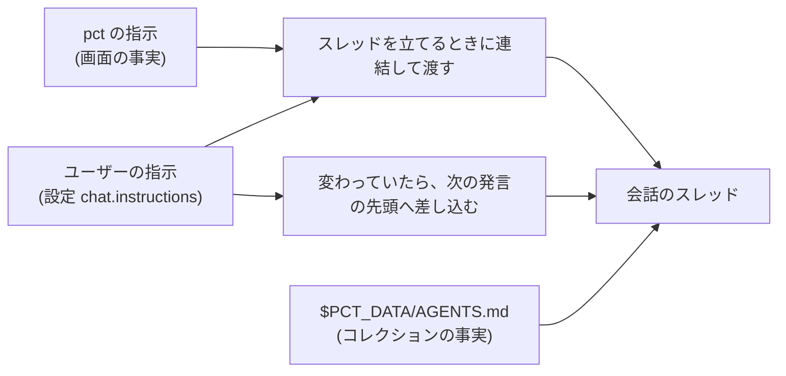

# 会話のエージェントへ渡す指示

- created: 2026-07-31
- status: reviewing
- implementation: not-started

## 解決したい問題

会話のエージェントに、次の 2 つが届くようにする。

- **pct の画面の事実。** 図をどう指せば画面に図として出るか。応答が markdown として記録に残ること。
- **ユーザーが決めた応答の仕方。** 口調、使う言語、答えの長さや形。

いまはどちらも届く先が無い。
前者はエージェントが知らないまま推測で書き、後者はユーザーが毎回発言の中で言い直すしかない。

**変えた指示は、続いている会話にも効く。**
会話は数日にわたることがあるので、設定を変えたのに古い指示のまま応答が返り続ける形にはしない。

## 問題の背景

会話のスレッドを立てるとき、pct が Codex へ渡しているのは作業ディレクトリ・サンドボックス・モデル・MCP の口だけである。
指示は渡していない。

そのためエージェントが pct について知る経路は、作業ディレクトリに置いた `$PCT_DATA/AGENTS.md` だけである。
これはコレクションの構造・slug の意味・検索の道具の使い方を書いた文書で(0002、0005)、Codex は作業ディレクトリの文書として読む。

**この文書はコレクションの事実を書く場所である。**
$PCT_DATA を作業ディレクトリにするエージェントなら誰でも読む。
ユーザーが自分で codex を動かした場合も同じものを読む。
そこへ「この形で書いた図だけが画面に出る」と書くと、pct の画面を持たない読み手にとって成り立たない記述になる。
0013 は図の指し方をこの文書に置くと決めたが、置き場所としてはここが噛み合っていない。

取り込みの解決・照合・翻訳・要約に使う裏方のスレッドは、作業ディレクトリが `$PCT_DATA` ではないので AGENTS.md を読まない。
これらは段階ごとに専用の指示を受け取っており、会話とは別の経路で動いている。

## この文書では書かないこと

- 設定欄の作り。入力欄の見た目と保存の操作は実装で決める。
- pct の指示の文面そのものと、指示を差し込むときの言い回し。ここで決めるのは何を含める層かであって、言い回しではない。
- `$PCT_DATA/AGENTS.md` に何を書くか。コレクションの構造の説明は 0013 のままである。

## やらないこと

- **会話ごとの指示を持たせない。** 「この会話だけ英語で答えさせる」という要求は考えられるが、frontmatter に項目が増え、設定との優先順位も決める必要が出る。会話ごとに変えたいことは発言の中で頼めば足りるので、設定を 1 つ持つところから始める。
- **モデルごとに指示を出し分けない。** モデルの違いを吸収する記述をユーザーに書かせる形は、モデルが変わるたびに設定を直させることになる。
- **ユーザーの指示を検証・整形しない。** 受け取った文字列をそのまま渡す。中身の善し悪しは pct が判断できるものではない。
- **裏方のスレッドへは渡さない。** 「短く答えて」のような指示が翻訳や照合に混ざると、記録として残る本文そのものが変わる。

## 概要

会話のスレッドに**指示の層**を 1 つ作る。
スレッドを立てるときに、pct の指示とユーザーの指示を連結して渡す。

図の読み方: 左の 3 つは指示の出所、右は受け取る会話のスレッド、中央はスレッドへ届く 2 つの経路である。
矢印は「この内容がここを通って届く」を表す。
AGENTS.md は作業ディレクトリの文書として Codex が読むので、pct が連結する対象ではない。

決めることは 5 つである。

1. **pct の指示に書くのは pct の画面の事実だけにする。** 図の指し方はここへ移す。コレクションの構造は AGENTS.md に残る。
2. **ユーザーの指示は設定に持つ。** コレクションには置かない。
3. **並びは pct が先、ユーザーが後にする。** ユーザーは自分の指示で pct の決まりを打ち消せる。
4. **指示が変わった会話では、次の発言の入力の先頭に新しい指示を差し込む。** スレッドを立て直さないので、それまでのやりとりも読み込み直しも要らない。
5. **差し込んだ指示は記録に残さない。** markdown に書くのはユーザーが打った本文だけである。

## シナリオ

ユーザーが設定欄に「常体で答える。前置きを書かない」と書いて保存する。

1. 新しい会話を始めると、pct の指示とこの文が連結されてスレッドへ渡る。以後その会話の応答は常体になる。
2. 同じ会話の中で図を尋ねると、エージェントは pct の指示に従って `@<slug>/assets/<名前>` の形で図を指す。画面には図が出る。
3. 昨日から続いている会話を開いて発言を送ると、その入力の先頭に新しい指示が差し込まれる。応答はここから常体になる。画面と markdown に残るのは、ユーザーが打った本文だけである。

## 詳細設計

### 渡す先と形

会話のスレッドを立てるときの指示として渡す。
Codex はこれをスレッドの指示として保持し、以後の要求に載せる。
発言として会話へ混ぜる形は取らない(「代替案」)。

渡す文字列は、pct の指示とユーザーの指示を空行で区切って連結したものである。
ユーザーの指示が空なら pct の指示だけになる。

### pct の指示に書くこと

**pct の画面の事実に限る。**
含めるのは次の範囲である。

- 図の指し方。論文の図は `@<slug>/assets/<名前>`、その会話の添付は `assets/<名前>` で指すと画面に図として出る(0013)。
- 応答が markdown として会話の記録に残ること。

コレクションの構造・slug の意味・検索の道具の使い方は AGENTS.md が持ち、ここには書かない。
同じ内容を 2 か所に置くと、どちらが正か決められなくなる。

境界は「pct の画面を持たない読み手にとって成り立つか」で引く。
成り立つならコレクションの事実なので AGENTS.md、成り立たないなら画面の事実なのでこの指示である。

### ユーザーの指示の置き場所

設定に `chat.instructions` として持つ。
設定はこの PC の設定ファイルにあり、コレクションの中には置かない(0002)。

この選択の帰結として、同じ NAS を別の PC からマウントしても指示は付いてこない。
コレクションは論文と議論の記録であり、応答の口調はそれを読む人の好みである。
人が変われば好みも変わるので、記録と一緒に運ぶものではない。

### 並び

pct の指示を先に、ユーザーの指示を後に置く。

後に置いた文のほうが強く読まれるため、ユーザーは自分の指示で pct の決まりを打ち消せる。
打ち消して失われるのは画面での表示であって、記録が壊れるわけではない。
たとえば「画像を出さない」と書けば図が出なくなるが、それはユーザーが選んだ結果である。

pct の決まりを守らせるために後ろへ置く形は取らない(「代替案」)。
設定欄に書いたことが効かない場面ができると、その欄が何をするものなのか分からなくなる。

### 変えた指示を、続いている会話へ効かせる

スレッドの指示は立てるときに固定される。
Codex がスレッドの設定として後から変えられるのは作業ディレクトリ・モデル・effort・承認の方針などで、指示は含まれない。
つまり指示そのものを差し替える道は、スレッドを立て直すか、会話の中へ入れるかの 2 つしかない。

**次の発言の入力の先頭へ差し込む。**
ユーザーが送った本文の前に、新しい指示と「これは指示の差し替えであること」「これに応答せず、そのまま会話を続けること」を並べて 1 つの入力にする。

立て直す形は取らない(「代替案」)。
立て直すと、それまでのやりとりを新しいスレッドへ渡し直すことになり、会話の前置きが全部作り直しになる。

差し込むのは、その会話に効いている指示と設定の指示が違うときだけである。
毎回の発言に付けると、同じ文が会話の中に積み上がる。

**どの指示が効いているかは state.sqlite に持つ。**
これは markdown に対応物を持たない運用の状態であり、索引と同じく作り直せる(0002)。
会話の記録に持たせない理由は「記録に残さない」に書く。

**コンパクションの後は差し込み直す。**
差し込んだ指示は会話の一部なので、コンパクションで落ちうる。
コンパクションはターンの中の項目として流れてくるので、それを見たら「効いている指示」を忘れ、次の発言でもう一度差し込む。
スレッドを立てるときに渡した指示はこの影響を受けない。会話ではなく指示の層にあるからである。

読み込み直しと分岐では、スレッドを立て直すときに最新の指示を渡すので、差し込みは要らない。

### 記録に残さない

markdown に書くのは、ユーザーが打った本文だけである。
差し込んだ指示は入力にだけ載る。

これは `@slug` の扱いと同じ形である(0006)。
記録に残すのは人が読む形で、エージェントへ渡すときにだけ展開する。

指示が変わった時点を記録に残す必要も無い。
読み込み直しでは、そのときの設定の指示と会話の全文を新しいスレッドへ渡すので、記録から指示の履歴を復元する場面が無い。

### 裏方との切り分け

会話のスレッドにだけ渡す。
取り込みの解決・照合・翻訳・要約のスレッドには渡さない。

これらは段階ごとの専用の指示で動いており、出力はそのままコレクションの markdown になる。
ユーザーの口調の指示がそこへ混ざると、記録として残る本文が変わる。
コレクションは pct の設定に左右されない記録である(0002)。

## 落とし穴

- **効くのは次の発言からである。** 設定を変えた時点では何も起きない。すでに返ってきている応答が変わるわけでもない。
- **エージェントが差し込みに触れることがある。** 応答しないよう書いても、モデルが「指示を確認した」と書き出す可能性は残る。そのときは記録にその一文が残る。
- **指示を何度も変えると、会話の中に差し込みが積み上がる。** 効くのは最後のものだが、前のものも履歴として残り、入力に載り続ける。
- **指示は毎回の要求に載る。** ユーザーが長い指示を書くほど、その会話のすべての要求で入力が増える。上限は設けないので、長さの見合いはユーザーが決める。
- **別の PC には付いてこない。** 同じコレクションをスマートフォンのブラウザや別の PC から開くと、そこには pct の設定が無いので、口調の指示は効かない。
- **AGENTS.md と合わせると指示の層が伸びる。** Codex は作業ディレクトリの文書に予算を持ち、超えると切り詰める。両方を短く保つ必要がある。

## 代替案

- **0013 のまま `$PCT_DATA/AGENTS.md` に図の指し方を書く。** 経路が 1 つで済み、実装も要らない。画面の事実がコレクションの文書に混ざり、pct 以外の読み手にとって成り立たない記述が残る。ユーザーの指示の置き場所にもならないので採らない。
- **ユーザーの指示をコレクションに置く。** 同じ NAS を開けばどの PC でも同じ口調になる。設定はコレクションの中に置かないという 0002 の決定と衝突し、コレクションが読む人の好みを持つことになるので採らない。
- **指示が変わったらスレッドを立て直す。** 指示が会話の外(指示の層)に居続けるので、コンパクションで落ちる心配が無い。それまでのやりとりを新しいスレッドへ渡し直すことになり、会話の前置きが作り直しになる。前置きが変わると、それまで積み上がった入力のキャッシュも外れる。数日続く会話ほど作り直しの量が大きくなるので採らない。
- **指示をターンごとに毎回差し込む。** 効いている指示を覚える必要が無く、コンパクションの後の扱いも要らない。同じ文が会話に積み上がり、毎ターン入力が増えるので採らない。
- **ユーザーの指示を先、pct の指示を後に置く。** pct の決まりが必ず残る。ユーザーが設定欄に書いたことが打ち消される場面ができ、欄の意味が分からなくなるので採らない。
- **会話ごとに指示を持たせる。** 会話ごとに口調を変えられる。frontmatter に項目が増え、設定との優先順位も決める必要が出る。設定を 1 つ持つ形で足りるかを先に見るので、いまは採らない。

メイン案を選ぶ基準は、**それが誰の事実かで置き場所が決まっているか**である。
コレクションの事実はコレクションの文書に、画面の事実は画面が渡す指示に、読む人の好みはその人の設定に置く。
この 3 つが混ざらない形はメイン案だけである。

## セキュリティ・プライバシー

ユーザーの指示はそのまま Codex へ渡る。
設定ファイルはこの PC にあり、コレクションにも索引にも入らない。

指示の中身は pct が解釈しないので、そこに書かれた内容がエージェントの振る舞いを変える。
これはこの機能の目的そのものであり、書く人と読ませる相手が同じ(ユーザー自身)なので、新たに検討することは無い。

## 負荷・コスト

指示は会話のすべての要求の入力に載る。
長さに比例して入力が増え、利用量の制限(0003)に効く。
pct の指示は数行に収める。ユーザーの指示の長さはユーザーが決める。

差し込みが起きるのは、指示を変えた後の 1 回とコンパクションの後の 1 回だけである。
そのぶん会話の履歴が指示の長さだけ伸びる。

差し込む形を選んだのは、会話の前置きを変えないためである。
前置きが変わらなければ、それまでの入力に対する提供側のキャッシュがそのまま効く。
立て直す形では会話の全文を新しい前置きとして送り直すことになり、数日続く会話ほどその量が大きい。

スレッドを立てるときの追加の仕事は、文字列を 1 つ連結することだけである。
発言ごとの追加の仕事は、効いている指示と設定の指示を突き合わせることだけである。
