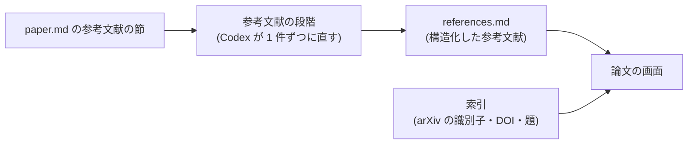

# 論文の参考文献を持つ

- created: 2026-07-31
- status: ready for review
- implementation: not-started

## 解決したい問題

論文の画面から、その論文が引用している論文へ辿れるようにする。

- 参考文献が 1 件ずつ並び、コレクションに取り込み済みのものはその印が付く。
- 取り込み済みなら、その論文の画面へ移れる。移った先から戻れる。
- 取り込んでいないなら、その場で取り込みを積める。

いまの本文では、参考文献は末尾の節に文字として並んでいるだけである。
読んでいる論文が挙げた論文を追うには、題を自分で写して取り込みの欄に貼ることになる。

## 問題の背景

参考文献の節は、変換と照合を経た `paper.md` の末尾にある。
形は論文の出版元ごとに違う。
コレクションの 15 本(719 件)を調べたところ、少なくとも次の 4 つがあった。

| 形 | 例 |
|---|---|
| 著者・年が先 | `Thomas Annen, Jan Kautz, ... 2004. Spherical harmonic gradients ... In *Proc. EGSR*. 331–336.` |
| 番号と姓イニシャル | `1. Bae, J., Kim, S., ...: Per-gaussian embedding-based deformation ... In: ECCV (2024)` |
| 番号と引用符 | `[1] Y. Zhang, L. Wang, ..., "Animecolor: ...," in *Proc. ACM MM*, pp. 6682–6690, 2025.` |
| 番号と URL | `[1] AMD. RDNA performance guide. https://gpuopen.com/..., 2023.` |

節の中には参考文献以外も混ざる。
組版の都合で図の画像とキャプションが同じページに載っていると、変換の結果でも参考文献の間に挟まる。
受理日の行や、ページの端の走り書きが残ることもある。

論文の識別子として pct が持っているのは slug で、これは `<筆頭著者の姓><年>-<題由来の短い語>` である(0002)。
短い語は取り込みのときにエージェントが選ぶ。
同じ論文でも、選ぶ語は入力(URL か題名)と本文の見え方で変わりうる。

## この文書では書かないこと

- 参考文献を並べる画面の見た目。1 件の行の作り、印の形、絞り込みの有無は実装で決める。
- 論文の画面の遷移の履歴をどう保持するか。戻れることだけを決める。
- 引用の網(誰が誰を引いているか)を辿る機能。

## やらないこと

- **参考文献を自動で一括取り込みしない。** 1 本の論文が 100 件以上を挙げることがあり、そのまま積むと GPU と Codex の利用量を使い切る。取り込むかはユーザーが 1 件ずつ決める。
- **被引用(この論文を引いている論文)を追わない。** 外部の索引が要る話で、コレクションの中だけでは決まらない。
- **参考文献の本文を訳さない。** 題は原語のままにする。訳すと突き合わせの鍵が二重になる。
- **取り込み済みの判定を保存しない。** 判定はそのつど索引に問う(「突き合わせ」)。保存すると、後から取り込んだ論文が古い判定に隠れる。

## 概要

参考文献を**構造化されたデータ**として持ち、画面はそれを索引と突き合わせて出す。



図の読み方: 左から右へデータが流れる。
矢印は「この内容がここへ渡る」を表す。
画面は参考文献と索引の両方を見て、取り込み済みかを決める。

決めることは 4 つである。

1. **参考文献を 1 件ずつに直す仕事を、取り込みの段階として足す。** 割るのは機械的にできるが、著者・年・題の取り出しは形ごとに崩れるので Codex に任せる。
2. **結果は `papers/<slug>/references.md` に置く。** 構造化した値を frontmatter が持つ。
3. **取り込み済みの判定は arXiv の識別子・DOI・正規化した題で行う。** slug は使わない。DOI を論文の frontmatter と索引に足す。
4. **画面は参考文献から論文へ移れるようにし、移った先から戻れるようにする。**

## シナリオ

ユーザーが `iwasaki2025-spherical-harmonics-hessian` を開き、末尾の参考文献を見る。

1. 38 件の塊のうち、参考文献である 23 件が並ぶ。図のキャプションや受理日は並ばない。
2. `Belcour et al. 2018, Integrating Clipped Spherical Harmonics Expansions` には取り込み済みの印が付いている。題が `belcour2018-clipped-spherical-harmonics` の題と一致するためである。
3. その行を押すと、belcour2018 の画面へ移る。戻るボタンで iwasaki2025 へ戻る。
4. 別の行(まだ取り込んでいない論文)で取り込みを押すと、その題で取り込みが積まれる。以後の見え方は、取り込みの欄に URL か題名を入れたときと同じである(0004)。

## 詳細設計

### 参考文献の段階

取り込みの段階に `references` を足す。
走るのは **`register` の後**である。

登録の後に置くのは、参考文献の失敗が論文の使用を妨げないようにするためである。
参考文献はその論文を読むための付随物で、本文と訳と索引が揃えば論文は読める。
段階として独立しているので、失敗しても再試行できる(0004)。

入力は `paper.md` の参考文献の節である。
節は見出し(`References` / `参考文献` / `Bibliography`)から次の見出しまでとする。

**1 件ずつに割るところは Codex に任せる。**
測ったところ、空行で区切る機械的な分割は件数としては正しいが、そこから著者・年・題を取り出す規則は形ごとに違う。
著者と年が先に来る形を当てにした取り出しは、719 件のうち 552 件(76.8%)しか読めず、番号と引用符の形・番号と姓イニシャルの形・番号と URL の形の 3 本では 1 件も読めなかった。
形ごとに規則を足す道は、次の形が出るたびに壊れる。

Codex は同じ 4 つの形をいずれも読み、節に混ざった図のキャプションや受理日を落とした。
指示は薄いままでよい。指示を厚くした版も試したが、結果は変わらなかった。

1 本あたり Codex の 1 ターンで、30 秒から 90 秒かかる。

### 参考文献の置き場所

`papers/<slug>/references.md` に置く。
構造化した値を frontmatter が持ち、本文は持たない。

```yaml
---
slug: iwasaki2025-spherical-harmonics-hessian
references:
  - text: 'Laurent Belcour, Guofu Xie, ... 2018. Integrating Clipped Spherical Harmonics Expansions. ACM Trans. Graph. 37, 2, Article 19.'
    title: Integrating Clipped Spherical Harmonics Expansions
    authors: [Laurent Belcour, Guofu Xie, Christophe Hery, Mark Meyer, Wojciech Jarosz, Derek Nowrouzezahrai]
    year: 2018
    arxiv_id: null
    doi: 10.1145/3015459
    kind: paper
---
```

`text` は論文に書かれていたままの 1 件である。
画面に出すのはこれで、構造化した値は突き合わせと取り込みに使う。
同じ内容を 2 か所に持たないために、原文も構造の中に入れる。

`kind` は `paper` と `other` を区別する。
web ページや規格や道具の説明も参考文献として挙がるので、取り込みを勧める相手をここで分ける。

本文を持たないファイルにするのは、これが人に読ませる文章ではなく画面が使うデータだからである。
論文の frontmatter に入れない理由は、121 件を持つ論文があり、本文のメタデータが読めなくなるためである。

### 取り込み済みの判定

判定は索引に問う。鍵は次の 3 つで、この順に見る。

1. **arXiv の識別子。** 一致すれば同じ論文である。
2. **DOI。** 同上。
3. **正規化した題。** 小文字にし、記号と空白を落として比べる。

**slug は使わない。**
slug の「題由来の短い語」は取り込みのときにエージェントが選ぶので、参考文献から同じ語を作り直せる保証が無い。
実際、コレクションの論文は同じ題から `belcour2018-clipped-spherical-harmonics` を得ているが、参考文献の文字列から作れば別の語になりうる。

**DOI を論文の frontmatter と索引に足す。**
いまの frontmatter は `arxiv_id` を持つが DOI は持たない(0002)。
参考文献は DOI を書いていることが多く、arXiv に無い論文(学会誌のみ)では DOI が唯一の確実な鍵になる。
値は取り込みの解決の段階で拾う。無ければ空にする。

題での判定は、同じ題の別論文を取り違えうる。
実用上は年と筆頭著者の姓も併せて見るが、これは実装の細部であって、鍵の優先順位がここでの決定である。

### 画面

論文の画面に参考文献を並べる。
1 件ごとに、原文と、取り込み済みかどうかと、押せる操作を出す。

- 取り込み済み: その論文の画面へ移る。
- 取り込んでいない(`kind` が `paper`): 題で取り込みを積む。積んだ後は取り込みの欄と同じ見え方になる(0004)。
- `other`: 操作を出さない。URL があればリンクにする。

**移った先から戻れるようにする。**
論文から論文へ移ると、どこから来たのかが分からなくなる。
画面は開いた論文の履歴を持ち、戻る操作で 1 つ前の論文に戻る。

## 落とし穴

- **参考文献は本文の質に引きずられる。** 変換と照合を経た文字が元なので、字が潰れていれば題も潰れる。突き合わせが外れる形で出る。
- **題での突き合わせは取り違えうる。** 同じ題の論文が複数あるとき(改訂版と初出など)、どちらか一方に当たる。
- **参考文献の段階は取り込みのたびに Codex を 1 ターン使う。** 100 本取り込めば 100 ターンである。利用量の制限(0003)に響く。
- **既に取り込んだ論文には参考文献が無い。** この段階は取り込みのときに走るので、それより前に入れた論文は空のままである。段階として独立しているので、後から積み直せる。

## 代替案

- **機械的な取り出しだけで済ませる。** Codex を使わないので速く、利用量も増えない。測ったところ 719 件中 552 件しか読めず、3 本の論文では 1 件も読めなかった。形ごとに規則を足す道は、次の形が出るたびに壊れるので採らない。
- **照合のプロンプトに参考文献の整理を混ぜる。** 段階が増えない。照合はページ単位で走り、参考文献はページをまたぐので、1 件が分断される。ページごとの結果を後で繋ぐ処理が要り、かえって複雑になるので採らない。
- **参考文献を `paper.md` の frontmatter に入れる。** ファイルが増えない。121 件を持つ論文があり、本文のメタデータが埋もれる。frontmatter は人が読んで直せる場所である(0002)という位置づけとも合わないので採らない。
- **突き合わせに slug を使う。** 索引を引くのが 1 回で済む。slug の短い語は取り込み時にエージェントが選ぶので、参考文献から作り直した slug は一致しない。実験で確かめた事実であり、採らない。
- **画面を開くたびに参考文献を取り出す。** 保存する場所が要らない。開くたびに Codex を 1 ターン使うことになり、待ち時間も利用量も見合わないので採らない。
- **取り込み済みかを `references.md` に書き込む。** 画面が索引を引かずに済む。後から取り込んだ論文が古い判定に隠れるので採らない。

メイン案を選ぶ基準は、**形式の違いに強いこと**と、**判定が常に最新であること**である。
形式の違いは Codex に吸収させ、取り込み済みかの判定は保存せずにそのつど索引へ問う。

## セキュリティ・プライバシー

参考文献の段階が読むのはコレクションの中の `paper.md` だけで、外へ出る要求は無い。
参考文献から取り込みを積むと外部への取得が起きるが、これは取り込みの欄から積むのと同じ経路である(0004)。

## 負荷・コスト

取り込み 1 本につき Codex の 1 ターンが増える。
入力は参考文献の節だけで、実測で 30 秒から 90 秒である。
`register` の後に走るので、論文が読めるようになる時刻は変わらない。

`references.md` は 1 本あたり数十 KB になる。
論文 1 本が数 MB から数十 MB(0002)なので、コレクションの大きさには効かない。

画面を開くたびに索引を引く回数が、参考文献の件数だけ増える。
索引はローカルの SQLite で、題の正規化した形に索引を張れば、100 件でも一度に引ける。
