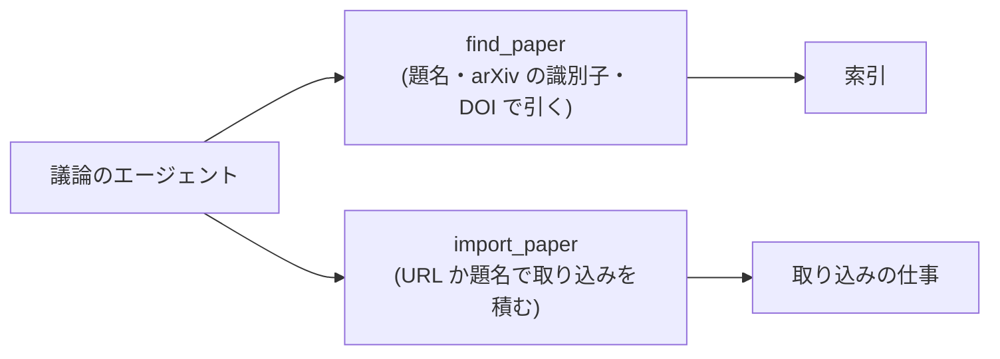

# チャットからの取り込み

- created: 2026-07-31
- status: reviewing
- implementation: not-started

## 解決したい問題

議論の中で出てきた論文を、その場で取り込めるようにする。

エージェントは web を検索して、コレクションに無い論文を挙げることがある。
いまはそれを取り込むために、ユーザーが題名か URL を写して論文の欄へ貼ることになる。
「その論文も取り込んで」と頼めば取り込みが始まる形にする。

あわせて、エージェントが「それは既にコレクションにある」と言えるようにする。
いまエージェントが持っているのは本文の検索だけで、題名から 1 本を引く道具が無い。

## 問題の背景

エージェントがコレクションに触れる口は MCP で、出しているのは 2 つの道具である(0005)。

- `search_papers` — 語句と条件で論文を探す。返るのはファイルの場所と抜粋で、本文は返らない。
- `list_tags` — 付いているタグと件数を返す。

**どちらも読むだけの道具である。**
エージェントがコレクションを変える道は、いまのところ無い。

pct は自分が立てた MCP のサーバーからの要求を自動で受け入れる(0003 の承認の扱い)。
道具を呼んでよいかをユーザーに尋ねることはない。
読むだけの道具しか無いので、これで困らなかった。

取り込みは URL か題名を受けて仕事を積む形になっている(0004)。
積むところまでは即座に終わり、解決も取得もその後の仕事として進む。

## この文書では書かないこと

- 道具の名前と引数の細かい形。MCP の道具の定義は実装で決める。
- エージェントが取り込みを提案する言い回し。
- 取り込みの進み方。積んだ後の段階は 0004 のままである。

## やらないこと

- **読む以外に変えられるものを、取り込み以外に増やさない。** 削除・アーカイブ・タグの変更・設定の変更はエージェントに渡さない。これらは取り消せないか、ユーザーの整理の意図そのものである(0002、0006)。
- **取り込みの完了を待たない。** 道具は積んだところで返る。完了まで待つと、会話が数分止まる。
- **エージェントに一括の取り込みをさせない。** 1 回の呼びで 1 本だけ積む。参考文献を全部入れるような使い方は、ユーザーが画面から行う(0015)。
- **取り込みの承認をユーザーに尋ねない。** 尋ねる形は「取り込んで」と頼んだ直後にもう一度確認することになる。代わりに、積んだ取り込みは必ずジョブの一覧に出て、取り消せる(0004)。

## 概要

MCP に**状態を変える道具を 1 つだけ**足す。
あわせて、題名から 1 本を引く読む道具を足す。

図の読み方: 矢印は「呼ぶ」を表す。
`find_paper` は索引を読むだけで、`import_paper` は仕事を積む。

決めることは 3 つである。

1. **`import_paper` は取り込みを積むだけにする。** 完了は待たず、積んだことと、それが新しい取り込みか既にあるものかを返す。
2. **`find_paper` を足す。** 題名・arXiv の識別子・DOI のいずれかで 1 本を引く。エージェントが「既にある」と言えるようにするための道具である。
3. **変えられるのは取り込みだけにする。** 消す・整理する・設定を変える道具は出さない。

## シナリオ

ユーザーが「この分野で最近出た論文を教えて」と尋ね、エージェントが web を検索して 3 本を挙げる。

1. エージェントは挙げる前に `find_paper` で 3 本を引き、1 本は既にコレクションにあると分かる。応答ではその 1 本に slug を添える。
2. ユーザーが「2 番目のを取り込んで」と頼む。
3. エージェントが `import_paper` を題名で呼ぶ。道具は仕事を積んで即座に返る。
4. エージェントは「取り込みを始めた」と答える。ユーザーの画面ではジョブの欄に取り込みが現れ、そのまま段階が進む。
5. 取得できる原本が無ければ、取り込みは失敗として一覧に残る(0004)。会話の中では分からないので、ユーザーが画面で気づく。

## 詳細設計

### `import_paper`

引数は URL か題名の文字列 1 つである。
これは論文の欄に入れるものと同じで、解決の仕事がどちらかを判断する(0004)。

返すのは次の 2 つのどちらかである。

- **積んだ。** これから解決が走る。slug はまだ決まっていない。
- **既にある。** その論文の slug を返す。

slug を返せないのは、解決が終わるまで論文が何かが決まらないためである。
エージェントには「積んだ」ことだけを伝え、結果を会話の中で待たせない。

1 回の呼びで 1 本だけ積む。
複数を渡せる形にしないのは、エージェントが会話の流れで大量に積むのを防ぐためである。
ユーザーが 10 本まとめて頼めば、エージェントは 10 回呼ぶことになるが、そのときは 10 本がジョブの一覧に並ぶので見て取り消せる。

### `find_paper`

引数は題名・arXiv の識別子・DOI のいずれかである。
返すのは 1 本の slug と題、または「無い」である。

`search_papers` があるのに足すのは、目的が違うからである。
`search_papers` は語句から関連する論文を探す道具で、本文の一部が返る。
`find_paper` は「この論文がコレクションにあるか」を確かめる道具で、当たったか外れたかだけが要る。
関連の強い別の論文が返ってくると、エージェントは「ある」と誤って答える。

突き合わせの鍵は 0015 と同じで、arXiv の識別子・DOI・正規化した題の順に見る。

### 承認の扱い

pct は自分の MCP のサーバーからの要求を自動で受け入れる(0003)。
`import_paper` もその扱いのままにする。

取り込みは取り消せる操作である。
積んだ仕事はジョブの一覧に出て、そこから取り消せる。取り込み済みの論文も削除できる(0002)。
取り消せる操作のために、頼んだ直後の確認を挟まない。

**取り消せない操作は道具にしない。** これがこの文書の線引きである。
削除・アーカイブ・設定の変更を出さないのはこの理由による。

## 落とし穴

- **エージェントは取り込みの結果を知らない。** 積んだ後の失敗は会話に返らない。ユーザーが画面で気づくことになる。会話の中で結果まで見せるには、道具が完了を待つか、取り込みの終わりを会話へ通知する仕組みが要る。どちらも会話の流れを壊すので、いまは取らない。
- **エージェントが同じ論文を何度も積みうる。** 解決の前に分かる重複は断られるが(0004)、題名が少し違えば別の取り込みとして積まれる。解決の後に重複と分かれば、そこで止まる。
- **`find_paper` は題の揺れに弱い。** エージェントが web から拾った題と、コレクションに入っている題が少し違えば「無い」と答える。arXiv の識別子か DOI があればそちらが当たる。

## 代替案

- **道具を足さず、会話の中で pct が「取り込んで」を読み取る。** MCP を広げずに済む。応答の文面から意図を読み取る処理を pct 側に持つことになり、言い回しの違いで動いたり動かなかったりする。エージェントに道具として渡すほうが確実なので採らない。
- **`import_paper` が取り込みの完了まで待つ。** エージェントが結果を会話で伝えられる。1 本の取り込みは変換と照合と翻訳で数分から数十分かかり、その間ターンが終わらない。会話が使えなくなるので採らない。
- **取り込みのたびにユーザーへ確認を求める。** 暴走を止められる。「取り込んで」と頼んだ直後に確認を出すことになり、頼んだ本人の操作が二度になる。取り消せる操作なので採らない。
- **`search_papers` に「完全一致で引く」条件を足して `find_paper` を作らない。** 道具が増えない。1 つの道具が「関連を探す」と「あるかを確かめる」の 2 つの意味を持ち、エージェントがどちらの使い方をしているかで結果の読み方が変わるので採らない。
- **削除やタグの変更も道具にする。** 会話だけでコレクションを整理できる。取り消せない操作と、ユーザーの整理の意図そのものを渡すことになるので採らない。

メイン案を選ぶ基準は、**取り消せる操作だけをエージェントに渡すこと**である。
取り込みは取り消せる。消すことと整理することは取り消せないか、ユーザーの意図そのものである。

## セキュリティ・プライバシー

`import_paper` は外部への取得を起こす。
起点はユーザーの依頼だが、実際に何を取りに行くかを決めるのはエージェントである。
取りに行く先は解決の仕事が扱い、これは論文の欄から積んだときと同じ経路である(0004)。

MCP の口はループバックで待ち受け、pct が立てたスレッドからのみ繋がる(0005、0007)。
他のエージェントがこの道具を呼べる状態にはならない。

## 負荷・コスト

`find_paper` は索引を 1 回引くだけで、`search_papers` より軽い(埋め込みを作らない)。

`import_paper` は仕事を積むだけで、その場では何もしない。
積まれた取り込みは、論文の欄から積んだものと同じ資源を使う(0004、0003)。
エージェントが呼ぶぶんだけ GPU と Codex の利用量が増えるが、1 回の呼びで 1 本なので、会話の中で急に増えることはない。
