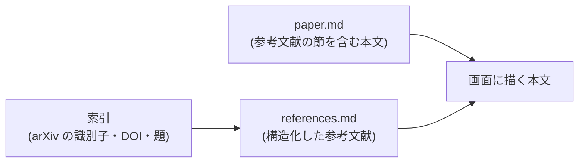

# 参考文献を本文の中で辿る

- created: 2026-07-31
- status: approved
- implementation: done (2026-07-31)

## 解決したい問題

本文を読んでいる流れのまま、引用された論文へ移り、まだ持っていない論文をその場で取り込めるようにする。

論文を読んでいて引用が気になるのは、本文のその行を読んでいる最中である。
いまは参考文献を辿るために別の欄へ移ることになり、本文のどこを読んでいたかを自分で覚えておくことになる。

## 問題の背景

参考文献は 2 つの形でコレクションの中にある。

1. `paper.md` の末尾の節。変換と照合を経た文字がそのまま並ぶ。
2. `papers/<slug>/references.md`。取り込みの `references` の段階が、その節を Codex に渡して 1 件ずつに直したもので、原文・題・著者・年・arXiv の識別子・DOI・種別を持つ(0015)。

画面は 2 を独立した欄で見せている。
1 件ずつに印が付き、取り込み済みならその論文へ移れ、まだなら取り込みを積める。
本文の欄と参考文献の欄は排他で、本文を読みながら参考文献を辿ることはできない。

本文の側にも参考文献への導線がある。
本文中の `[Belcour et al. 2018]` のような引用は、参考文献の節の**先頭**へのリンクになっている。
飛び先を個々の文献にしていないのは、変換器が返す参考文献が 1 項目ずつに分かれているとは限らず、実測では 100 件近い文献が 3 つの塊になっていたためである。
節の先頭へ着いた後は、読者が目で目的の文献を探すことになる。

`references` の段階は `register` の後に走る。
この順にしたのは、参考文献の失敗が論文の使用を妨げないようにするためだった(0015)。
その結果、取り込みが終わっているのに参考文献を持たない論文が、正常な状態として存在する。

## この文書では書かないこと

- 参考文献 1 件の行の見た目(印の形、操作の並び)。
- 引用の文字列と個々の文献の対応付け。
- 参考文献を 1 件ずつに直す指示と、その結果の形(0015 のまま)。

## やらないこと

- **`paper.md` を書き換えない。** 参考文献の節を構造化した内容で置き換えると、変換と照合を経た原文が失われる。`paper.md` は人が読んで直せる記録であり、画面のためのデータではない(0002)。
- **本文の引用そのものを個々の文献へのリンクにしない。** 引用の書き方は形式ごとに違い(番号・著者と年・記号)、文字列から文献を一意に決められない。当たらない引用が混じるより、節へ送って一覧から選ばせるほうが確実である。対応付けの精度を測れる形になれば再検討しうる。
- **参考文献を一括で取り込まない**(0015 のまま)。1 本が 100 件以上を挙げることがあり、取り込むかはユーザーが 1 件ずつ決める。

## 概要

**本文の参考文献の節の中身を、構造化した参考文献の一覧に、表示のときだけ差し替える。**
ファイルは書き替えない。
差し替えるのは節の中身だけで、見出しは本文のものを残す。

これにより、本文を下まで読んでいくと参考文献がそのまま操作できる一覧になっている。
引用のリンクで節へ飛んだ先も同じ一覧なので、飛んで選んで移る、が 1 つの流れになる。
参考文献の独立した欄は持たない。

図の読み方: 矢印は「この内容がここへ渡る」を表す。
画面は本文とその論文の参考文献を受け取り、本文の参考文献の節の位置に参考文献を描く。
参考文献に付く取り込み済みの印は、索引と突き合わせて決まる(0015)。

あわせて、**`references` の段階を `register` の前へ移す**。
取り込みが終わった論文は参考文献を持っている状態にして、本文の中の導線が常にある状態にする。

## シナリオ

ユーザーが `iwasaki2025-spherical-harmonics-hessian` を開き、本文を読む。

1. 本文中の `[Belcour et al. 2018]` を押すと参考文献の節へ移る。
2. 節には 23 件が 1 件ずつ並び、`Belcour et al. 2018, Integrating Clipped Spherical Harmonics Expansions` には取り込み済みの印が付いている。
3. その行を押すと belcour2018 の画面へ移り、戻る操作で iwasaki2025 へ戻る。
4. 別の行(まだ取り込んでいない論文)で取り込みを押すと、その題で取り込みが積まれる。
5. 和訳に切り替えても、参考文献の節は同じ一覧である。並ぶ文字は原語のままである。

## 詳細設計

### 差し替えの単位と条件

差し替えるのは、参考文献の節の**中身**である。
見出し(`References` / `参考文献` / `Bibliography` など)は本文のものをそのまま出し、その下から次の見出しまでを一覧に置き換える。
見出しを残すのは、本文の引用のリンクの飛び先が節の先頭であり、そこに何の節かが見えている必要があるためである。

差し替えるのは次の条件がすべて成り立つときに限る。

- その論文の `references.md` があり、1 件以上を持つ。
- 本文に参考文献の節がある。

どちらかが欠けるときは本文をそのまま出す。
参考文献をまだ持たない論文で節が消えると、読める内容が減るだけになる。

**英語の本文と和訳のどちらでも差し替える。**
和訳の参考文献の節も、原文と同じ位置に同じ一覧が出る。
並べる文字は `references.md` が持つ原文で、訳さない(0015)。
参考文献の題は突き合わせの鍵であり、訳すと鍵が二重になる。

### 差し替えを行う側

差し替えは**画面側**で行う。
サーバーは `paper.md` をそのまま返し、参考文献は別の口で返す(0015)。

本文の引用を節へのリンクにする処理が既に画面側にあり、参考文献の節を見つける仕事はそこと同じである。
サーバーが差し替えた本文を返す形にすると、`paper.md` の内容と画面が受け取る内容が食い違い、本文を返す口が「ファイルの中身」と「画面用の本文」の 2 つの意味を持つ。

### 参考文献の欄を持たない

参考文献の独立した欄は無くす。
本文の中に同じ一覧が出るので、欄を残すと同じものが 2 か所にある状態になり、どちらを見るべきかが決まらない。

参考文献をまだ持たない論文で参考文献の整理を積む操作は、本文の参考文献の節から行う。

### 参考文献の段階を登録の前へ移す

`references` は `register` の前に走る。
取り込みの段階は `resolve` → `fetch` → `convert` → `verify` → `translate` → `references` → `register` の順になる。

**この並びにする根拠は、Codex を使う段階が既に `register` の前にあることである。**
照合(`verify`)と翻訳(`translate`)は Codex の応答を待つ段階で、どちらも `register` より前にある。
Codex が使えない間(週次の制限に達している間、app-server が落ちている間)は、参考文献をどこに置こうと取り込みは登録まで到達しない。
参考文献を前に置くことで新しく生じる「読めない状態」は無い。

残るのは参考文献の段階そのものが失敗する場合だが、これは実測で 22 回中 0 回である(コレクションの 15 本、開発用の 3 本、指示を比べた実験の 4 本)。
参考文献の節を渡して 1 件ずつに直すだけの、道具を使わない 1 ターンであり、失敗の形は応答が JSON として読めないことに限られる。
段階は独立していて積み直せる(0004)ので、失敗しても取り込みの最初からやり直すことにはならない。

取り込みが終わった論文が参考文献を持っている状態になることで、本文の中の導線が「ある論文と無い論文」に分かれなくなる。

## 落とし穴

- **参考文献の節が見つからない論文では差し替えが起きない。** 節の見出しが変換で崩れている論文では、本文の節も `references.md` も同じ理由で空になる。画面には本文の文字がそのまま並ぶ。
- **参考文献の段階の失敗が登録を止める。** 失敗した取り込みは仕事の一覧に残り、そこから積み直せる。積み直すまで、その論文は検索にも一覧にも出ない。
- **参考文献は本文の質に引きずられる**(0015)。字が潰れていれば題も潰れ、取り込み済みの印が外れる形で出る。
- **本文の引用から個々の文献へは飛べない。** 節の先頭までしか送れないので、件数の多い論文では読者が一覧から目で探すことになる。

## 代替案

- **取り込みのときに `paper.md` の参考文献の節を構造化した内容で書き換える。** 画面は本文をそのまま描くだけでよくなる。変換と照合を経た原文が失われ、`paper.md` が人の読む記録ではなく画面用のデータになるので採らない。
- **参考文献の欄を残し、本文の節からその欄へ飛ばす。** 変更が小さく、いまの見た目を保てる。読んでいる位置を失わずに辿るという目的を満たさないので採らない。
- **`references` を `register` の後に置いたまま、参考文献がまだ無い論文では本文の節をそのまま出す。** 登録が 45 秒から 5 分早く、参考文献の失敗が論文の使用を妨げない。参考文献を持たない論文が正常な状態として存在し続け、本文の中の導線がある論文と無い論文に分かれるので採らない。
- **本文の引用の文字列を、個々の文献へのリンクにする。** 読んでいる行から目的の文献へ直接飛べる。引用の書き方が形式ごとに違い、文字列から文献を一意に決められないので採らない。

メイン案を選ぶ基準は、**読んでいる位置を失わずに辿れること**と、**記録としての `paper.md` を変えないこと**である。
本文の中に一覧を出すことで前者を満たし、差し替えを表示のときだけに限ることで後者を満たす。

## セキュリティ・プライバシー

差し替えは画面の中で完結し、外へ出る要求は増えない。
参考文献から取り込みを積む経路は 0015 のままで、取り込みの欄から積むのと同じである。

## 負荷・コスト

画面が論文を開くたびに参考文献を 1 回引く(0015 のまま)。
引く先はローカルの索引で、参考文献の件数だけ突き合わせが走る。

段階の並べ替えで、論文が読めるようになる時刻が参考文献の段階のぶんだけ遅れる。
コレクションの 15 本の実測では、参考文献の段階まで含めた取り込み 1 本が 3.5 分から 14 分(中央値 8.8 分)で、そのうち参考文献の段階は 45 秒から 5 分(中央値 100 秒)を占める。
遅れは中央値で 2 割ほどで、参考文献の多い論文(119 件)では 6 割になる。
Codex の利用量は変わらない(走る回数が同じで、順序だけが変わる)。
