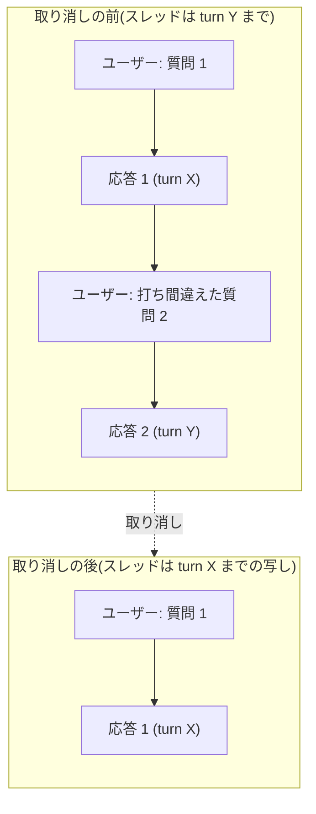

# 直前のやりとりの取り消し

- created: 2026-07-31
- status: reviewing
- implementation: not-started

## 解決したい問題

打ち間違えた直前の発言を、会話を増やさずに取り消して、書き直して送り直せるようにする。

送った直後に打ち間違いに気づくことがある。
いまは打ち直すために会話を分岐し、元の会話をアーカイブすることになる。
残るのは打ち間違いを含む会話とその分岐の 2 つで、どちらも消えない。

## 問題の背景

会話は `chats/YYYY/MM/DD/<id>/chat.md` に、発言を上から順に並べた markdown として残る(0002、0013)。
応答の発言には、その応答で完了した Codex の turn の識別子が付く(0012)。

分岐はこの識別子を使う。
選んだ発言が属する turn の 1 つ前までを引き継ぎ、**新しい会話**として別のディレクトリに書く。
Codex 側は `thread/fork` に引き継ぐ範囲の末尾の turn を渡して写す。
スレッドが Codex 側に残っていないとき(保存領域の掃除やマシンの入れ替えで失われたとき)は写せないので、引き継ぐ範囲の記録から新しいスレッドを立て直す(0012)。

分岐が新しい会話を作るのは、**分かれた先の議論を両方とも残すため**である。
別の筋を試したいときに元の会話が消えては困る。
打ち間違いの打ち直しにこれを使うと、残したくない側まで残る。

## この文書では書かないこと

- 取り消しの操作の見た目(ボタンの位置、確認の出し方)。
- 分岐の仕組みそのもの(0012 のまま)。

## やらないこと

- **何往復も遡らない。** 取り消せるのは末尾の 1 往復だけである。それ以上戻りたいときは分岐を使う。何往復でも遡れるようにすると、どこまで戻ったかを画面で見せる必要が出て、分岐と役割が重なる。
- **発言の編集にしない。** 記録の書き換えと送り直しを 1 つの操作にすると、取り消してから書き直さずにやめる、という使い方ができなくなる。
- **消した応答を復元できるようにしない。** 取り消した応答を残す場所を持つと、記録が「見えている会話」と「見えていない会話」の 2 層になる。

## 概要

**同じ会話のまま、記録の末尾の 1 往復を落とし、スレッドを 1 つ前の turn まで巻き戻す。**
会話の識別子もファイルの場所も変わらない。

図の読み方: 四角は会話の記録に並ぶ発言で、実線の矢印は記録の並び順(上から下)を表す。
点線の矢印は、取り消しによって記録全体がこの状態へ移ることを表す。

落とした発言の本文は入力欄へ戻る。
ユーザーはそれを直して送り直せる。
取り消した応答は失われる。

## シナリオ

ユーザーが `@iwasaki2025-spherical-harmonics-hessian` について尋ね、応答を読む。
続けて質問を送った直後に、題名を打ち間違えていたことに気づく。

1. 取り消しを押す。会話の末尾から、打ち間違えた発言とそれに続く応答が消える。
2. 打ち間違えた本文が入力欄に戻っている。ユーザーは題名を直して送る。
3. 応答は 1 つ前のやりとりまでを踏まえて返る。打ち間違えた発言は踏まえない。
4. 会話の一覧に増えたものは無い。記録には打ち間違いが残っていない。

## 詳細設計

### 記録から落とす範囲

落とすのは、記録の末尾にある**ユーザーの発言 1 つと、それに続く応答**である。
turn の境界は応答の側に付いた識別子で決まるので、落とす範囲は「最後の応答」と「その応答が答えているユーザーの発言」になる。

落とした後の記録は、その 1 つ前の応答で終わる。
会話のメタデータのうち、識別子・作成日時・分岐元は変わらない。

### スレッドの巻き戻し

Codex のスレッドは、残る記録の末尾の応答が持つ turn の識別子までを写したものに差し替える。
写しは `thread/fork` で作り、会話が指すスレッドをその写しに付け替える。
元のスレッドは Codex 側に残るが、会話からは指さなくなる。

**写せない場合は、残る記録から新しいスレッドを立て直す。**
写せないのは、残る記録に turn の識別子が無いとき(取り消しで会話の最初の 1 往復が消えるとき)と、スレッドが Codex 側に残っていないときである。
立て直しは分岐と同じ形で、残る発言を 1 つの入力にまとめて渡す(0012)。
このとき中間状態(道具の呼び出しの記録など)は引き継がれない。

指示の層は写しにそのまま引き継ぐ(0014)。

### いつ取り消せるか

取り消せるのは次を満たすときだけである。

- 記録の末尾が応答である。
- その会話で応答が走っていない。

応答の生成中に取り消せるようにすると、書き込みの途中の記録に対して落とす範囲を決めることになる。
生成を止めたいときは、いまと同じく応答が終わるのを待つ。

### 戻るものと戻らないもの

落としたユーザーの発言の本文は入力欄へ戻す。
打ち間違いを直して送り直すのが目的なので、本文を打ち直させない。

添付した画像の実体は消さない。
添付の名前は内容から決まるので(0013)、同じ画像を付け直せば同じ実体を指す。
どの発言からも参照されなくなった実体は残るが、会話のディレクトリの中に留まり、他の会話には影響しない。

**取り消した応答は失われる。**
確認は挟まない。
消える範囲が末尾の 1 往復に限られ、ユーザーが送った本文はその場で入力欄に戻るので、取り消しは打ち間違いに気づいた直後の 1 操作で完結すべきものである。

### 分岐との見せ方の違い

取り消しは会話を分けないので、分岐元(`forkedFrom`)を持たない。
会話の一覧に現れる会話の数も変わらない。

## 落とし穴

- **取り消した応答は戻らない。** 長い応答を取り消してから、やはり読みたくなっても復元できない。
- **写せないときは中間状態が落ちる。** スレッドが残っていない会話で取り消すと、残る記録から立て直すことになり、道具の呼び出しの記録などは引き継がれない(0012 と同じ)。
- **元のスレッドが Codex 側に残る。** 会話からは指さなくなるが、保存領域には残る。分岐でも同じことが起きる。
- **1 往復より前の打ち間違いには使えない。** 気づくのが遅れたときは分岐で対処することになる。

## 代替案

- **分岐で作り、元の会話をアーカイブする。** いまの仕組みだけで足りる。打ち間違えるたびに会話が増え、アーカイブの操作も要るので採らない。
- **記録だけ落とし、スレッドはそのままにする。** Codex への呼び出しが要らず、実装が最小になる。Codex 側は打ち間違えた発言を覚えたままなので、次の応答が記録に無い発言を踏まえる。記録と応答の食い違いは追跡できない形の不具合になるので採らない。
- **何往復でも遡れるようにする。** 打ち間違い以外(議論の筋を戻したいとき)にも使える。どこまで戻ったかを見せる必要があり、分岐と役割が重なるので採らない。会話を残さずに戻りたい要求が繰り返し出るなら再検討しうる。
- **発言の編集にする。** 打ち直しが 1 操作で済む。記録の書き換えと送り直しが同時に起き、取り消してやめるという使い方ができない。取り消しが入った後で、その上に足せる形なので今は採らない。

メイン案を選ぶ基準は、**打ち間違いの跡を残さないこと**と、**記録とスレッドが食い違わないこと**である。
同じ会話の中で末尾を落とすことで前者を満たし、記録とスレッドを同じ turn まで同時に戻すことで後者を満たす。

## セキュリティ・プライバシー

取り消しはローカルの記録と Codex のスレッドだけを操作する。
外部へ新しく送る内容は無い。

## 負荷・コスト

写せる経路では Codex への呼び出しが 1 回増えるだけで、ターンは使わない。
立て直しの経路では 1 ターンを使う(分岐と同じ)。

記録の書き換えは 1 ファイルで、会話の索引はそのファイルを読み直す(0006)。
落とした発言は索引からも消える。
