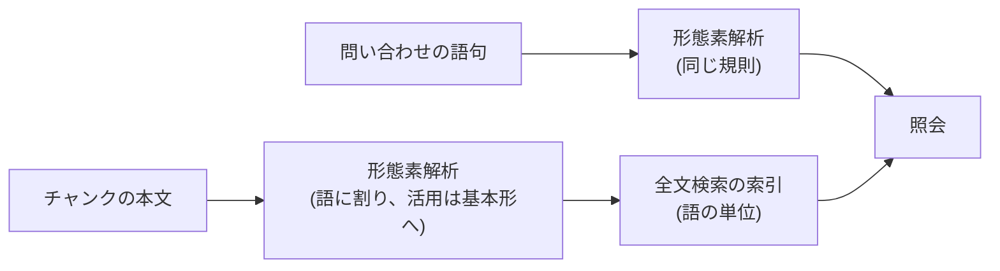

# 全文検索の索引を語の単位にする

- created: 2026-07-31
- status: approved
- implementation: done (2026-07-31)

## 解決したい問題

日本語の短い語で本文を探せるようにし、語の途中に当たる誤ヒットをなくす。

いま「照明」「光源」「影」で探すと、全文検索は 1 件も返さない。
コレクションの本文には「照明」が 110 チャンク、「ノイズ」が 60 チャンクに出てくるのにである。
英語も、`art` と打つと `\partial` の一部に当たる。

## 問題の背景

論文の検索は 3 つの経路でできている(0005)。
著者・学会名・出版年・タグの**構造化条件**が候補の集合を決め、その中で**全文検索**と**ベクトル検索**が順位を出し、順位の逆数で融合する。
語句を打つたびに全文検索とベクトル検索の両方が走るので、全文検索は検索の半分を担っている。

全文検索の索引は **3 文字の並び**を単位にしている。
日本語は空白で語が区切られないため、空白を区切りとする索引では和訳の本文もタイトルの日本語も検索できない。
3 文字の並びを索引にすれば語の切り出しが要らず、切り方を外して取りこぼすこともない。
これが 0005 で 3 文字単位を選んだ理由である。

その代償が、いま出ている 2 つの形である。

- **3 文字に満たない語を引けない。** 索引の単位が 3 文字なので、2 文字の語は照会そのものが成り立たない。日本語の技術用語は 2 文字が多い(照明・光源・反射・分散・誤差・経路)。
- **語の切れ目を無視して当たる。** 3 文字の並びが一致すれば当たるので、`art` は `\partial` の中に当たる。当たった分は全文検索の上位 100 件の枠を占め、融合後の順位に混ざる。

検索結果が空になるわけではない。
ベクトル検索は動くので、「照明」でも意味の近いチャンクは返る。
落ちているのは、その語がそこに書いてあるという確実な当たりが順位を押し上げる働きである。

## この文書では書かないこと

- チャンクの切り方(0005 のまま)。
- ベクトル検索と融合の仕組み(0005 のまま)。
- 検索の画面の見た目。

## やらないこと

- **英語の語幹をまとめない。** `rendering` と `render` を同じ語として扱う処理は入れない。語形の違いはベクトル検索が吸収する。
- **同義語の辞書を持たない。** 「レンダリング」と `rendering` を結ぶような対応表は持たない。これもベクトル検索の担当である。
- **3 文字単位の索引を残して併用しない。** 索引を 2 つ持つと、同じ語句に対して 3 つの経路が順位を出すことになり、融合の重みが決めにくくなる。取りこぼしが問題になったときに再検討する。

## 概要

**全文検索の索引を、3 文字の並びから語の単位へ変える。**
本文を分かち書きしてから索引に入れ、問い合わせも同じ分割を通す。

図の読み方: 矢印は「この内容がここへ渡る」を表す。
索引を作るときと問い合わせるときに同じ解析を通すことで、両側の語の切れ目と語形が揃う。

分かち書きには**辞書を持つ形態素解析器(kuromoji.js と IPADIC)**を使い、活用する語は基本形に直して索引に入れる。
表示する本文と抜粋は元の文字のままで、分かち書きした語列は索引にだけ入る。
会話の検索も同じ索引の形を使っているので、同じように変える。

実測では、2 文字の語(照明・光源・影)が引けるようになり、`art` は語としての `art` にだけ当たる。
索引は 11.2 MB から 2.1 MB に減る。

## シナリオ

ユーザーが和訳を読みながら、照明の扱いを比べたくなる。

1. 検索の欄に「照明」と打つ。
2. 全文検索は「照明」を語として持つチャンクを返す。いまは 1 件も返らない。
3. ベクトル検索の結果と融合され、その語が書かれている論文が上位に来る。
4. `art` と打ったときは、`\partial` の中ではなく `state of the art` に当たる。
5. 「散乱する」と打つと、「散乱した」と書かれた箇所にも当たる。どちらも `散乱 / する` に直るためである。

## 詳細設計

### 索引に入れるもの

全文検索の索引には**分かち書きした語列**を入れる。
チャンクの本文そのものは、これまでどおり別に持つ(表示と抜粋はこちらを使う)。

索引と本文が別の文字列になるので、索引が当てた位置から本文の位置を割り出すことはできない。
いまも抜粋はチャンクの先頭から作っており(0005)、当たった位置を使っていないので、これで困らない。

### 使う解析器と辞書

**kuromoji.js(0.1.x)を使い、辞書は同梱の mecab-ipadic 2.7.0-20070801(IPADIC)とする。**

- **純粋な JavaScript で動く。** ビルドの手順や native の依存が要らず、`pnpm install` だけで揃う。pct は Node の標準の SQLite を使うなど、native の追加を避ける作りにしてある。
- **辞書を同梱している。** 別に落として置く手順が要らない。辞書の実体は 17 MB、パッケージ全体で 40 MB である。
- **ライセンスが両立する。** kuromoji.js は Apache-2.0、IPADIC は再配布を許す BSD 系である。

辞書は 2007 年で更新が止まっている。
近年の術語は要素に割れるが、問い合わせ側も同じ辞書で割るので当たらなくなるわけではない(「落とし穴」)。
分野の語を 1 語として扱いたくなったときは、辞書を差し替えるか利用者の辞書を足すことになる。
これは**いまはやらない**。まず標準の辞書で使い、取りこぼしが見えてから決める。

### 分かち書き

辞書は語の切れ目だけでなく品詞と基本形を返すので、次の 2 つが得られる。

- **活用する語を基本形に直せる。** 「散乱した」は `散乱 / する / た`、「積分される」は `積分 / する / れる` に直る。問い合わせ側も同じ解析を通すので、「散乱する」で打った語が「散乱した」と書かれた箇所に当たる。
- **固有名詞がまとまる。** 「埼玉大学」は 1 語として扱われる。

**索引に入れるのは、活用する語は基本形、それ以外は表層形**である。
問い合わせも同じ規則で解析するので、両側の形が揃う。

複合語(球面調和関数)は要素に割れる。
これは辞書つきでも同じで、取りこぼしにはならない。
問い合わせ側も同じ並びに割れ、語の並びとして一致するためである。

### 問い合わせ

問い合わせの語句も同じ分割を通し、語の並びとして照会する。
いまは語句全体を 1 つのまとまりとして扱っており(引用符で囲む)、この扱いは変えない。
分割の結果を並びとして照会するので、「経路追跡」は「経路」と「追跡」がこの順に続く箇所に当たる。

### 索引の作り直し

語の単位の索引は、いまの索引と中身が違うので作り直しが要る。
**作り直しはチャンクの本文から行い、埋め込みは作り直さない。**
分かち書きは本文だけから決まるので、埋め込みを作る必要が無い。
GPU を使わずに済み、ユーザーの操作も要らない。

### 会話の検索

会話の検索も同じ索引の形(3 文字の並び)を使っている。
同じ理由で同じ問題が出るので、同じ形に変える。

## 落とし穴

- **切り方を外すと当たらない。** 3 文字の並びの索引は語の切れ目を知らないぶん取りこぼしが無かった。語の単位にすると、索引側と問い合わせ側で切れ目が食い違った語は当たらなくなる。両側で同じ解析を通すので、食い違うのは前後の文脈で分割が変わる場合に限られる。
- **辞書が 2007 年で止まっている。** IPADIC はそれ以降の語を知らないので、近年の術語は要素に割れる。実測でも「多角形」が `多角 / 形` に割れる例があった(この語は ICU の分割のほうが正しい)。並びとして照会するので当たるが、要素が一般的な語だと関係の薄いチャンクも当たる。
- **kuromoji.js の更新は活発ではない。** 辞書を読んで解析するだけの部品で、外との通信も無いため、更新が止まっても使い続けられる。差し替えが要るとしたら、辞書を新しくしたくなったときである。
- **辞書を積む。** インストールしたときの容量が 40 MB 増える(うち辞書が 17 MB)。
- **1 文字の語も引ける。** 「影」のような 1 文字の語が引けるようになる一方、助詞や記号も語として索引に入る。順位は BM25 が決めるので、頻出する語は上位に来にくい。
- **英語の語形の違いは吸収しない。** `rendering` で打つと `render` には当たらない。ベクトル検索の担当である。

## 代替案

- **native や wasm の解析器(lindera、vibrato、MeCab)を使う。** 解析が速く、新しい辞書(UniDic など)も選べる。ビルドの手順か配布物の取り込みが要り、pct が避けてきた native の依存が増える。速度は取り込みの待ちに埋もれる程度なので、まず純粋な JavaScript で済ませる。
- **辞書を NEologd などの拡張版にする。** 新語や固有名詞に強い。辞書だけで数百 MB あり、更新も止まっている。まず標準の辞書で測ってから決める。
- **Node に入っている ICU の語分割(`Intl.Segmenter`)で済ませる。** 依存が増えず、分かち書きも 25 倍速い(実測で 2.58 MB を 0.3 秒、辞書つきは 7.5 秒)。名詞の切り方は実測した範囲で辞書つきとほぼ同じで、「多角形」のように ICU のほうが正しい例もある。ただし品詞と基本形を返さないので、活用する語を吸収できない(「散乱する」で「散乱した」に当たらない)。検索の当たり方に効くのはこの差なので採らない。
- **3 文字の並びのまま、3 文字未満の問い合わせだけ別の手段(部分一致の照会)で補う。** 変更が小さい。語の途中に当たる誤ヒットは残り、2 つの経路が別の規則で動くことになるので採らない。
- **全文検索をやめてベクトル検索だけにする。** 索引が 1 つで済む。著者名・記号・略称のような、意味ではなく字面で探したいものが当たらなくなるので採らない(0005 の判断のまま)。
- **3 文字の並びの索引と語の単位の索引を両方持つ。** 取りこぼしを互いに補える。同じ語句に 3 つの経路が順位を出すことになり、融合の重みが決めにくくなるうえ、索引も 2 つ分になるので採らない。

メイン案を選ぶ基準は、**打った語がそこに書いてあるときに確実に当たること**である。
語の単位にすることで字面の一致を確実にし、基本形に直すことで語形の違いを越えて当たるようにする。

## セキュリティ・プライバシー

索引はローカルの SQLite の中で完結し、外へ出る要求は増えない。
分かち書きも同じプロセスの中で行い、辞書はインストール時に入るものを読むだけである。

## 法的考慮事項

kuromoji.js は Apache-2.0 である。
同梱の辞書は mecab-ipadic 2.7.0-20070801 で、著作権表示と免責の掲示を条件に再配布と改変を許す BSD 系のライセンスである(奈良先端科学技術大学院大学)。
どちらも pct の配布に支障が無い。

## 負荷・コスト

コレクション(論文 15 本、2240 チャンク、本文 2.58 MB)で測った。

- **分かち書き**: コレクション全体(3737 チャンク)で 21 秒(辞書の読み込みは別に 0.2 秒、プロセスごとに 1 回)。取り込みでは 1 本ぶんが 1 秒ほどで、変換や翻訳の待ちに埋もれる。問い合わせのたびに走るのは語句 1 つぶんで、測れる量ではない。
- **索引の大きさ**: 3 文字の並びで 11.2 MB、語の単位で 2.1 MB。索引は語列の写しを持たないので、本文の大きさに対する膨らみが小さい。
- **辞書**: インストールで 40 MB 増える。埋め込みのモデル(GB 単位)を既に置いているので、置き場所の負担としては小さい。
- **作り直し**: 既にあるチャンクの本文を読み直して入れ直すだけで、埋め込みは作り直さない。上の分かち書きの時間がそのまま作り直しの時間になる。
