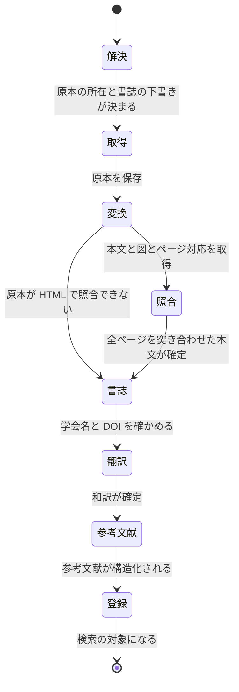

# 書誌を本文が出てから確かめる

- created: 2026-07-31
- status: approved
- implementation: done (2026-07-31)

## 解決したい問題

学会名や DOI が空のまま登録される論文をなくす。
どこで発表された論文かが、取り込んだ後に手で調べ直さなくても frontmatter に入っている。

本番のコレクション 31 本のうち、9 本は学会名を持たない(7 本が空、2 本は `arXiv` とだけ書かれている)。
DOI も 11 本が空である。
どれも arXiv から取り込んだ論文で、後から会議に採録されたことが分かっても、その事実がコレクションに入らない。

## 問題の背景

取り込みは段階の連なりで、書誌情報を確定させるのは先頭の**解決**の段階である(0004)。
解決は原本を取りに行くための下調べであり、入力は URL か題名だけで、本文はまだ手元に無い。
arXiv の URL は規則で解決し、arXiv の API が返すタイトル、著者、abstract をそのまま使う。
この API は学会名を返さない。
どの会議に通ったかは著者が `comments` 欄に書くことがあるだけで、規則で取り出せる形になっていない。
それ以外の URL と題名は Codex の作業スレッドに委ねるが、こちらも探すのは「取得できる原本の所在」であり、書誌はその過程で分かった範囲を返す。

その結果、解決が学会名や DOI を空のまま返し、以後どの段階もそこに触れない。
照合は本文の文字と紙面の構造を確定させる段階で、frontmatter は入力にも出力にも含まない(0009)。
翻訳と参考文献も本文だけを見る。

一方、変換と照合を終えた時点では、原本そのものから起こしたタイトルと著者が手元にある。
この 2 つがあれば、出版社の閲覧ページやプロジェクトページを web で探して、学会名と DOI を確かめられる。
実測でも、タイトルと著者だけを渡した Codex のターンは、arXiv の版しか出ていない論文と、SIGGRAPH 2026 に採録された論文を区別して返した(「負荷・コスト」)。

## この文書では書かないこと

- 解決の段階が原本の所在を見つける仕組み(0004)。
- 照合、翻訳、参考文献の中身(0004、0009、0010、0015)。
- 手元の PDF を原本として受け取る経路(0021)。
- 取り込みの進みを出す画面の見た目。

## やらないこと

- **既に取り込んである論文へ後から掛けない。** 登録の済んだ論文の frontmatter は、ユーザーが誤りを直す対象である(0002)。後から書誌を探して上書きすると、その訂正を消しうる。上書きしてよいかを判定する仕組みを持たない限り、掛ける先は取り込みの途中の論文に限る。学会名が空のまま入っている既存の論文は、手で直すか、取り込み直す。既存にも掛けたくなったら、訂正の有無を見分ける手立て(ユーザーが触った項目の記録)を先に設計する。
- **slug を付け直さない。** slug は生成後に変えない(0002)。会話の markdown に `@slug` として残った参照を後から書き換えられないためで、この契約はこの設計でも変えない。
- **書誌の API を規則で叩かない。** Crossref や DBLP に題名で問い合わせて DOI を引く経路は持たない。題名の一致は揺れるうえ、学会名がプロジェクトページにしか書かれていない論文には届かない。web 検索を許した Codex のターンは、どちらの形の出所も同じ 1 回で扱える。

## 概要

段階の列に**書誌**を足す。
本文が確定した後に、そのタイトルと著者で web を探し、学会名、出版年、DOI、原本の所在を確かめて frontmatter を直す。

入力は確定した本文である。
本文が確定するのは照合の後なので、書誌は照合と翻訳の間に置く。
原本が HTML で照合を飛ばす場合(0004)は、変換の後がその位置になる。

探す先は、PDF が取れる所在に限らない。
出版社の閲覧ページ、プロジェクトページ、著者のページのように、学会名と DOI が書かれているページを対象にする。
解決の段階が「素の HTTP で取得できる所在」に絞っているのは原本を取るためであり、書誌の段階は取得しない。

確かめられなければ何も直さずに次へ進む。
学会名が空でも論文は読めるので、ここで取り込みを止めない。

図の読み方: 四角が取り込みの段階、矢印は段階の遷移で、ラベルはその遷移が起きる条件である。
`変換` から出る 2 本は排他で、原本が PDF なら `照合` へ、HTML なら `照合` を飛ばして `書誌` へ進む。

## シナリオ

arXiv の新着から 1 本を取り込む。

解決は arXiv の API からタイトルと著者と abstract を得るが、学会名は返らないので空のままになる。
取得、変換、照合が済み、本文が確定する。

**書誌**の段階が、本文の先頭から取ったタイトルと著者で web を探す。
出版社の閲覧ページが見つかり、この論文が SIGGRAPH 2026 の会議論文で、DOI が `10.1145/3799902.3811094` であることが分かる。
frontmatter の `venue`、`year`、`doi` が埋まる。

翻訳と参考文献を経て登録され、論文リストに学会名つきで並ぶ。
学会名で絞り込む検索(0005)にも、この論文が乗る。

同じ段階を、arXiv にしか出ていない論文が通ったときは、探しても会議のページが見つからない。
`venue` は空のまま、`doi` に arXiv が発行した DOI だけが入り、取り込みは何事もなく次へ進む。

## 詳細設計

以下では、段階の入力と出力、直してよい項目と何を正とするか、確かめられなかったときの扱い、取り込みの途中に限る理由を述べる。

### 段階の入力と出力

書誌の段階が入力に取るのは、確定した本文から読めるタイトルと著者、そして解決が置いた書誌の下書き(学会名、出版年、DOI、arXiv の識別子)である。
出力は `paper.md` の frontmatter の書き換えだけで、本文には触れない。

段階の成果物がファイルとして増えないので、完了したかどうかを成果物の存在では判定できない。
取り込みの記録が持つ段階の値(0004)で進みを表し、再開したときはこの段階からやり直す。
同じ段階を二度走らせても frontmatter が同じ値に上書きされるだけで、副作用は残らない。

### 直してよい項目と、何を正とするか

書き換えてよいのは `title`、`authors`、`venue`、`year`、`doi`、`arxiv_id`、`pdf_url` である。
`slug`、`tags`、`added_at`、`source_url` は触らない。
slug は不変、タグはユーザーだけが決める、追加日時と `source_url` は取り込みを始めたときの事実だからである(0002)。

食い違ったときに何を採るかには向きを与える。

| 項目 | 正とするもの |
|---|---|
| `title`、`authors` | 本文 |
| `venue`、`year`、`doi`、`arxiv_id`、`pdf_url` | web で見つけた出所 |

タイトルと著者は原本そのものに書かれており、web の一覧や紹介ページの表記より確かである。
学会名と DOI は原本の紙面に載らないことが多く、載っていても投稿時の版のままのことがある。

`venue` には学会名または雑誌名だけを入れる(0002)。
プレプリントしか見つからなかったときは、`arXiv` のような投稿先の名前を書かずに空のままにする。
空であることが「まだどこにも採録されていない」という事実を表す。

### 確かめられなかったときの扱い

出所が見つからない、または見つかった記述が渡したタイトルと著者に一致しないときは、何も書き換えずに次の段階へ進む。
この段階は取り込みを失敗させない。
学会名が空でも本文と訳は読め、検索にも乗る。
ここで失敗にすると、読めるはずの論文が読めなくなる。

一致の判定は Codex のターンに委ねる。
渡すのはタイトルと著者で、当てずっぽうを書かずに確かめられなかった項目を空で返すよう指示する。

### 取り込みの途中に限る理由

この段階は取り込みの連なりの中でだけ走らせ、登録の済んだ論文へ積み直せる口は持たない。
取り込みの途中の frontmatter は、解決が置いた下書きをまだ誰も直していない状態なので、上書きが人の訂正を壊さない。
登録の後は、ユーザーが学会名やタイトルを直している可能性があり、それを見分ける手立てが無い。

## 落とし穴

- **slug は下書きのままの書誌で決まる。** slug は解決の直後に、その時点のタイトルと著者と出版年から作られる(0002)。書誌の段階が著者や出版年を直しても slug は変わらないので、`smith2025-...` のような名前が実際の書誌と食い違って残ることがある。slug は論文を指す名前であって書誌の写しではないので、これは受け入れる。
- **web の誤りを取り込む余地がある。** 学会名と DOI は web で見つけた記述を正とするため、出所のページが誤っていればその誤りが frontmatter に入る。ユーザーが frontmatter を直せること(0002)が受け皿になる。
- **arXiv 版と会議版は別の論文のままである。** 書誌の段階が会議版の DOI を見つけても、コレクションに入っているのは arXiv 版の本文である。本文が違うものを同じ論文としてまとめない扱い(0004)は変えない。frontmatter は会議版の書誌を指し、本文は arXiv 版という状態になる。
- **Codex の枠を 1 ターン余分に使う。** 枠が尽きているときは、この段階でも取り込みが待たされる(0003)。

## 代替案

- **照合のプロンプトに混ぜる。** 照合はページごとにターンを回す段階なので、どのページのターンで web を探させるかを決める必要があり、全ページで探させれば枠を無駄に使う。照合は「文字は変換結果、構造はページ画像」という別の契約(0009)を持っており、そこへ web 検索を足すと契約が二重になる。
- **参考文献の段階に混ぜる。** どちらも web を使うが、参考文献が扱うのは他の論文で、対象が違う。失敗の扱いも違い、参考文献は失敗させるがこちらは失敗させない。1 つのターンに両方を求めると、この違いを指示で書き分けることになる。
- **解決の段階で粘る。** 解決の時点で持っているのは URL か題名だけで、本文が無い。題名だけで探せる範囲は既に解決が探しており、それでも学会名が空になっている。
- **登録の後に背景の仕事として走らせる。** 既に取り込んである論文にも掛けられるのが利点である。ユーザーが直した frontmatter を上書きしうるので、どの項目が人の手で直されたかを記録する仕組みが要る。その仕組みは frontmatter を正とする設計(0002)に新しい状態を足すことになるので、いまは採らない。
- **Crossref などの書誌 API を規則で叩く。** 決定的で速く、Codex の枠も使わない。題名からの一致は同名の論文や版違いで揺れ、プロジェクトページにしか学会名が無い論文には届かない。web 検索を許したターンなら、どちらの形も同じ 1 回で扱える。

メイン案を選ぶ基準は、**本文が確定した後にしか得られない確かなタイトルと著者を、書誌を確かめるために使えること**である。
独立した段階にすることで、入力(確定した本文)と出力(frontmatter)と失敗の扱い(止めない)を、他の段階の契約と混ぜずに決められる。

## セキュリティ・プライバシー

この段階が外へ出すのは、取り込んでいる論文のタイトルと著者である。
web 検索を許した Codex のターンは解決の段階が既に同じ形で使っており(0003、0004)、新しい信頼境界は増えない。
コレクションの本文や訳は渡さない。

## 負荷・コスト

Codex のターンが 1 本の取り込みにつき 1 回増える。
web 検索を許し、reasoning effort は低くする。

本番のコレクションから、学会名の空いている 3 本のタイトルと著者だけを渡して実測した。

| 論文 | 時間 | 返った書誌 |
|---|---|---|
| 8DNA: 8D Neural Asset Light Transport by Distribution Learning | 22 秒 | SIGGRAPH 2026 Conference Papers / `10.1145/3799902.3811094` |
| Occlusion-Point Reuse for Ray-Traced Ambient Occlusion and Shadow | 27 秒 | 学会名は無し / arXiv の DOI |
| Neural Representation of Minimal Surfaces | 17 秒 | 学会名は無し / DOI は無し |

取り込み 1 本の全体は 3.5 分から 14 分、中央値 8.8 分である(0017 の実測)。
上乗せは 20 秒前後で、この待ちに埋もれる。
GPU は使わず、索引にも触らない。
