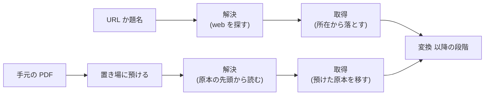

# 手元の PDF を原本として取り込む

- created: 2026-07-31
- status: reviewing
- implementation: not-started

## 解決したい問題

出版社のページからは原本を取れない論文を、手元にある PDF から取り込めるようにする。
取り込んだ後の姿は、URL から入れた論文と同じである。
照合された本文、和訳、構造化された参考文献、検索の索引が揃い、チャットから `@slug` で参照できる。

## 問題の背景

取り込みは URL を入り口にした段階の連なりである(0004)。
先頭の**解決**が、渡された URL か題名から原本の所在と書誌情報を確定させ、そこで slug が決まる。
続く**取得**がその所在から原本を落とす。
この形になっているのは、原本を手に入れる手立てが「取りに行く」しか無かったからである。

原本の取得は素の HTTP の道具で行う。
ブラウザを動かさないのは、取り込みが背景の仕事として何本も並ぶ処理であり、画面も操作も持たないためである。

この前提が成り立たない出所がある。
`dl.acm.org` は素の HTTP の要求に対して Cloudflare の判定ページを返し、PDF を返さない(応答の `cf-mitigated` が `challenge` になる)。
ブラウザと同じ User-Agent を付けても結果は変わらない。
`diglib.eg.org` の一部のリンクは HTTP としては成功しながら HTML を返す。
判定を迂回する道は取らない。
出版社が人手による操作を求めているものを機械で通す行為であり、そのための細工を実装しない。

該当する論文は、ブラウザで開けば人の手では落とせる。
落とした PDF が手元にあるのに、コレクションへ入れる口が無い。

## この文書では書かないこと

- 書誌を本文が出てから確かめる段階(0020)。手元から入れた論文の学会名と DOI は、その段階が埋める。
- 変換、照合、翻訳、参考文献の中身(0004、0009、0010、0015)。
- ファイルを選ぶボタンの見た目の細部。

## やらないこと

- **文字層の無い PDF を扱わない。** 紙面を走査しただけの PDF は、原本から書誌を読み取れない。取り込み全体も文字層を前提にしており、照合は変換結果と文字層を突き合わせて文字の正を決めている(0009)。走査した PDF を扱うなら、その前提から設計し直すことになる。
- **PDF 以外の形式を受け取らない。** 保存した HTML や画像の束は受け取らない。原本が HTML の経路は URL から取り込むときだけ扱う(0004)。
- **複数のファイルをまとめて上げない。** 1 回の操作で 1 本を取り込む。まとめて上げたくなるのは、手元に落とした PDF が溜まっている場合だが、いまはその状況が無い。
- **Bot の判定を迂回しない。** ブラウザに見せかける、判定を解く、といった細工は実装しない。この方針は変えない。

## 概要

上げた PDF を**取得済みの原本**として扱い、段階の列はそのまま通す。
経路によって照合や訳の質が変わらないようにするためである。

変えるのは解決の段階の入力だけである。
解決は、URL か題名を渡されたときは web を探し、手元の原本を渡されたときは**原本そのものから読む**。
原本の先頭 2 ページの文字層を Codex に渡し、タイトル、著者、出版年を起こす。
どちらの場合も出力は同じ形なので、以降の段階は入り口を知らずに済む。

手元から入れた論文は URL を持たない。
`source_url` と `pdf_url` は空になり、出所は DOI が表す。
その DOI と学会名は、本文が確定した後の書誌の段階が埋める(0020)。

原本は slug が決まるまで置き場に預け、slug が決まってからコレクションへ移す。
コレクションの形は `papers/<slug>/` だけで、slug が決まる前の置き場所が無いためである(0002)。

図の読み方: 四角が処理、矢印は「この結果が次の処理へ渡る」を表す。
上の行が既にある経路、下の行が手元の PDF の経路で、変換より後は 1 つに合流する。

## シナリオ

ACM にしか置かれていない論文を読みたい。
ブラウザで開いて PDF を落とし、pct の取り込みの欄の隣にあるボタンから、そのファイルを選ぶ。

ファイルは置き場へ上がり、取り込みが始まる。
**解決**が原本の先頭 2 ページの文字層を読み、タイトル、著者、出版年を起こす。
同じタイトルの論文が既にコレクションに無いことを確かめ、slug が `huo2015-matrix-sampling` に決まる。
**取得**は、預けた原本を `papers/huo2015-matrix-sampling/` へ移すだけで終わる。

**変換**、**照合**が済み、本文が確定する。
**書誌**の段階(0020)がタイトルと著者で web を探し、`ACM Transactions on Graphics` と DOI `10.1145/2816795.2818120` を frontmatter に入れる。
`source_url` と `pdf_url` は空のままである。

**翻訳**、**参考文献**、**登録**を経て、URL から入れた論文と同じように論文リストに並ぶ。

## 詳細設計

以下では、原本の受け取り方と置き場、解決の 2 通りの入力、取得の段階が何をするか、重複の判じ方、取り込みの記録が URL を持たない場合を述べる。

### 原本の受け取り方と置き場

原本は、要求の本文をそのまま PDF とする形で受け取る。
ファイル名は問い合わせの文字列で渡す。
本文をディスクへ流しながら書けるようにするためで、数百 MB の PDF をメモリに載せない(「負荷・コスト」)。
大きさの上限は取得の段階と同じ 512 MB とする。
先頭が PDF の印で始まらないものは、その場で断る。

置き場はコレクションの外、状態のディレクトリの下に持つ。
コレクション(`$PCT_DATA`)に置くのは論文と会話だけであり(0002)、slug の決まっていない原本はどちらでもない。
置き場のファイルは、slug が決まってコレクションへ移った時点で無くなる。
解決が失敗して取り込みが始まらなかったときも、置き場に残さない。

### 解決の 2 通りの入力

解決の段階が確定させるもの(原本の所在、タイトル、著者、出版年、学会名、abstract、arXiv の識別子、DOI、slug の語幹)は、どちらの入力でも同じである(0004)。
違うのは、その値をどこから得るかである。

| 入力 | 得かた | 原本の所在 |
|---|---|---|
| URL か題名 | web を探す | 見つけた所在 |
| 手元の原本 | 原本の先頭 2 ページの文字層を読む | 空(預けた原本が原本である) |

手元の原本から解決するときに web を探さないのは、書誌を web で確かめるのが後の段階の仕事だからである(0020)。
解決の時点で必要なのは、slug を決めるためのタイトルと著者と出版年、そして重複を判じるためのタイトルだけである。

先頭 2 ページを渡すのは、著者所属のリポジトリが付ける表紙のページがあるためである。
実測した 1 本は 1 ページ目が HAL の表紙で、論文の標題は 2 ページ目にあった。
渡した範囲から標題を選ぶ判断は Codex のターンに委ねる。

文字層が空の PDF は、この段階で失敗する。
何が起きたかは取り込みの一覧に残り、ユーザーが消すか、別の版を上げ直す。

### 取得の段階が何をするか

手元から入れた取り込みでは、取得は預けた原本を `papers/<slug>/` へ移す操作になる。
段階の並びを変えないのは、成果物の有無で完了を判定する契約(0004)をそのまま使うためである。
移し終われば原本のファイルが存在し、取得は完了したと判定される。

やり直しの意味は経路で変わる。
URL から入れた取り込みは、失敗しても同じ所在からもう一度落とせる。
手元から入れた取り込みは、取りに行く先が無いので、原本を失えばやり直せない。
取り込みを取り消したときは原本も消えるので、もう一度上げ直すことになる。

### 重複の判じ方

手元から入れた取り込みは、URL による重複の判定(0004)の対象にしない。
判定に使う URL が無いためである。

代わりに、解決が読み取ったタイトルで既にコレクションにある論文を引き、一致したらその論文を結果として返して取り込みを始めない。
同じ論文を URL から 1 度、手元から 1 度入れることは起こりうる。
タイトルは索引が持っており、原本の先頭から読み取った時点で判定できる。

### 取り込みの記録が URL を持たない場合

取り込みの記録(0004)は、どの取り込みがどこから来たかを持ち、一覧に出す。
手元から入れた取り込みでは、URL の代わりに、手元のファイルから入れたことと選んだファイルの名前が分かる値を持つ。
この値は URL による重複の判定には使わない。
同じ名前のファイル(`paper.pdf` など)を別々の論文で選ぶことがあり、名前の一致は同じ論文であることを意味しないからである。

## 落とし穴

- **同じ論文が 2 つの slug で入りうる。** タイトルの表記が既存の論文と違えば(副題の有無、記号の違いなど)、重複と判定されずに別の論文として入る。URL から入れた論文と手元から入れた論文で、原本の版が違うこともある。
- **取り込みを取り消すと原本も消える。** 消した後にもう一度入れるには、同じ PDF を上げ直す。手元の PDF は pct の外にあるので、ユーザーの手元に残っていることが前提になる。
- **文字層の無い PDF は入れられない。** 走査しただけの PDF は解決の段階で失敗する。失敗の理由は一覧に残る。
- **書誌の段階が重複に気づいても止まらない。** 0020 の段階が DOI を確かめた結果、既にある論文と同じ DOI だと分かることがある。その時点で変換と照合は終わっており、取り込みは止めずに最後まで進む。重複はユーザーが論文リストで見て消す。
- **`source_url` が空の論文が並ぶ。** 論文リストから原本のページへ飛ぶ手立てが無くなる。DOI が入っていればそこから辿れる。

## 代替案

- **題名をユーザーに打たせ、既存の解決をそのまま使い、取得だけ差し替える。** 解決を変えずに済む。打った題名と PDF の中身が違っても気づけず、別の論文の書誌で slug が決まる。手で打つ手間も増える。
- **変換を先に走らせ、確定した本文からタイトルを取ってから解決する。** 本文の方が原本の先頭より確かである。経路によって段階の順が変わり、slug が決まる前に変換の成果物を置く場所も無い。
- **手元の PDF 専用の経路を作る。** 既存の取り込みに手を入れずに済む。経路が 2 本になると、照合や訳の扱いが経路ごとに分かれ、同じ論文でも入り口によって結果が変わりうる。
- **要求を multipart で受け取る。** ファイル名や他の項目を本文と一緒に運べる。数百 MB をメモリに載せる実装になりやすく、上限を上げるほど危うくなる。運ぶ必要のある項目はファイル名だけなので、問い合わせの文字列で足りる。
- **置き場を持たず、仮の slug で `papers/` の下に作って後から改名する。** 置き場の仕組みが要らない。slug は不変という契約(0002)を、途中の状態とはいえ破ることになり、改名の途中で落ちたときの後始末も要る。

メイン案を選ぶ基準は、**入り口が増えても、取り込んだ後の論文が入り口によって変わらないこと**である。
段階の列を共有し、解決の出力の形を揃えることで、変換より後のすべてが入り口を知らずに動く。

## セキュリティ・プライバシー

受け取るのは、同じ端末の利用者が選んだファイルである。
サーバーの公開範囲は変えない(0007)。
大きさの上限と PDF の印の確認で、置き場が意図しないもので埋まるのを防ぐ。
上げたファイルはコレクションの外の置き場を経て `papers/<slug>/` へ入るだけで、外へは出ない。

## 負荷・コスト

原本の受け取りは、要求の本文をディスクへ流すだけである。
191 MB の本文を流したときの常駐メモリは 67 MB から 105 MB で、本文の大きさには比例しなかった(実測)。

解決は Codex のターンを 1 回使う。
原本の先頭 2 ページの文字層(実測で 6800 文字)を渡し、web は探さない。
実測では 2 本とも 6 秒から 9 秒で、表紙のあるものも含めてタイトル、著者、出版年を正しく起こし、slug の語幹も既にコレクションにあるものと同じ値になった。

置き場はコレクションと同じディスクを使う。
1 本ぶんの原本が、取り込みが取得の段階を終えるまでの間だけ二重に存在する。
