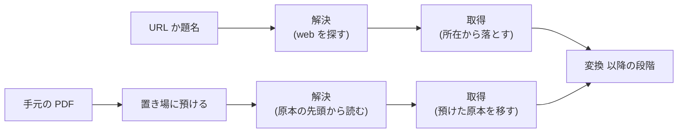

# 手元の PDF を原本として取り込む

- created: 2026-07-31
- status: approved
- implementation: done (2026-07-31)

## 解決したい問題

出版社のページからは原本を取れない論文を、手元にある PDF から取り込めるようにする。
取り込んだ後の姿は、URL から入れた論文と同じである。
照合された本文、和訳、構造化された参考文献、検索の索引が揃い、チャットから `@slug` で参照できる。

## 問題の背景

取り込みは URL を入り口にした段階の連なりである(0004)。
先頭の**解決**が、渡された URL か題名から原本の所在と書誌情報を確定させ、そこで slug が決まる。
続く**取得**がその所在から原本を落とす。
この形になっているのは、原本を手に入れる手立てが「取りに行く」しか無かったからである。

原本の取得は素の HTTP の道具で行う。
ブラウザを動かさないのは、取り込みが背景の仕事として何本も並ぶ処理であり、画面も操作も持たないためである。

この前提が成り立たない出所がある。
2026-07-31 現在、`dl.acm.org` は素の HTTP の要求に対して Cloudflare の判定ページを返し、PDF を返さない(応答の `cf-mitigated` が `challenge` になる)。
ブラウザと同じ User-Agent を付けても結果は変わらない。
`diglib.eg.org` の一部のリンクは HTTP としては成功しながら HTML を返す。

**同じ論文が、人の手では落とせて、pct では落とせない。**
ユーザーがブラウザで開けば判定を通って PDF が保存できる。
pct が背景の仕事として取りに行くと、同じ URL から判定ページが返る。
そのため、この論文は URL を貼っても題名を打っても取り込めない。
解決の段階が原本を探せないのではなく、探し当てた原本を取得の段階が落とせない。

判定を迂回する道は取らない。
出版社が人手による操作を求めているものを機械で通す行為であり、そのための細工を実装しない。
残るのは、ユーザーが落とした PDF を pct に渡す道である。

## この文書では書かないこと

- 書誌を本文が出てから確かめる段階(0020)。手元から入れた論文の学会名と DOI は、その段階が埋める。
- 変換、照合、翻訳、参考文献の中身(0004、0009、0010、0015)。
- ファイルを選ぶボタンの見た目の細部。

## やらないこと

- **PDF 以外の形式を受け取らない。** 保存した HTML や画像の束は受け取らない。原本が HTML の経路は URL から取り込むときだけ扱う(0004)。
- **複数のファイルをまとめて上げない。** 1 回の操作で 1 本を取り込む。まとめて上げたくなるのは、手元に落とした PDF が溜まっている場合だが、いまはその状況が無い。
- **Bot の判定を迂回しない。** ブラウザに見せかける、判定を解く、といった細工は実装しない。この方針は変えない。

## 概要

上げた PDF を**取得済みの原本**として扱い、段階の列はそのまま通す。
経路によって照合や訳の質が変わらないようにするためである。

変えるのは解決の段階の入力だけである。
解決は、URL か題名を渡されたときは web を探し、手元の原本を渡されたときは**原本の先頭から読む**。
どちらの場合も出力は同じ形なので、以降の段階は入り口を知らずに済む。

ここで読み取る書誌は暫定である。
解決の時点で要るのは、slug を決めるための名前と、重複を判じるための題名だけである。
確かなタイトルと著者は、照合を終えて本文が確定した後に、書誌の段階が本文から直す(0020)。

手元から入れた論文は URL を持たない。
`source_url` と `pdf_url` は空になり、出所は DOI が表す。
その DOI と学会名は、本文が確定した後の書誌の段階が埋める(0020)。

原本は slug が決まるまで置き場に預け、slug が決まってからコレクションへ移す。
コレクションの形は `papers/<slug>/` だけで(0002)、slug が決まる前の原本を置く場所が無いためである。

図の読み方: 四角が処理、矢印は「この結果が次の処理へ渡る」を表す。
上の行が既にある経路、下の行が手元の PDF の経路で、変換より後は 1 つに合流する。

## シナリオ

ACM にしか置かれていない論文を読みたい。
URL を貼って取り込むと、取得の段階が判定ページを返されて失敗する。
ブラウザで開けば PDF は保存できるので、それを落とし、pct の取り込みの欄の隣にあるボタンから、そのファイルを選ぶ。

ファイルは置き場へ上がり、取り込みが始まる。
**解決**が原本の先頭の文字を読み、タイトル、著者、出版年を起こす。
同じタイトルの論文が既にコレクションに無いことを確かめ、slug が `huo2015-matrix-sampling` に決まる。
**取得**は、預けた原本を `papers/huo2015-matrix-sampling/` へ移すだけで終わる。

**変換**、**照合**が済み、本文が確定する。
**書誌**の段階(0020)がタイトルと著者で web を探し、`ACM Transactions on Graphics` と DOI `10.1145/2816795.2818120` を frontmatter に入れる。
`source_url` と `pdf_url` は空のままである。

**翻訳**、**参考文献**、**登録**を経て、URL から入れた論文と同じように論文リストに並ぶ。

## 詳細設計

以下では、原本の受け取り方と置き場、解決の 2 通りの入力、そこで読み取る書誌の位置づけ、取得の段階が何をするか、重複の判じ方、取り込みの記録が URL を持たない場合を述べる。

### 原本の受け取り方と置き場

原本は、要求の本文をそのまま PDF とする形で受け取る。
ファイル名は問い合わせの文字列で渡す。
本文をディスクへ流しながら書けるようにするためで、数百 MB の PDF をメモリに載せない(「負荷・コスト」)。
大きさの上限は取得の段階と同じ 512 MB とする。
先頭が PDF の印で始まらないものは、その場で断る。

置き場はコレクションの外、状態のディレクトリの下に持つ。
コレクション(`$PCT_DATA`)に置くのは論文と会話だけであり(0002)、slug の決まっていない原本はどちらでもない。
置き場のファイルは、slug が決まってコレクションへ移った時点で無くなる。
解決が失敗して取り込みが始まらなかったときも、置き場に残さない。

置き場が要るのは、slug が決まるまでの間だけである。
slug が決まった後の取り込みは、途中の状態も `papers/<slug>/` の下で進む。
登録の段階が行うのは索引への追加であって、コレクションへの配置ではない(0004)。
取り込みが途中で失敗した論文も、その slug のディレクトリに成果物を残したまま一覧に並び、ユーザーが再試行するか消すかを決める。

### 解決の 2 通りの入力

解決の段階が確定させるもの(原本の所在、タイトル、著者、出版年、学会名、abstract、arXiv の識別子、DOI、slug の語幹)は、どちらの入力でも同じである(0004)。
違うのは、その値をどこから得るかである。

| 入力 | 得かた | 原本の所在 |
|---|---|---|
| URL か題名 | web を探す | 見つけた所在 |
| 手元の原本 | 原本の先頭を読む | 空(預けた原本が原本である) |

手元の原本から解決するときに web を探さないのは、書誌を web で確かめるのが後の段階の仕事だからである(0020)。
解決の時点で必要なのは、slug を決めるための名前と、重複を判じるための題名だけである。

渡すのは先頭 2 ページ分である。
著者所属のリポジトリが付ける表紙のページがあり、1 ページ目に論文の標題が無いことがあるためである。
実測した 1 本は 1 ページ目が HAL の表紙で、標題は 2 ページ目にあった。
渡した範囲から標題を選ぶ判断は Codex のターンに委ねる。

先頭の文字は、PDF に埋め込まれた文字層があればそれを使い、無ければそのページの画像を渡す。
紙面を走査しただけの論文のために取り込みの経路を分けないのは 0010 の判断であり、照合も文字層の無いページは紙面の画像から書き起こしている。
入り口の側で PDF の種類を見分けて振り分けると、見分けを誤ったときに丸ごと失敗する。

### 解決が読み取る書誌は暫定である

この段階の読み取りが決めるのは、slug と重複の判定という 2 つの用途に足りる範囲である。
frontmatter に入るタイトルと著者は、照合を終えた本文を正として書誌の段階が直す(0020)。
原本の先頭は投稿時の版の標題を載せていることがあり、表紙の書式もリポジトリごとに違うので、ここで読んだ値を最終的な書誌として扱わない。

slug だけは後から直せない(0002)。
そのため slug は、この暫定の読み取りで決まったまま残る(「落とし穴」)。

### 取得の段階が何をするか

手元から入れた取り込みでは、取得は預けた原本を `papers/<slug>/` へ移す操作になる。
段階の並びを変えないのは、成果物の有無で完了を判定する契約(0004)をそのまま使うためである。
移し終われば原本のファイルが存在し、取得は完了したと判定される。

やり直しの意味は経路で変わる。
URL から入れた取り込みは、失敗しても同じ所在からもう一度落とせる。
手元から入れた取り込みは、取りに行く先が無いので、原本を失えばやり直せない。
取り込みを取り消したときは原本も消えるので、もう一度上げ直すことになる。

### 重複の判じ方

手元から入れた取り込みは、URL による重複の判定(0004)の対象にしない。
判定に使う URL が無いためである。

代わりに、解決が読み取ったタイトルで既にコレクションにある論文を引き、一致したらその論文を結果として返して取り込みを始めない。
同じ論文を URL から 1 度、手元から 1 度入れることは起こりうる。
タイトルは索引が持っており、原本の先頭から読み取った時点で判定できる。

### 取り込みの記録が URL を持たない場合

取り込みの記録(0004)は、どの取り込みがどこから来たかを持ち、一覧に出す。
手元から入れた取り込みでは、URL の代わりに、手元のファイルから入れたことと選んだファイルの名前が分かる値を持つ。
この値は URL による重複の判定には使わない。
同じ名前のファイル(`paper.pdf` など)を別々の論文で選ぶことがあり、名前の一致は同じ論文であることを意味しないからである。

## 落とし穴

- **同じ論文が 2 つの slug で入りうる。** タイトルの表記が既存の論文と違えば(副題の有無、記号の違いなど)、重複と判定されずに別の論文として入る。URL から入れた論文と手元から入れた論文で、原本の版が違うこともある。
- **取り込みを取り消すと原本も消える。** 消した後にもう一度入れるには、同じ PDF を上げ直す。手元の PDF は pct の外にあるので、ユーザーの手元に残っていることが前提になる。
- **slug は暫定の書誌のまま残る。** slug は解決の直後に、原本の先頭から読んだ著者と出版年と題名で決まる。書誌の段階が本文を正としてタイトルと著者を直しても、slug は変わらない(0002)。走査しただけの PDF では紙面の画像から読むので、読み取りが揺れる余地はその分だけ大きい。
- **書誌の段階が重複に気づいても止まらない。** 0020 の段階が DOI を確かめた結果、既にある論文と同じ DOI だと分かることがある。その時点で変換と照合は終わっており、取り込みは止めずに最後まで進む。重複はユーザーが論文リストで見て消す。
- **`source_url` が空の論文が並ぶ。** 論文リストから原本のページへ飛ぶ手立てが無くなる。DOI が入っていればそこから辿れる。

## 代替案

- **題名をユーザーに打たせ、既存の解決をそのまま使い、取得だけ差し替える。** 解決を変えずに済む。打った題名と PDF の中身が違っても気づけず、別の論文の書誌で slug が決まる。手で打つ手間も増える。
- **変換と照合を先に走らせ、確定した本文からタイトルを取ってから解決する。** 照合を経た本文は原本の先頭より確かで、slug も確かな書誌から決まる。経路によって段階の順が変わり、slug が決まる前に変換と照合の成果物を置く場所も無い。取り込みの記録も slug で追っており(0004)、slug の無い状態で 2 つの段階を回すことになる。得られるのは slug の確かさだけで、frontmatter の確かさは書誌の段階(0020)が別に担っている。
- **原本の先頭を、文字層を使わずページの画像だけから読む。** 読み取りの経路が 1 つで済み、走査した PDF と埋め込みのある PDF を同じに扱える。文字は文字層が正である(0009)ので、綴りや記号の正確さで劣る。ページを描き起こす手間も増える。文字層があるならそれを使い、無いときだけ画像に落とす方が、どちらの PDF も扱えて精度も落ちない。
- **手元の PDF 専用の経路を作る。** 既存の取り込みに手を入れずに済む。経路が 2 本になると、照合や訳の扱いが経路ごとに分かれ、同じ論文でも入り口によって結果が変わりうる。
- **要求を multipart で受け取る。** ファイル名や他の項目を本文と一緒に運べる。数百 MB をメモリに載せる実装になりやすく、上限を上げるほど危うくなる。運ぶ必要のある項目はファイル名だけなので、問い合わせの文字列で足りる。
- **置き場を持たず、仮の slug で `papers/` の下に作って後から改名する。** 置き場の仕組みが要らない。slug は不変という契約(0002)を、途中の状態とはいえ破ることになり、改名の途中で落ちたときの後始末も要る。

メイン案を選ぶ基準は、**入り口が増えても、取り込んだ後の論文が入り口によって変わらないこと**である。
段階の列を共有し、解決の出力の形を揃えることで、変換より後のすべてが入り口を知らずに動く。

## セキュリティ・プライバシー

受け取るのは、同じ端末の利用者が選んだファイルである。
サーバーの公開範囲は変えない(0007)。
大きさの上限と PDF の印の確認で、置き場が意図しないもので埋まるのを防ぐ。
上げたファイルはコレクションの外の置き場を経て `papers/<slug>/` へ入るだけで、外へは出ない。

## 負荷・コスト

原本の受け取りは、要求の本文をディスクへ流すだけである。
191 MB の本文を流したときの常駐メモリは 67 MB から 105 MB で、本文の大きさには比例しなかった(実測)。

解決は Codex のターンを 1 回使う。
原本の先頭 2 ページ分を渡し、web は探さない。
文字層を渡す場合、実測した 2 本では 6800 文字前後で、6 秒から 9 秒で返った。
どちらも表紙の有無にかかわらずタイトル、著者、出版年を正しく起こし、slug の語幹も既にコレクションにあるものと同じ値になった。

文字層の無い PDF では、そのページを画像に描き起こして渡す。
ページ画像を作る手立ては照合が既に持っており(0004)、2 ページ分の描き起こしと画像 1 枚あたりの入力が上乗せになる。
この経路を通るのは走査した PDF だけで、日常の取り込みは文字層のある PDF が通る。

置き場はコレクションと同じディスクを使う。
1 本ぶんの原本が、取り込みが取得の段階を終えるまでの間だけ二重に存在する。
