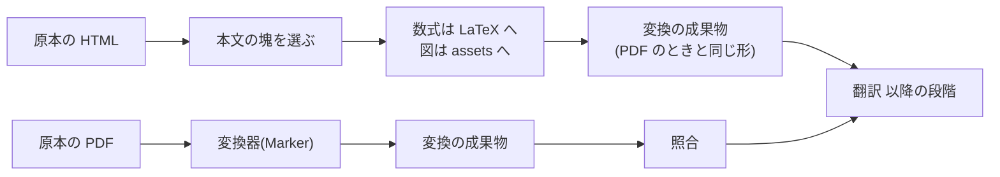

# HTML の原本を本文だけ取り出して変換する

- created: 2026-08-01
- status: ai-approved
- implementation: done (2026-08-01)

## 解決したい問題

PDF が手に入らず HTML でしか読めない論文を、他の論文と同じ形でコレクションに入れる。
和訳と参考文献と検索の索引が揃い、チャットから `@slug` で参照できる状態になる。

## 問題の背景

取り込みは原本の種別に PDF と HTML の 2 つを持つ設計になっている(0004)。
原本が HTML のときはページ画像を作れないため照合を飛ばす、という判断まで書かれている。

**ところが変換の段階の実装は PDF しか読まない。**
変換器(Marker)へ渡すのは `original.pdf` の場所で、HTML を保存しても読む相手がいない。
実際に開発環境で HTML の原本を取り込ませると、取得までは通って変換の段階で「そのようなファイルが無い」と落ちる。
そのため現在の取得は PDF だけを受け取るようにしてあり、HTML でしか読めない論文は取り込めない。

HTML の原本には、PDF と違う 2 つの性質がある。

- **本文以外の要素が混ざる。** 出版社の閲覧ページも arXiv の HTML も、案内の欄、共有のボタン、関連論文の一覧、脚注の飛び先などを同じ文書に含む。そのまま markdown にすると本文にこれらが混ざる。
- **数式が構造を持ったまま入っている。** 論文の HTML は数式を MathML で書くことが多く、LaTeX の原稿から起こしたページ(LaTeXML が出すものなど)は元の式を `alttext` に持っている。PDF の紙面から読み直すのとは違い、著者が書いた式そのものが手に入る。

## この文書では書かないこと

- 原本の所在を見つける仕組み(0004、#221)。
- 照合、翻訳、参考文献、書誌の中身(0004、0009、0010、0015、0020)。
- 手元の PDF からの取り込み(0021)。

## やらないこと

- **HTML の原本にページ画像を作らない。** 紙面という単位が無いので、照合(0009)の入力を作れない。0004 の判断のまま、HTML の原本では照合を飛ばす。
- **JavaScript を動かして描かれる本文を取らない。** 取りに行くのは素の HTTP で、ブラウザを動かさない(0021)。中身を JavaScript で描くページは、取れた HTML に本文が無いので失敗する。
- **HTML を PDF に変換してから読まない。** 「代替案」に書く。
- **出版社ごとの抜き出し規則を持たない。** ドメインごとに「本文はこの要素」と決め打ちする表は持たない。増やし続ける保守が要るうえ、当たらない出所で必ず失敗する。共通の手がかりで選ぶ。

## 概要

HTML の原本は、**本文の塊を選んでから markdown にする**。
選ぶのは案内や共有のボタンを落とすためで、変換器(Marker)には渡さない。

数式は MathML の中に入っている LaTeX を取り出して `$...$` の形にする。
図は `` を落として `assets/` へ置き、キャプションと組にする。
出来上がりは PDF の変換と同じ形(本文の markdown、図の画像とキャプション)にし、以降の段階は原本の種別を知らずに動く。

照合は飛ばす(0004)。
飛ばすかどうかは**ページ画像を作れるかどうか**で決め、原本が PDF かどうかを見る。

図の読み方: 四角が処理、矢印は「この結果が次の処理へ渡る」を表す。
上の行が HTML の原本、下の行が PDF の原本で、変換の成果物から先は同じ段階が続く。
照合を通るのは PDF の原本だけである。

## シナリオ

出版社の閲覧ページでしか本文が出ていない論文を取り込む。
PDF は置かれておらず、ブラウザで読む形だけが公開されている。

**解決**が閲覧ページを原本の所在として返し、**取得**が PDF を探して見つからないので、その HTML を保存する。
**変換**が本文の塊(`<article>`)を選び、案内の欄と「この論文を引用する」の欄を落とす。
数式 `<math alttext="\int_\Omega f(x)dx">` は `$\int_\Omega f(x)dx$` になり、図は `assets/` へ落ちてキャプションと組で本文に入る。

照合は飛ばし、**書誌**が学会名と DOI を確かめ(0020)、**翻訳**が和訳を作る。
**参考文献**は本文の参考文献の節を読み(0015)、**登録**で索引に載る。

論文リストには、PDF から入れた論文と同じ形で並ぶ。
違いはページ画像と照合の記録が無いことだけで、`paper.raw.md` との差分も出ない。

## 詳細設計

以下では、本文の塊の選び方、数式と図の扱い、変換の成果物の形、照合を飛ばす判定、走らせる場所を述べる。

### 本文の塊の選び方

共通の手がかりだけで選ぶ。

1. `<article>`、`<main>`、`role="main"` の要素があればそれを採る。論文を出す側のページはたいていこのいずれかを持つ。
2. 無ければ、文章の量が最も多い要素を選ぶ。見出しと段落の文字数を数え、案内の欄のような短い塊を外す。

選んだ塊からは、案内(`nav`)、頭と足(`header`、`footer`)、傍注(`aside`)、`script`、`style`、フォーム、ボタンを落とす。

**取り出せたのが本文でなかったときは、変換を失敗させる**(段階の失敗として一覧に出る)。
判じるのは**地の文の段落がいくつあるか**である。
中身を JavaScript で描くページは、取れた HTML に案内と同意の文しか無く、それらは短い。
実測では、そうしたページが 200 文字以上の段落を 3 個しか持たないのに対し、本文が入っている HTML は 41 個持っていた。

文字数の合計では判じられない。
同意や個人情報の案内は長く、合計だけを見ると本文と区別がつかない(実測で 2840 文字)。

### 数式

数式は `<math>` の中から LaTeX を取り出す。
LaTeXML が出す HTML は `alttext` に元の式を持ち、MathML の `annotation` にも同じものが入る。
どちらも無いときは、MathML から読める文字をそのまま残す。

`display="block"` の式は `$$...$$`、それ以外は `$...$` にする。
この形は PDF の変換と同じで、翻訳(0011)も照合(0009)も同じ約束で扱える。

### 図

`<figure>` と `` を落として `assets/` へ置く。
落とせなかった画像は本文から外し、代わりに元の場所への参照を残す。
キャプションは `<figcaption>` から取り、図と組にする。

図の画像は本文と同じ出所から取る。
取りに行くのは素の HTTP で、失敗しても取り込み全体は止めない(図の無い本文になる)。

### 変換の成果物の形

HTML の変換も、PDF の変換と同じ成果物(本文の markdown、図の画像、図とキャプションの組)を作る。
以降の段階が原本の種別を知らずに済むためである。

ページという単位が無いので、ページ番号は 0、紙面上の位置は空にする。
これらを使うのは照合だけで(0004)、HTML では照合を飛ばす。

### 照合を飛ばす判定

照合を飛ばすかどうかは、**ページ画像を作れるかどうか**で決める。
原本が PDF であることがその条件なので、`original.pdf` の有無で判じる。

### 走らせる場所

HTML の変換は GPU を使わない。
**ジョブの資源クラスは network とする**(0003)。
図の画像を落とすので通信を伴い、GPU の列(同時実行 1)に並べる理由が無い。

## 落とし穴

- **本文の塊を選び損ねることがある。** 共通の手がかりに当たらない作りのページでは、案内や関連論文が本文に混ざる。混ざったまま登録されると翻訳と索引にも入る。短すぎるときは失敗させるが、多すぎる側は機械的に判定できない。読んで気づいたら取り込み直す。
- **照合が無いので、変換の誤りが残る。** PDF の原本では紙面と突き合わせて直す(0004)。HTML ではその手立てが無く、抜き出しの結果がそのまま本文になる。
- **JavaScript で描かれるページは取れない。** 取れた HTML に本文が無いので、短すぎるとして失敗する。
- **図の取りこぼしが黙って起きる。** 画像が取れなかったときは本文から外れる。参照だけが残るので、読んだときに気づける。

## 代替案

- **HTML を PDF に変換してから、いまの変換器で読む。** Marker は HTML を weasyprint で PDF にしてから読む経路を持っており、これを使えば照合もそのまま通る。weasyprint という native の依存(pango と cairo)が増える。加えて、HTML が持っている LaTeX を捨てて、紙面の画像から数式を読み直すことになる。取り出せる情報を捨てる方向なので採らない。
- **markdown への変換を汎用の道具(pandoc など)に任せる。** 書き手を持たずに済む。本文の塊を選ぶ働きが無く、案内の欄まで markdown になる。数式も MathML のまま残る。
- **出版社ごとに本文の場所を決め打ちする表を持つ。** 当たる出所では確実である。表に無い出所で必ず失敗し、ページの作りが変わるたびに直すことになる。共通の手がかりで外したときだけ、後から個別の手当てを考える。
- **HTML の原本を扱わないと決め、0004 の判断を取り消す。** 実装が要らない。PDF を出さない出版社が現に増えており、手元の PDF から入れる道(0021)だけでは、ブラウザでしか読めない論文が取り込めない。

メイン案を選ぶ基準は、**原本に入っている情報を落とさずに本文へ運ぶこと**である。
HTML から直接読めば、著者が書いた LaTeX と図の画像をそのまま持ってこられる。

## セキュリティ・プライバシー

取り込むのはユーザーが指した論文の HTML である。
本文の抜き出しは取得済みのファイルに対して行い、`script` は落として実行しない。
図の画像を落とすときだけ通信が増えるが、出所は本文と同じ論文のページである。

## 負荷・コスト

HTML の変換は GPU も Codex の枠も使わない。
本文の抜き出しは文字列の処理で、論文 1 本ぶんの HTML(数百 KB)を読む程度である。
図の画像の取得だけが通信で、枚数に比例する。

PDF の変換(実測で 12 秒から数十秒)と比べて軽い。
照合を飛ばすぶん、取り込み全体は PDF の論文より短くなる。
