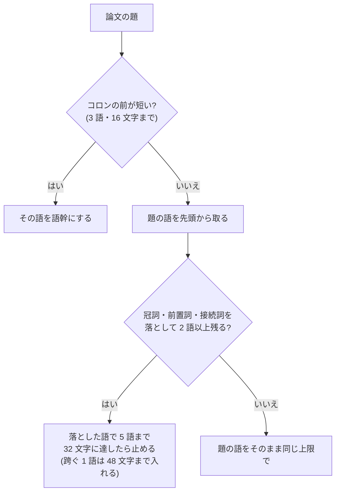

# slug の語幹を題の語から作る

- created: 2026-08-01
- status: approved
- implementation: not-started

## 解決したい問題

チャットで `@` に続けて題の記憶を打つと、その論文が候補に出る。
題のどこを覚えていても当たるように、slug の語幹を題の語から作る。

## 問題の背景

slug は論文を指す不変の名前で、チャットの markdown に `@slug` として残る(0002)。
後から書き換えられないので、付け方を間違えると、その論文を指す手立てが悪いまま残り続ける。

打つときは補完が助けるが、補完は**打った文字が slug に含まれるか**で候補を絞る。
つまり当たりやすさは、その論文らしい語が語幹にいくつ入っているかで決まる。
ユーザーは題を一言一句は覚えておらず、先頭のほうの意味のある語を覚えていることが多い。

0002 は語幹を「論文に定着した略称があればそれを使い、無ければタイトルの内容語を 1〜3 語つないだもの」と定めている。
この語を提案するのは取り込みの解決の段階で、そこへ渡している指示は「論文に定着した略称。無ければタイトルの内容語を 1〜3 語」だけである。
**定着した略称かどうかを確かめる手立てが無い。**

その結果、題に出てこない頭字語が語幹になることがある。
実際にコレクションへ入った `wang2018-ash` は、題 `Analytic spherical harmonic coefficients for polygonal area lights` の頭文字から作られている。
`ash` は題のどこにも出てこないので、題を覚えていても補完で当たらない。

## この文書では書かないこと

- slug の全体の形(`<筆頭著者の姓><出版年>-<語幹>`)と、不変であること(0002)。
- 衝突したときの連番、著者や年が取れないときのフォールバック(0002)。
- 補完の出し方(#231)。

## やらないこと

- **既に付いた slug を新しい規則で付け直さない。** slug は不変である(0002)。付け直すとチャットに残った `@slug` が指す先を失う。名前を変えたい論文は、取り込み直して参照を書き換えることになる。
- **題から略称を作らない。** 頭文字をつないだ語は短くて見栄えがするが、題の記憶から打っても当たらない。これがこの文書を書く理由である。
- **同義語や分野の言い換えを足さない。** `brdf` と `reflectance` を結ぶような対応は語幹に持たせない。それは検索(0005)の担当である。
- **飛ばす語かどうかの辞書を分野ごとに持たない。** `von Mises` のような固有名詞を語の表で見分けようとすると、分野ごとに表が要る。判じるのは題を読んでいる解決に任せ、規則の側は明示があったときだけ譲る。

## 概要

**語幹は題から作る。**
題の先頭から順に語を拾い、上限に達したところで打ち切る。

題の先頭から語を取り、冠詞と前置詞と接続詞は飛ばす。
どの論文の題にも出る語で、当たりを絞れないためである。
飛ばした結果が 2 語に満たなくなるときは、題をそのまま使う。

語幹は **5 語まで、32 文字を目安に、長くても 48 文字まで**とする。
32 文字に達したところで止めるが、そこを跨ぐ 1 語は 48 文字以内なら入れる。
長い語が 1 つあるだけで入る語数が減るのを避けるためである。

ハイフンで繋がれた複合語(`real-time`、`block-compressed`)は 1 語として扱い、途中で割らない。

コロンの前が短ければ(3 語・16 文字まで)、それを論文が与えた略称として使う(`NeRF: Representing Scenes ...` → `nerf`、`Mip-NeRF 360: ...` → `mip-nerf-360`)。
これは発明ではなく、著者が題の中で与えた名前である。

飛ばす語が固有名詞の一部であることがある(`von Mises-Fisher` の `von`)。
規則では判じられないので、**取り込みの解決が「この語は落とすな」と名指しできる**ようにする。
名指しできるのはそこまでで、語幹そのものは指せない。

図の読み方: 四角が処理、ひし形が分かれ道、矢印は上から下への流れである。

## シナリオ

`Analytic spherical harmonic coefficients for polygonal area lights` を取り込む。

コロンが無いので題の語を先頭から取る。
`for` を飛ばし、`analytic-spherical-harmonic` まで来たところで 27 文字である。
次の `coefficients` を入れると 40 文字で 32 文字を超えるが、48 文字には収まるので入れて止める。
slug は `wang2018-analytic-spherical-harmonic-coefficients` になる。

後日、チャットで「球面調和の解析的な係数の論文」を指したくなる。
題をうろ覚えのまま `@spherical` と打つと候補に出る。
`@analytic` でも `@harmonic` でも出る。

## 詳細設計

### 語幹の作り方

| 題 | 語幹 | 理由 |
|---|---|---|
| `NeRF: Representing Scenes as Neural Radiance Fields ...` | `nerf` | コロンの前が 1 語 |
| `Analytic spherical harmonic coefficients for polygonal area lights` | `analytic-spherical-harmonic-coefficients` | 前置詞を飛ばし、32 文字を跨ぐ `coefficients` まで入れて打ち切り |
| `Mip-NeRF 360: Unbounded Anti-Aliased Neural Radiance Fields` | `mip-nerf-360` | コロンの前が 3 語・12 文字 |
| `Clustering on the Unit Hypersphere using von Mises-Fisher Distributions` | `clustering-unit-hypersphere-von-mises-fisher` | `von` を残す語として取り込みが指した(下記) |
| `Real-Time Neural Materials using Block-Compressed Features` | `real-time-neural-materials-block-compressed` | 複合語を割らない |
| `Attention Is All You Need` | `attention-is-all-you-need` | 飛ばすと 2 語未満になるので題のまま |

飛ばすのは冠詞・前置詞・接続詞と、姓の前置き(`von`、`van`、`de` など)に限る。
動詞と代名詞は落とさない。
`Attention Is All You Need` のように、それらが題の中身である題があるためである。

### 飛ばす語が固有名詞の一部である場合

`von Mises-Fisher` の `von` は姓の前置きだが、`von Mises` で 1 つの名前である。
一律に飛ばすと `mises` から始まる形になり、題の記憶と食い違う。
一方で `Clustering on the Unit Hypersphere` の `on` と `the` は落として構わない。

**同じ語が、飛ばしてよい前置きにも、固有名詞の一部にもなる。**
どちらであるかは語の並びだけからは決まらないので、規則では判じない。

取り込みの解決は題を読んでいるので、ここを判じられる。
**解決は、規則が飛ばす語のうち残すべきものを名指しできる。**
名指しされた語は、題の先頭から拾っていく途中でその語に行き当たったときに、落とさずに拾う。

名指しが無ければ規則どおりに飛ばす。
規則を捨てて解決に任せきりにしないのは、同じ問い合わせでも返る語が揺れるためである。
名指しされた語も、題に出てこなければ使わない。

**名指しできるのは「この語を落とすな」までで、語幹そのものは指せない。**
固有名詞句を丸ごと語幹にすると、その句で枠が埋まり、題の先頭にある語が入らなくなる。
`von Mises-Fisher` を語幹にすると `Clustering` も `Unit Hypersphere` も落ちる。
題の先頭から拾うという規則は変えず、名指しはその途中で 1 語ずつ効く。

句の途中で上限に達して切れてよい。
`clustering-unit-hypersphere-von` まで入っていれば、題のどこを覚えていても引ける。
下記の上限では句の最後まで入るが、それは結果であって、句を入れ切ることを目的にはしない。

解決へ渡す指示も、語幹そのものではなく「規則が飛ばす語のうち、固有名詞の一部なので残す語」を返す形に改める。
これで `ash` のような、題に出てこない頭字語が語幹になる余地が無くなる。

### 語数と文字数

**5 語まで、32 文字に達したら止め、そこを跨ぐ 1 語は 48 文字以内なら入れる。**

長さは、当たりやすさの制約にならない。
`@` の補完と一覧のコピーで入れるので、手で打ち切ることはほとんど無い。
チャットの本文でも、slug は `@Wang 2018` のような著者と年の短い形で出る(0024)。

**長さが効くのは、会話や論文の markdown をエディタで開いて読むときだけである。**
そこでは短縮が働かず、`@wang2018-analytic-spherical-harmonic-coefficients` が地の文に並ぶ。
これは上限を無くさない理由になるが、数語の差を惜しむ理由にはならない。

一方で文字数の上限は、**長い語が 1 つあると入る語数を削る**。
`Clustering on the Unit Hypersphere` は `hypersphere` の 11 文字で枠の 3 分の 1 が埋まる。

上限を決めるにあたって、**2026-08-01 の時点でコレクションに入っている 57 本**の題を材料にした。
ユーザーが実際に取り込んだものがそのまま全部で、上限を決めるために選んだり除いたりはしていない。
分野は計算機グラフィックスに偏っており、題に `Real-Time` や `Neural` のような複合語と修飾が多い。
別の分野では語の長さの分布が違うので、ここで出た数字はそのまま当てはまらない。

上限を 32 文字にしたとき語幹に入る語は平均 3.2 語で、47 本が文字数で切られ、語数の上限 5 で止まる論文は 1 本も無かった。
48 文字にすると平均 4.5 語になり、17 本が語数で止まる。
つまり 32 文字では、上限として働いているのは文字数だけである。

64 文字まで伸ばすと文字数で切られる論文が 0 本になり、上限は語数だけで決まる。
そこまで伸ばしても入る語は 4.5 語から 4.9 語にしか増えず、語幹だけで 59 文字になる論文が出る。
エディタで読むときの重さに見合わないので、48 文字で止める。

32 文字を目安に 48 文字までとしたときの 57 本の実測は、語幹が中央 35 文字・最長 44 文字、slug 全体で中央 46 文字・最長 57 文字である。
32 文字で打ち切る場合(語幹 中央 27・最長 32)と比べて、入る語が 0.8 語増える。

**32 文字を跨ぐ 1 語を入れるのは、跨いだところで切ると語の並びが不自然になるためである。**
`interactive-cloth-rendering` は 27 文字で、次の `microcylinder` を入れると 41 文字になる。
この論文を特徴づけるのは `microcylinder` のほうである。

### ハイフンで繋がれた複合語

`real-time` や `block-compressed` は、上限の計算でも 1 語として扱い、途中で割らない。

割ると語が別の語に化ける。
`Block-Compressed Features` を `block` で切ると、語幹の末尾は題に無い意味の語になり、`@block-compressed` と打っても当たらない。
57 本のうち 3 本が、上限 32 文字で複合語の途中(`color-coherent` の `color`、`block-compressed` の `block`、`surface-based` の `surface`)で切れていた。

## 落とし穴

- **題の後ろにある語では引けないことがある。** 語数と文字数の上限に収まらなかった語は語幹に入らない。題の後半にしか特徴の無い論文では、題を覚えていても当たらない。全文検索(0019)なら当たるので、そちらを使うことになる。
- **同じ研究の連作は似た語幹になる。** 題の先頭が同じ論文が並ぶと、語幹まで同じになり、後から入れたほうに連番が付く(0002)。連番の付いた slug は読んで区別しにくい。
- **題が変わると語幹も変わる。** プレプリントと会議版で題が変わることがあり、取り込み直すと別の語幹になる。slug が不変なのは付けた後だけで、付け直しの結果までは揃わない。
- **ASCII に落ちない題は語幹にならない。** 日本語やギリシャ文字だけの題では語が残らず、著者と年とハッシュのフォールバックになる(0002)。

## 代替案

- **0002 のまま 1〜3 語にする。** slug が短く保てる。題の 3 語目までにしか当たらないので、`Clustering on the Unit Hypersphere ...` のような題では `clustering-on-the` のように機能語で枠が埋まる。機能語を飛ばす扱いと合わせないと成り立たない。
- **機能語も落とさずに題の先頭から取る。** 規則が単純で、元の題の並びがそのまま読める。同じ長さで入る内容語が減り、当たりにくくなる。
- **略称を作ってよいことにする(`ash`)。** 短く、その論文を知っている人には読める。題の記憶から打っても当たらない。この文書はこれを避けるために書いている。
- **題をすべてつなぐ。** どの語でも当たる。会話や論文の markdown をエディタで開いたとき、題がそのまま二重に並ぶ。ディレクトリ名としても扱いにくい。
- **語幹をやめてハッシュにする。** 衝突しない。人が読めず、`@` から打てない(0002 が人間の読める形を選んだ理由がこれである)。
- **飛ばす語の判断も規則だけで行う。** 実装が単純で、結果が揺れない。`von Mises-Fisher` のような固有名詞を途中で切ってしまう。分野ごとの辞書を持てば減らせるが、その保守が要る。
- **語幹の決定を丸ごと解決に任せる。** 題を読んでいるので、固有名詞も略称も見分けられる。同じ問い合わせでも返る語が揺れ、`ash` のような発明された頭字語を弾く手立ても無くなる。この文書が直そうとしている問題そのものである。
- **規則ごと解決に渡して語幹を作らせ、規則で検証して落ちたら機械の結果に戻す。** どこで切れば題を思い出せるかという判断を任せられる。実際に 57 本で試すと、渡した規則のうち語数の上限を 3 本で、コロンの略称の扱いを 9 本で破った。落ちたぶんは機械の結果に戻るので、規則を渡す手間に見合わない。
- **固有名詞句を 1 つの語として語幹に据える。** `von-mises-fisher` のように、その論文を特徴づける名前がまとまって入る。句で枠が埋まり、題の先頭にある語(`Clustering`、`Unit Hypersphere`)が入らなくなる。題のどこを覚えていても引けるという目的から遠ざかるので採らない。

メイン案を選ぶ基準は、**題のどこを覚えていても打って当たること**である。
題の語だけを使い、当たりに寄与しない語を落とし、生の markdown を読むときに邪魔にならない長さに収める。

## 負荷・コスト

語幹を作るのは取り込みごとに 1 回の文字列処理で、題の長さに比例する。
解決の問い合わせも増えない。
既にあるコレクションには何もしない。
