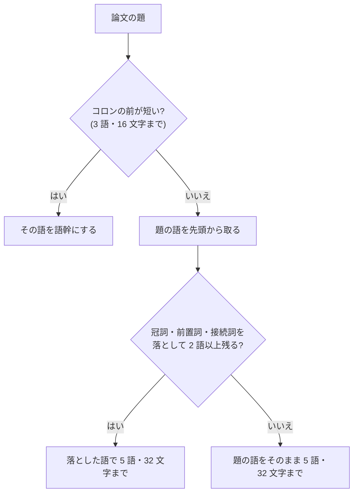

# slug の語幹を題の語から作る

- created: 2026-08-01
- status: ready for review
- implementation: done (2026-08-01)

## 解決したい問題

チャットで `@` に続けて題の記憶を打つと、その論文が候補に出る。
題のどこを覚えていても当たるように、slug の語幹を題の語から作る。

## 問題の背景

slug は論文を指す不変の名前で、チャットの markdown に `@slug` として残る(0002)。
後から書き換えられないので、付け方を間違えると、その論文を指す手立てが悪いまま残り続ける。

打つときは補完が助けるが、補完は**打った文字が slug に含まれるか**で候補を絞る。
つまり当たりやすさは、その論文らしい語が語幹にいくつ入っているかで決まる。
ユーザーは題を一言一句は覚えておらず、先頭のほうの意味のある語を覚えていることが多い。

0002 は語幹を「論文に定着した略称があればそれを使い、無ければタイトルの内容語を 1〜3 語つないだもの」と定めている。
この語を提案するのは取り込みの解決の段階で、そこへ渡している指示は「論文に定着した略称。無ければタイトルの内容語を 1〜3 語」だけである。
**定着した略称かどうかを確かめる手立てが無い。**

その結果、題に出てこない頭字語が語幹になることがある。
実際にコレクションへ入った `wang2018-ash` は、題 `Analytic spherical harmonic coefficients for polygonal area lights` の頭文字から作られている。
`ash` は題のどこにも出てこないので、題を覚えていても補完で当たらない。

## この文書では書かないこと

- slug の全体の形(`<筆頭著者の姓><出版年>-<語幹>`)と、不変であること(0002)。
- 衝突したときの連番、著者や年が取れないときのフォールバック(0002)。
- 補完の出し方(#231)。

## やらないこと

- **既に付いた slug を新しい規則で付け直さない。** slug は不変である(0002)。付け直すとチャットに残った `@slug` が指す先を失う。名前を変えたい論文は、取り込み直して参照を書き換えることになる。
- **題から略称を作らない。** 頭文字をつないだ語は短くて見栄えがするが、題の記憶から打っても当たらない。これがこの文書を書く理由である。
- **同義語や分野の言い換えを足さない。** `brdf` と `reflectance` を結ぶような対応は語幹に持たせない。それは検索(0005)の担当である。

## 概要

**語幹は題から作る。**
取り込みが提案した語は、それが題に出てくるときだけ使う。

題の先頭から語を取り、冠詞と前置詞と接続詞は飛ばす。
どの論文の題にも出る語で、当たりを絞れないためである。
飛ばした結果が 2 語に満たなくなるときは、題をそのまま使う。

語幹は **5 語・32 文字まで**とする。
`@` に続けて打つ名前なので、長くすると打ちにくくなる。

コロンの前が短ければ(3 語・16 文字まで)、それを論文が与えた略称として使う(`NeRF: Representing Scenes ...` → `nerf`、`Mip-NeRF 360: ...` → `mip-nerf-360`)。
これは発明ではなく、著者が題の中で与えた名前である。

図の読み方: 四角が処理、ひし形が分かれ道、矢印は上から下への流れである。

## シナリオ

`Analytic spherical harmonic coefficients for polygonal area lights` を取り込む。

コロンが無いので題の語を先頭から取る。
`for` を飛ばし、`analytic-spherical-harmonic` で 32 文字に達するのでそこで止める。
slug は `wang2018-analytic-spherical-harmonic` になる。

後日、チャットで「球面調和の解析的な係数の論文」を指したくなる。
題をうろ覚えのまま `@spherical` と打つと候補に出る。
`@analytic` でも `@harmonic` でも出る。

## 詳細設計

### 語幹の作り方

| 題 | 語幹 | 理由 |
|---|---|---|
| `NeRF: Representing Scenes as Neural Radiance Fields ...` | `nerf` | コロンの前が 1 語 |
| `Mip-NeRF 360: Unbounded Anti-Aliased Neural Radiance Fields` | `mip-nerf-360` | コロンの前が 3 語・12 文字 |
| `Analytic spherical harmonic coefficients for polygonal area lights` | `analytic-spherical-harmonic` | 前置詞を飛ばし、32 文字で打ち切り |
| `Clustering on the Unit Hypersphere using von Mises-Fisher Distributions` | `clustering-unit-hypersphere` | 同上 |
| `Attention Is All You Need` | `attention-is-all-you-need` | 飛ばすと 2 語未満になるので題のまま |

飛ばすのは冠詞・前置詞・接続詞と、姓の前置き(`von`、`van`、`de` など)に限る。
姓の前置きを飛ばすのは、`von Mises-Fisher` のような名前が途中で切れた語幹になるのを避けるためである。
動詞と代名詞は落とさない。
`Attention Is All You Need` のように、それらが題の中身である題があるためである。

### 提案された語の扱い

取り込みの解決は、その論文の略称を提案できる(0004)。
提案された語は、**その語がすべて題に出てくるときだけ**使う。
出てこない語は、頭文字をつないで作られたものとみなして捨て、題から作り直す。

解決へ渡す指示も「論文自身が題の中で与えている略称。題に出てこない語を作らない」に改める。
ただし指示だけに頼らず、受け取った側で確かめる。
同じ問い合わせでも返る語は揺れるためである。

### 語数と文字数

5 語・32 文字までとする。
`@` に続けて手で打つ名前なので、長さは打ちやすさと直結する。
一方で 1〜3 語では、題の後ろのほうにある語で引けない。

`analytic-spherical-harmonic-coefficients` は 39 文字で、`coefficients` を入れると 32 文字を超える。
この論文では 3 語で打ち切られるが、`Clustering on the Unit Hypersphere` のように機能語が多い題では、同じ 32 文字で内容語が 3 つ入る。

## 落とし穴

- **題の後ろにある語では引けないことがある。** 32 文字の枠に収まらなかった語は語幹に入らない。題の後半にしか特徴の無い論文では、題を覚えていても当たらない。全文検索(0019)なら当たるので、そちらを使うことになる。
- **同じ研究の連作は似た語幹になる。** 題の先頭が同じ論文が並ぶと、語幹まで同じになり、後から入れたほうに連番が付く(0002)。連番の付いた slug は読んで区別しにくい。
- **題が変わると語幹も変わる。** プレプリントと会議版で題が変わることがあり、取り込み直すと別の語幹になる。slug が不変なのは付けた後だけで、付け直しの結果までは揃わない。
- **ASCII に落ちない題は語幹にならない。** 日本語やギリシャ文字だけの題では語が残らず、著者と年とハッシュのフォールバックになる(0002)。

## 代替案

- **0002 のまま 1〜3 語にする。** slug が短く保てる。題の 3 語目までにしか当たらないので、`Clustering on the Unit Hypersphere ...` のような題では `clustering-on-the` のように機能語で枠が埋まる。機能語を飛ばす扱いと合わせないと成り立たない。
- **機能語も落とさずに題の先頭から取る。** 規則が単純で、元の題の並びがそのまま読める。同じ 32 文字で入る内容語が減り、当たりにくくなる。
- **略称を作ってよいことにする(`ash`)。** 短く、その論文を知っている人には読める。題の記憶から打っても当たらない。この文書はこれを避けるために書いている。
- **題をすべてつなぐ。** どの語でも当たる。`@` に続けて打つには長すぎ、一覧でも読みにくい。
- **語幹をやめてハッシュにする。** 衝突しない。人が読めず、`@` から打てない(0002 が人間の読める形を選んだ理由がこれである)。

メイン案を選ぶ基準は、**題のどこを覚えていても打って当たること**である。
題の語だけを使い、当たりに寄与しない語を落とし、打ちやすい長さに収める。

## 負荷・コスト

語幹を作るのは取り込みごとに 1 回の文字列処理で、題の長さに比例する。
解決の問い合わせも増えない。
既にあるコレクションには何もしない。
