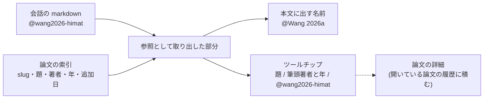

# チャットの論文参照を短く見せる

- created: 2026-08-01
- status: reviewing
- implementation: not-started

## 解決したい問題

チャットの本文に書いた `@slug` が地の文より長くなり、会話が読みにくい。
記録は slug のまま保ったうえで、画面では著者と年の短い名前で読めて、そこから論文の詳細へ移れるようにする。

## 問題の背景

slug は `<筆頭著者の姓><出版年>-<語幹>` の形をした、論文を指す不変の名前である(0002)。
チャットの markdown には `@slug` として書かれ、後から書き換えられない。

語幹は題の語から作る(0023)。
題のどこを覚えていても補完で当たるように、題の先頭から 5 語まで、32 文字を目安に 48 文字まで入る。
コレクションの 57 本では slug が中央 46 文字・最長 57 文字になり、`@wang2018-analytic-spherical-harmonic-coefficients` は 49 文字である。
日本語の 1 文がおよそ 30 文字から 50 文字なので、参照 1 つで 1 文ぶんの場所を取る。

いまチャットの本文では、この `@slug` が地の文と同じ見た目の文字として出ている。
描く側が `@` を見ておらず、markdown としても意味を持たないためで、特別な理由があってそうなっているわけではない。
色も下線も無いまま 49 文字が挟まるので、参照が 2 つ 3 つ入ると地の文より参照のほうが長くなる。

slug を短くする方向では解けない。
補完は打った文字が slug に含まれるかで候補を絞るので、語幹を削ると題の記憶から引けなくなる(0023)。

## この文書では書かないこと

- slug の形と、語幹の作り方(0002、0023)。
- 打つときの `@` の補完。
- エージェントへ渡すときの `@slug` の展開(0014)。
- 論文の詳細画面の中身と、参考文献から論文へ移る経路(0015、0017)。

## やらないこと

- **markdown に短い形を書かない。** 会話の記録に `@Wang 2026a` のような短い名前を残し、slug を別のところに持つ形は採らない。同じ参照を指す記録が 2 つになり、どちらが正かが決まらなくなる。エージェントへ渡すときの展開も、全文検索も、slug を読んでいる。
- **短い名前で参照を書けるようにしない。** 入力の側で `@Wang 2026a` を受け付けると、指す先が一意でなくなる(同じ姓と年の論文が後から増えると、同じ文字が別の論文を指す)。書くのは slug だけで、短い名前は読むためだけにある。
- **入力中の欄では短縮しない。** 打っている途中の文字を縮めると、消したり直したりできなくなる。短縮するのは送信済みの発言を描くときだけである。
- **論文の本文には持ち込まない。** `@slug` はチャットの中だけの書き方で、論文の markdown には出てこない。

## 概要

**記録と表示を分ける。**
会話の markdown には `@slug` を書いたまま、画面に描くときだけ短い名前にする。

本文には **`@<姓> <年>`** を出す(`@Wang 2026`)。
同じ姓と年の論文が他にもあるときは、後ろに `a`、`b` と字を足して見分けを付ける(`@Wang 2026a`)。
論文の参考文献で同じ著者・同じ年が並ぶときと同じ表記である。

この名前は **slug の文字から作る**。
slug は姓と年を先頭に持っているので、索引を待たずに、どの環境で開いても同じ名前になる。

短くするぶん、指した(マウスを載せた、または触れた)ときに **ツールチップ**を出す。
そこには論文の題、筆頭著者と年、そして正式な slug を並べる。
**ツールチップの slug を押すと、論文の詳細へ移る。**
移った先は、参考文献から論文へ移るときと同じ「開いている論文の履歴」に積むので、「戻る」で元の論文へ返れる(0015、0017)。

索引に無い slug は短縮しない。
短縮されていること自体が、指す先がある印になる。



図の読み方: 四角が画面に出るものと、その材料である。
実線の矢印は「左のものから右のものを作る」、点線の矢印は「ツールチップの slug を押したときに移る先」を表す。

## シナリオ

会話で 2 本の論文を比べている。

```markdown
@wang2026-himat の生成の仕方と @zhang2026-successive-height-preintegration の前積分は、どちらも……
```

本文には **`@Wang 2026a` の生成の仕方と `@Zhang 2026` の前積分は、どちらも……** と出る。
`Wang 2026` はコレクションに 2 本あるので字が付き、`Zhang 2026` は 1 本なので付かない。

`@Wang 2026a` にマウスを載せると、題 `HiMat: DiT-based Ultra-High Resolution SVBRDF Generation`、`Jiaping Wang ほか, 2026`、そして `@wang2026-himat` が出る。
どの論文かはここで分かるので、本文へ戻ってそのまま読み進められる。

いま左の欄では別の論文を開いている。
ツールチップの `@wang2026-himat` を押すと、左の欄がその論文の詳細に変わる。
読み終えて「戻る」を押すと、元の論文へ返る。

## 詳細設計

以下では、参照をどこで取り出すか、本文に出す名前の作り方、ツールチップの中身とそれに要る索引、論文へ移る経路と履歴の持ち主、見た目を述べる。

### 参照は markdown の構文木の上で取り出す

`@slug` は、markdown を解析して得た構文木の**地の文の節点の中**から取り出し、参照の節点に置き換える。

構文木を通すのは、**コードの中の `@slug` を置き換えないため**である。
会話ではファイルの場所やコマンドを引用符で囲んで貼ることがあり、その中の `@slug` は文字として読まれるべきものである。
構文木では地の文とコードが別の種類の節点になるので、地の文だけを触れる。

取り出す形は `@` に続く slug の綴り(小文字の英数字とハイフン)である。
これは会話をエージェントへ渡すときに参照を見つける形と同じで、書き手が打った記法をそのまま読む。

### 本文に出す名前

**`@<姓を先頭だけ大文字にしたもの> <年>`** を、slug の文字から作る。
`wang2026-himat` なら `@Wang 2026` である。

**slug から作るのは、姓の切り出しを 1 か所に閉じるため**である。
索引の著者名は `Ben Mildenhall` と `Mildenhall, Ben` の両方の形で入ってくるので、どちらが姓かを判じる処理が要る(0002)。
その処理を表示の側にもう 1 つ置くと、slug を付けたときの判断と食い違いうる。
食い違えば、本文の `@Ben 2020` とツールチップの `@mildenhall2020-nerf` が別の人を指しているように読める。
slug は既にその判断の結果を持っているので、そこから読む。

著者と年が取れなかった論文の slug(`unknown0000-` で始まる形。0002)は短縮しない。
短くしても読めるものにならない。

### 同じ姓と年が重なったとき

同じ `<姓><年>` を持つ論文が他にもあるときだけ、年の後ろに `a`、`b`、`c` と字を足す。
`@Wang 2026a` と `@Wang 2026b` になる。
1 本しか無ければ字は付かない。

これは論文の参考文献の表記と同じ形である。
読み手は「同じ著者の同じ年の別の論文だ」と字を見ただけで判じられる。
どちらがどちらかはツールチップで確かめる。

**字は、その論文をコレクションに入れた順に振る。**
slug の綴り順ではなく追加日の順にするのは、**後から取り込んでも既に付いた字が動かないようにする**ためである。
綴り順だと、`wang2026-abc` を後から入れた時点で既存の `@Wang 2026a` が別の論文を指すようになり、過去の会話の読み方が変わってしまう。
追加日が同じときは slug の綴り順で決める。

26 本を超えたら `aa`、`ab` と続ける。

### ツールチップ

指した(マウスを載せた、または触れた)ときに出し、次の 3 つを縦に並べる。

- 論文の題。
- 筆頭著者と年(`Jiaping Wang ほか, 2026`)。
- 正式な slug(`@wang2026-himat`)。押せる。

題を出すのは、**短縮で落ちた情報をその場で取り戻せるようにする**ためである。
slug だけでは、語幹を読み解かないとどの論文か分からない。

ツールチップは**押せる**ので、マウスが本文から離れた後もしばらく残す。
触って使う場合は、1 度触れると出て、外を触ると消える。

### 索引の口

ツールチップに出す題と著者、そして字を振るのに使う追加日は、**画面が起動したときに一度引く索引**から取る。

いまこの口は slug の綴りだけを返している。
参照ごとに論文を 1 件ずつ引く形にすると、会話 1 つに参照が 20 個あれば 20 回の問い合わせになる。
そこで**この口が返すものを、slug ごとの `{ slug, title, authors, year, addedAt }` に広げる**。
`authors` は筆頭著者だけでよいが、論文の一覧が既に全著者を持っているので、そのまま返す。

1 本あたり数百バイトで、57 本なら 10 KB 台である。
論文が 1000 本に増えても数百 KB で、起動時の 1 回に収まる。

この索引は、打つときの `@` の補完も同じものを読める。

### 論文へ移る経路と履歴

ツールチップの slug を押すと、左の欄を論文の表示に切り替え、その論文の詳細を開く。

論文の詳細は既に**開いている論文の履歴**を持っている。
参考文献から別の論文へ移るたびに履歴が伸び、「戻る」で 1 つ前へ返る(0015、0017)。
チャットからの移動も**この履歴に積む**。
既に論文を開いていれば「戻る」で元の論文へ返れるし、一覧を見ていたなら履歴を新しく張る。

**この履歴の持ち主を、論文の一覧の画面から画面全体へ上げる。**
いまは論文の一覧の画面が内部に持っているが、チャットの側からも積むことになる。
同じ状態を 2 か所が別々に持つと、どちらが正かが決まらず、片方だけが動いて食い違う。

画面が狭いときはチャットが前面に出ているので、移動と同時に畳んで論文の詳細を見せる。

### 見た目

本文の色のまま点線の下線を引き、指したときにアクセント色にする。
論文の本文の引用(0017)と同じ、**本文の中の控えめな参照**の見た目である。
外部リンク(アクセント色に実線の下線)とは区別する。
参照が飛ぶ先は手元の論文であって、外の web ではない。

**`@` は残す。**
書き手が markdown に打った記法がそのまま読めるので、本文の `@Wang 2026a` と記録の `@wang2026-himat` が同じものだと分かる。
参考文献の引用が `[Wang 2026]` の形で出るのとも見分けが付く。

## 落とし穴

- **姓が ASCII に落ちる。** slug から名前を作るので、`Jiménez Ayguadé` は `@Jimenezayguade 2026` になる。読めるが原綴りではない。正しい綴りはツールチップの著者名に出る。
- **同じ姓・同じ年の論文は、本文では字でしか区別が付かない。** `@Wang 2026a` と `@Wang 2026b` のどちらがどちらかは、指さないと分からない。ふだんは短く読めることを優先した結果である。
- **論文を消すと字がずれる。** 字は追加した順に振るので、途中の論文を消すと後ろの字が繰り上がり、過去の会話の `@Wang 2026b` が別の論文を指すようになる。取り込みは日常的だが削除は稀なので、追加で動かないことを優先している。
- **短縮された名前をコピーしても slug にならない。** 本文を選んで別の場所へ貼ると `@Wang 2026a` が入る。slug が要るときは、ツールチップから取るか、markdown のファイルを読むことになる。
- **生の markdown を読むときは長い slug がそのまま出る。** 会話のファイルをエディタで開いたときは短縮が効かない。語幹の長さの上限(0023)はそのための歯止めである。

## 代替案

- **markdown に短い名前を書き、slug を別のところに持つ。** 記録がそのまま短くなるので、生のファイルを読むときも短い。同じ参照を指す記録が 2 つになり、どちらが正かが決まらない。会話のファイルを手で直したときに 2 つがずれる。
- **本文に論文の題を出す。** どの論文か一目で分かる。題は slug より長いので、場所を取るという問題が悪化する。
- **本文の見た目を CSS で省略する(`text-overflow`)。** 描く仕組みを変えずに済む。行の途中にある文字は省略できず、途中で切れた slug は読めない。文字を選んでコピーすることもできなくなる。
- **slug 自体を短くする。** 語幹の上限を下げれば表示も短くなる。補完は打った文字が slug に含まれるかで絞るので、題の記憶から引けなくなる(0023 が解こうとしている問題に戻る)。
- **押したら確認なしに論文へ移る(ツールチップを出さない)。** 操作がひと手間減る。誤って押したときに画面が飛び、どの論文を指しているかを移らずに確かめる手立ても無くなる。
- **本文に出す名前を索引の著者名から作る。** 発音記号と分かち書きが正しく出る(`@Jiménez Ayguadé 2026`)。姓の切り出しが slug を作るときと表示するときの 2 か所になり、食い違うと本文とツールチップで別の姓が出る。
- **描く前の markdown の文字列を置き換える。** 実装が短い。コードとして囲んだ中の `@slug` まで置き換わり、会話に貼ったコマンドやファイルの場所が壊れて見える。
- **描いた後の画面の要素を書き換える。** markdown の仕組みに触らずに済む。応答の途中で何度も描き直されるので、そのたびに追いかけることになる。

メイン案を選ぶ基準は、**記録は slug のまま変えず、画面では短く読めて、指した先へ確実に渡れること**である。
記録を触る案(短い名前を書く)は 1 つ目を満たさず、題を出す案と CSS で省略する案は 2 つ目を満たさない。

## セキュリティ・プライバシー

新しい外部入力は無い。
ツールチップに出すのは手元のコレクションの題と著者で、押した先も同じ画面の中である。
索引の口が返すものは増えるが、返す相手は同じ画面で、外へ出る通信は増えない。

## 負荷・コスト

参照を取り出すのは、既に組み立てている markdown の構文木を 1 度なぞるだけで、発言の長さに比例する。
描いた結果は発言ごとに持ち回るので、応答の途中の描き直しでは組み立て直さない。

索引は起動時に 1 回引く。
論文 1 本あたり数百バイトで、1000 本でも数百 KB である。

ツールチップは指したときだけ組み立てる。
本文に出す名前と字の割り振りは、索引が届いた時点で slug ごとに 1 度決まる。
