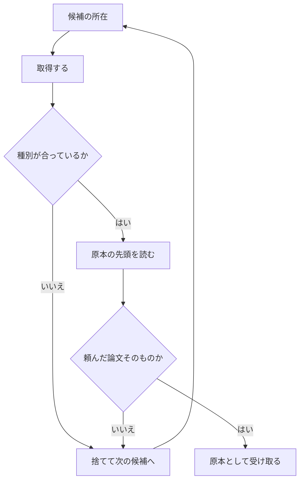

# 取得した原本が頼んだ論文かを確かめる

- created: 2026-08-01
- status: reviewing
- implementation: not-started

## 解決したい問題

頼んだ論文とは別の文書がコレクションに入り、和訳と索引まで通ってしまうのを止める。

## 問題の背景

取得の段階は、解決が挙げた所在を順に試して原本を保存する(0004)。
受け取ってよいかの判断に使っているのは、**取れた中身が PDF のバイト列であること**だけである。
これは出版社の閲覧ページが HTTP としては成功しながら HTML を返すためで、種別を見ないと断りの画面が原本になってしまう。

取得は所在が 1 つ落ちても諦めない(#243)。
解決が挙げた所在を試し、駄目なら別の所在を探させ、それでも駄目なら候補のページを開いて **PDF への直リンクを拾う**。
出版社の閲覧ページと PDF で URL の形が違う出版社が多く、ページを見ないと原本に辿り着けないためである。

このリンクの拾い方は「そのページにある `.pdf` で終わるリンク」であり、それが論文かどうかは見ていない。
**種別の検査を通れば、どの PDF でも原本になる。**

実際に混入した。
`Ray Tracing Massive Amounts of Animated Geometry` を題名で取り込んだところ、解決は正しい所在(ACM の PDF)を返したが、ACM は素の HTTP に 403 を返す。
再試行が候補のページ(AMD GPUOpen の解説記事)を開いて PDF のリンクを拾ったが、**そのページにある `.pdf` は footer の企業文書 2 つだけ**だった。
論文本体へのリンクは `.pdf` で終わらない ACM のページである。

```
href="https://www.amd.com/content/dam/amd/en/documents/corporate/cr/supply-chain-transparency.pdf"
href="https://www.amd.com/content/dam/amd/en/documents/pdfs/corporate/amd-uk-tax-strategy.pdf"
```

1 つ目が PDF として取れたので原本になり、変換・照合・書誌・翻訳・参考文献・登録がすべてその文書に対して通った。
照合は取れた紙面と本文が一致するかを見る(0009)ので矛盾は出ず、書誌は本文から題を取る(0020)ので題だけが差し替わり、**企業の法務文書が描画の論文として和訳され、索引に載り、`@slug` で引用できる状態**になった。

## この文書では書かないこと

- 原本の所在の探し方(0004、#243)。
- 変換・照合・書誌・翻訳・参考文献の中身(0008〜0011、0015、0020)。
- 手元の PDF からの取り込み(0021)。
- 同じ論文を二度取り込まないための突き合わせ(#245、#263)。

## やらないこと

- **走査した紙面の原本のために、経路を分けない。** 紙面を画像として持つだけの PDF でも、同じ判定を通す。読ませ方だけが変わる(0010、0021)。
- **書誌の段階を失敗させない。** 学会名や DOI が確かめられなくても論文は読めるので、そこで取り込みを止めない(0020)。この文書が足すのは取得の段階の判定であり、書誌の扱いは変えない。
- **原本の全文は読ませない。** 判定に使うのは先頭だけにする。全文を読ませれば確かさは上がるが、候補ごとに論文 1 本ぶんを渡すことになる。どの文書かは先頭で分かる。
- **取り込んだ後に見張らない。** 既にコレクションにある論文を定期的に検査して取り違えを探すことはしない。取得の時点で弾くほうが安く、直しようもある。

## 概要

**取得は、取れた原本が頼んだ論文かを確かめてから受け取る。**

判定は、**原本の先頭を Codex に読ませ、頼んだ論文そのものかを判じさせる**。
これが同じ論文かどうかは、文字の重なりでは決まらない。
その論文を引用した特許、発表のスライド、補足資料、同じ著者の別の論文は、題の語をそのまま含んでいる。

読ませるのは先頭 2 ページで、文字層があればその文字、無ければページの画像を渡す(0021 と同じ読み方)。
走査しただけの紙面も同じ判定を通せる。

落ちた候補は原本にせず、**次の所在を試す**。
取得は既に候補を順に試す形になっているので、判定はその輪の中に入る。
すべての候補が落ちたら、原本を取れなかったのと同じ失敗として扱い、内訳に判定の理由を残す。

手元から入れた原本は判定しない。
ユーザーが選んだファイルが正であり、書誌はその PDF から読み取るので、突き合わせる相手が無い(0021)。



図の読み方: 四角が処理、ひし形が分かれ道、矢印は上から下への流れである。
「種別」は PDF と HTML のどちらを取りに行っているかを指す。
「頼んだ論文そのものか」は Codex が判じる。
候補が尽きるまで輪を回り、尽きたら取得の失敗になる。

## シナリオ

`Ray Tracing Massive Amounts of Animated Geometry` を題名で取り込む。

解決は ACM の PDF を所在として返す。
ACM は素の HTTP に 403 を返すので取得は失敗し、再試行が候補のページを開いて PDF のリンクを拾う。
拾えたのは企業文書の PDF だけである。

その 1 つ目は PDF として取れるので、先頭 2 ページを読ませる。
中身は企業の法務文書なので、**頼んだ論文ではない**と判じられる。
原本にせず、次の候補へ移る。
2 つ目も同じく落ちる。

候補が尽きるので、取得は失敗する。
一覧には「原本を取得できなかった」と、試した所在ごとの理由(403、頼んだ論文ではなかった)が出る。
ユーザーは ACM から PDF を落として、取り込みの欄から入れられる(0021)。

変換も照合も翻訳も走らないので、GPU は使わない。

## 詳細設計

以下では、判定を置く位置と落ちたときの動き、何を読ませて何を判じさせるか、判じた結果の形、判定しない場合、候補が尽きたときの扱いを述べる。

### 判定の位置と、落ちたときの動き

判定は**取得の段階の中**、種別の検査の直後に置く。

取得は既に「候補を順に試し、駄目なら次へ」という形をしている。
判定をここに置けば、落ちた候補は種別が違ったときと同じ扱いで次へ回せる。
落ちた原本のファイルは消す。
残すと原本があるように見え、次の段階も再開の判定も成果物の存在を見ている(0004)ためである。

**書誌の段階ではなく取得に置く。**
書誌は本文が確定した後なので、そこで判じると変換と照合を走らせてから落ちることになる。
照合は分単位で GPU を使う。
さらに書誌の位置からは候補を試し直せないので、正しい所在が候補の後ろにあっても辿り着けない。

### 何を読ませて、何を判じさせるか

渡すのは**頼んだ論文の書誌**と**取れた原本の先頭**の 2 つである。

書誌は解決が返した題と著者と出版年を使う。
解決は原本の所在と書誌の下書きを同時に決めるので、この時点で揃っている。

原本の先頭は、種別ごとに次のように読む。

- **PDF**: 先頭 2 ページ。文字層があればその文字、無ければページの画像を渡す(0021 と同じ読み方)。表紙が付いていることがあるので 1 ページでは足りない。
- **HTML**: 取れたファイルの文字。本文の塊を選ぶ前(0022)でも、題と著者は文字として出ている。

**判じさせるのは「この文書は、その書誌が指す論文そのものか」である。**
落とすべきものは 3 つに分かれる。

- **論文ではない文書。** 企業の文書、契約や規約、案内、スライド。
- **その論文に付随する別の文書。** 補足資料、発表の資料、その論文を引用した特許。
- **別の論文。** 同じ著者の別の研究、題の語が重なる無関係な論文、会議版と学位論文のような別の刊行物。

**この見分けは文字の重なりでは付かない。**
付随する文書も、引用した特許も、題と著者をそのまま含んでいる。
どれであるかは中身を読まないと決まらないので、読める相手に判じさせる。

### 判じた結果の形

返させるのは、**同じ論文かどうか**と、**そうでないなら何であるか**の一言である。

理由を持たせるのは、取得が失敗したときに一覧へ出すためである。
「頼んだ論文ではなかった」だけでは、所在が悪いのか論文が公開されていないのかが分からない。
「補足資料だった」「別の論文だった」まで出れば、次にどうすればよいかが読み取れる。

**判定そのものが行えなかったとき(応答が読めない、枠が尽きた)は、その候補を落とす。**
確かめずに受け取ると、この設計が防ごうとしているものが素通りするためである。
仕事は積み直せるので、Codex 側の一時的な不調で原本を失うことはない。

### 判定しない場合

**手元から入れた原本(0021)は判定しない。**
ユーザーが選んだファイルが正であり、書誌はその PDF の先頭から読み取る。
突き合わせる相手が無い。

### 候補が尽きたとき

すべての候補が判定に落ちたら、**原本を取得できなかったのと同じ失敗**にする。

取得の失敗は、試した所在ごとの理由を持って一覧に出る(#243)。
そこに判定の理由(補足資料だった、別の論文だった、など)を加える。
ユーザーは、そもそも公開された PDF が無いのだと読み取って、手元の PDF から入れる(0021)ほうへ進める。

半端な成果物は残らない。
落ちた候補のファイルは消してあり、記録は取得の段階で失敗している。

## 落とし穴

- **解決が返した書誌が間違っていると、弾けない。** 判定が保証するのは「解決が言う論文と、取れた原本が一致すること」であり、解決が別の論文を指していたときは、その論文の原本が正しく取れて通る。
- **判定が揺れる。** 同じ候補でも、返る答えが毎回同じとは限らない。会議版と論文誌版のように、同じ研究の別の刊行物をどちらに寄せるかは境目にある。取り込みが通らないときは、手元の PDF から入れる道が残っている(0021)。
- **候補ごとに Codex のターンを 1 つ使う。** 取れた候補の数だけ増える。取り違えを弾いたときは変換以降が走らなくなるので、全体としては減る側に働くが、正しい所在が 1 つ目で取れるときは純粋な上乗せになる。
- **候補が尽きて失敗する取り込みが増える。** いままでは何かしらの PDF が入って完了していたものが、正直に失敗するようになる。取り込めなかったこと自体は画面に出るので、手元の PDF から入れ直せる。

## 代替案

- **題の語が原本の先頭に現れるかで、機械的に判じる。** Codex を使わないので速く、枠も使わない。コレクションの 85 本で測ると、正しい組は題の語がすべて先頭 2 ページに現れ(85 本すべて 1.00)、混入した企業文書は 1 語も現れなかった(0.00)。今回のような無関係な文書は弾ける。**その論文に付随する文書や、引用した特許や、同じ著者の別の論文は弾けない。** どれも題と著者をそのまま含むためである。文字層を持たない走査した紙面も判じられず、通すことになる。防ぎたいのは「別の文書が入ること」であって「無関係な文書が入ること」ではないので、これでは足りない。
- **書誌の段階で、本文から取った題と突き合わせて失敗させる。** 本文全体が手に入っているので判定は正確で、読み取りを新しく足さずに済む。変換と照合を走らせてから落ちるので、GPU と時間を捨てる(照合は分単位)。その位置からは候補を試し直せない。書誌は取り込みを失敗させないという 0020 の決めとも衝突する。
- **ページから拾う PDF のリンクを、題と関係のあるものに絞る。** 混入の入口が狭まり、取得の回数も減る。正しい PDF が `paper.pdf` のようなそっけない名前で置かれていることがあるので、落とし過ぎないためには判定を緩くせざるを得ず、緩い判定は無関係な PDF を通す。取れたものが正しいかを見ていない点は変わらない。取得の判定と併せるなら意味があるが、これだけでは足りない。
- **取り込んだ後に人が読んで気づく(何もしない)。** 実装が要らない。気づくまでに和訳と索引と参考文献まで通り、`@slug` で引用もできる。取り違えたことに気づく手掛かりが、本文を開くまで無い。

メイン案を選ぶ基準は、**別の文書が入るのを止めたうえで、正しい所在が残っていればそこへ進めること**である。
何が入ったかを見分けるには中身を読む必要があり、取得の中で判じれば、変換より前に落ちて次の候補へ回れる。

## セキュリティ・プライバシー

新しい外部入力は無い。
読むのは取得した原本のファイルで、既に手元にあるものである。

判定のために、その先頭 2 ページを Codex へ渡す。
渡す相手は取り込みの他の段階(解決・書誌・翻訳・参考文献)と同じで、渡すのは論文の公開されている面である。

## 負荷・コスト

取れた候補ごとに、原本の先頭 2 ページを読んで Codex に 1 ターン投げる。

先頭を読む処理は、実測(コレクションの 20 本)で 50ms から 410ms、中央 92ms である。
Codex のターンは短い入力の 1 往復で、解決の段階(実測 22 秒)より軽い。
資源クラスは取得と同じで、GPU は使わない。

増えるのは取れた候補の数だけで、多くの取り込みでは 1 つである。
取り違えを弾いたときは、変換(実測で 12 秒から数十秒)と照合(分単位)と翻訳が走らなくなるので、全体では減る側に働く。
