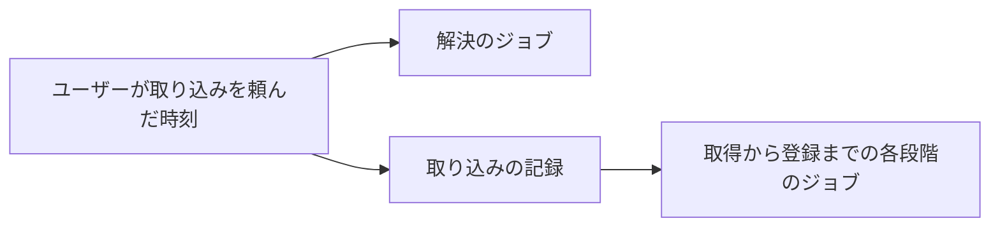
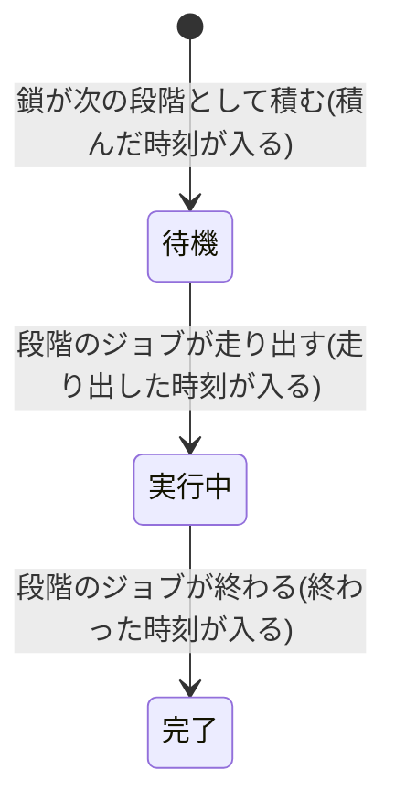

# 取り込みを頼んだ順に 1 本ずつ流し、進みを実行時間で見せる

- created: 2026-08-03
- status: ready for review
- implementation: not-started

## 解決したい問題

論文をまとめて取り込んだとき、先に頼んだ 1 本が先に読めるようになる。
いまは全部の論文が同じ段階を横並びで進むため、1 本目が読めるまでに全体とほぼ同じ時間がかかる。

あわせて、進みの一覧に出る数字が、その段階に実際にかかった時間を表すようにする。
いまは順番待ちの時間が混ざっているため、どの段階が重いのかを読み取れない。
そして、積まれているだけの段階と、いま走っている段階を一覧で見分けられるようにする。

## 問題の背景

取り込みは 解決・取得・変換・照合・書誌・翻訳・参考文献・登録 の段階を順に進む(0004)。
各段階は 1 つのジョブで、前の段階が終わった時点で次の段階が積まれる。
ジョブは資源クラス(GPU / Codex / ネットワーク)ごとに同時実行数を持ち、同じ資源クラスの中では優先度(ユーザーが結果を待っているか)が先に効く(0003)。

キューは積まれた順に取り出す。
これはキューが取り込みの鎖という概念を持たないためで、キューから見ると 20 本の取り込みは互いに無関係なジョブの列である。
待ち行列を積まれた順に流すこと自体に、これ以上の設計理由は無い。

この既定が、段階の横並びを生む。
20 本を押すと、Codex を資源クラスとするジョブの列に 20 件の解決が並ぶ。
1 本目の解決が終わって取得と変換が進み、照合が積まれる時点では、まだ 16 件の解決が先に並んでいる。
照合も解決も Codex を使うので、1 本目の照合はその 16 件の後ろに付く。
以降の段階でも同じことが起こり、結果として全部の論文がほぼ同時に読めるようになる。

段階ごとの所要時間は `state.sqlite` の段階の記録が持つ。
この記録は、取り込みの鎖が次の段階へ進むときに 1 度だけ書かれる。
鎖から見ると「前の段階が終わった時刻」と「次の段階が始まった時刻」に切れ目が無いので、1 つの時刻で両方を表せる。
そのジョブが実際にいつ走り出したかは鎖からは見えないため、記録に入っていない。
順番待ちが数秒で済む間はこの差が問題にならなかったが、上の並べ替えを入れると待ちが数十分に伸びるので、待ちと実行の区別が要る。

## この文書では書かないこと

- 各段階が何をするか(解決・照合・翻訳の入出力契約)。0004 が持つ。
- 資源クラスの分け方と同時実行数、残枠による待機。0003 が持つ。
- 失敗した取り込みをどの段階から再開するかの決め方。既存の挙動を前提として使う。
- 進みの一覧で使う記号と色の具体。

## やらないこと

- **論文 1 本を 1 つのジョブにまとめない。**

  取り込み 1 本を 1 つのジョブとし、段階をそのジョブの中で順に回す設計である。
  順序は論文単位で自明になる。
  しかし 1 つのジョブが変換のために GPU を、翻訳のために Codex を要求することになり、資源クラスごとに同時実行数を決める仕組み(0003)が働かなくなる。
  成果物の有無から再開位置を決める契約(0004)も、ジョブの中の進みとして持ち直すことになる。
  資源クラスと段階ごとの再開は取り込みの骨格なので、順序のためにこれを崩さない。

- **待ち時間の長さで順序を動かさない。**

  長く待っているジョブの順序を徐々に上げ、いつかは必ず走るようにする設計である。
  後から頼んだ論文が延々と待たされる状態を防げる。
  しかし取り込みは人が押して始まるもので、押し続けない限り列はいつか空く。
  順序が時間で動くと「先に頼んだ論文が先に終わる」という約束も崩れる。
  取り込みを押し続けても後の論文が始まらない、という訴えが実際に出るまで入れない。

- **待ち時間を所要時間に足して見せる直し方をしない。**

  一覧の数字を、頼んでから終わるまでの時間に統一する設計である。
  体感の待ち時間とは一致する。
  しかし、その数字はキューの混み具合で何倍にも変わるので、どの段階が重いのかを比べる用途には使えない。
  変換器やモデルを選び直すときは同じ論文で段階ごとの時間を比べるため、比べられる数字のほうを一覧に出す。

## 概要

ジョブに **順序キー** を持たせる。
これは「この仕事がどの取り込みのために積まれたか」を時刻で表す数値で、取り込みの鎖に属するジョブは、その取り込みをユーザーが頼んだ時刻を全段階で共有する。
同じ資源クラスの中の実行順は、優先度、順序キー、積まれた順の 3 つで決まる。
これにより、先に頼んだ論文のジョブが、どの段階でも後から頼んだ論文の解決より先に走る。
1 本の鎖は同時に 1 つのジョブしか持たないので、同時実行数はこれまでどおり後続の論文が埋める。
全部が終わるまでの時間は変わらず、1 本目が読めるまでの時間だけが縮む。

順序を変えると後の論文は長く待つので、待っていることが一覧から分かる必要がある。
段階の記録に **積んだ時刻・走り出した時刻・終わった時刻** の 3 つを持たせる。
段階が 待機 / 実行中 / 完了 のどれであるかは、この 3 つだけで決まる。
段階を積むのは取り込みの鎖、走り出したと記すのはその段階のジョブで、両者が同じ記録の別の欄を埋める。

所要時間は「終わった時刻 − 走り出した時刻」とし、待っていた時間を含めない。
待ち時間は所要時間に足さず、別の量として扱う。

図の読み方: 矢印は、順序キーとして同じ値が渡る向きを表す。
解決のジョブは頼まれた時点で積まれるので値を直接受け取り、以降の段階は取り込みの記録が持つ同じ時刻を読む。

## シナリオ

フィードから 20 本の論文をまとめて取り込む。

押した直後、進みの一覧には 20 行が並ぶ。
先頭の数行は解決が実行中、残りは解決が待機で、待機の行は記号と色が実行中と違う。
どれもまだ題が分からないので、slug の代わりに未解決と出る。

数分後、1 本目の解決が終わって取得と変換に進む。
このとき 16 本はまだ解決を待っているが、1 本目の照合は順序キーが最も早いので、Codex の枠が空いた時点でその 16 本より先に走る。
1 本目は照合から登録まで止まらずに進み、10 分ほどで読めるようになる。

このとき 20 本目の行は、解決が待機のまま動いていない。
一覧の合計時間は 0 秒で、押してから 10 分経っていることは行の見た目では分からない。
ユーザーはこれを見て「順番待ちであって、失敗しているのではない」と判断できる。

すべて終わった後、1 本目の行を見ると 照合 3 分 20 秒、翻訳 4 分 10 秒 と出ている。
これはその段階が実際に走っていた時間で、20 本目の行の照合も、待った長さに関わらず同じ程度の数字になる。

## 詳細設計

以下では、順序キーの契約、並行度への影響、段階の記録の契約、所要時間の定義を順に述べる。

### 順序キーの契約

ジョブは順序キーを 1 つ持つ。
値は時刻(エポックミリ秒)で、小さいほど先に走る。

同じ資源クラスの中から次に走らせるジョブを選ぶ順序は次のとおりである。

1. 優先度(前景が背景より先)
2. 順序キー(小さいほうが先)
3. 積まれた順

優先度を順序キーより先に置くのは、優先度が「ユーザーが結果を待っているか」を表す軸だからである(0003)。
フィードの abstract の和訳のような背景の仕事が、取り込みの順序に割り込んではいけない。

**取り込みの鎖に属するジョブの順序キーは、その取り込みをユーザーが頼んだ時刻である。**
解決のジョブは頼まれた時点で積まれるので、自分が積まれた時刻がそのまま順序キーになる。
取得から登録までのジョブは、取り込みの記録が持つ「頼まれた時刻」を読んで同じ値を使う。
取り込みの記録はこの時刻を既に持っている。
記録ができるのは解決が終わってからだが、そのときの現在時刻ではなく押された時刻を入れてあり、解決にかかった時間が記録から抜け落ちないようにしてある。

**やり直しでも順序キーを変えない。**
失敗した取り込みを押し直したとき、順序キーは最初に頼まれた時刻のままである。
やり直しで列の最後尾に回ると、一度失敗した論文が新しい取り込みに追い越され続けて、いつまでも読めなくなる。

**取り込みの鎖に属さないジョブは、自分が積まれた時刻を順序キーにする。**
フィードの取得、abstract の和訳、会話の索引、埋め込みの積み直しがこれに当たる。
これらは互いに独立した仕事なので、積まれた順に流れるのが素直である。
順序キーを積まれた時刻にすると、並べ替えの規則は 1 つのままで、これらの仕事はこれまでと同じ順序で流れる。

### 並行度は落ちない

順序キーは、同時に走るジョブの数を減らさない。

取り込み 1 本の鎖は、ある時点で高々 1 つのジョブしか持たない。
段階は前の段階が終わってから積まれるからである。
したがって Codex の枠が 4 つあるとき、1 本目が使うのは 1 つで、残り 3 つは順序キーが次に小さい論文が埋める。

順序キーが変えるのは「空いた枠を誰が取るか」だけで、枠の数ではない。
全部の取り込みが終わるまでの時間は、資源クラスごとの同時実行数と 1 本あたりの仕事量で決まるので、順序キーを入れても変わらない。
変わるのは、その総時間のどこで各論文が読めるようになるかである。

### 段階の記録の契約

段階の記録は、取り込みと段階の組ごとに次の 3 つの時刻を持つ。

| 欄 | 意味 | 誰が書くか |
|---|---|---|
| 積んだ時刻 | その段階のジョブをキューに入れた時刻 | 取り込みの鎖 |
| 走り出した時刻 | そのジョブが実際に動き始めた時刻 | その段階のジョブ |
| 終わった時刻 | そのジョブが終わった時刻 | 取り込みの鎖 |

段階の状態は、この 3 つが埋まっているかだけで決まる。

図の読み方: 四角が段階の状態、矢印は状態の遷移である。
ラベルは、その遷移を起こす出来事と、そのとき記録に入る時刻を表す。

**記録に無い段階は、まだそこまで来ていない。**
原本が HTML で照合を飛ばした場合(0004)のように、走らない段階は記録を持たない。
待機と「まだ来ていない」は、記録があるかどうかで分かれる。

書き手を 2 つに分けるのは、積まれてから走り出すまでの間を記録に残すためである。
鎖は次の段階を積むところまでしか知らず、ジョブがいつ枠を得たかは知らない。
ジョブは自分が走り出したことしか知らず、いつ積まれたかを持たない。
どちらか一方だけが書く形にすると、この間の長さがどこにも残らない。

この契約により、進みの一覧は段階の記録だけを見て 待機 / 実行中 / 完了 を描ける。
取り込みの記録が持つ「いまどの段階か」と突き合わせる必要が無くなり、両者が食い違ったときに表示が壊れることもなくなる。

### 所要時間の定義

段階の所要時間は「終わった時刻 − 走り出した時刻」である。
走り出していない段階に所要時間は無い。

取り込み全体の所要時間は、各段階の所要時間の和である。
段階の間には順番待ちがあるので、この和は「頼んでから終わるまで」より短くなる。

待っていた時間は「走り出した時刻 − 積んだ時刻」として記録から取れるが、所要時間には足さない。
足すと、同じ論文でもキューの混み具合で数字が何倍にもなり、段階どうしを比べられなくなる。

## 落とし穴

- **後から頼んだ論文は、解決すら始まらないまま長く待つ。** 20 本押すと、後半の論文は前半が読めるようになるまで題も分からない。進みの一覧には未解決の行として出るので、押したことが消えるわけではない。
- **順序キーは飢餓を防がない。** 取り込みを押し続ける限り、後の論文はいつまでも始まらない。押すのは人なので列はいつか空くが、自動で取り込む仕組みを将来入れるなら、この前提が崩れる。
- **失敗してやり直した取り込みは、頼んだ時刻のまま先頭に戻る。** 何日も放置した失敗を押し直すと、いま進んでいる論文を追い越す。押した本人はその論文を待っているので望ましい向きだが、他の論文の完了は遅れる。
- **一覧の合計時間は、体感の待ち時間より短く出る。** 実行時間だけを足すので、押してから読めるまでの実時間とは一致しない。
- **走り出した時刻を書く前にサーバーが落ちると、その段階は待機のまま残る。** 再開時にジョブが積み直され、走り出した時点で埋まる。

## 代替案

- **走り出した論文を最優先にする優先度をもう 1 段作る。**

  優先度に「一度でも段階が走り出した論文」という段を足し、まだ何も始まっていない論文より常に先に走らせる設計である。
  順序キーという新しい概念を持たずに済み、変更は最も小さい。
  しかし走り出した論文が増えると、その中の順序はまた積まれた順に戻るので、同じ横並びが 1 段下で再現する。
  優先度は「ユーザーが結果を待っているか」を表す軸なので(0003)、そこに別の意味を重ねると軸がぼやける。
  順序キーは論文が何本あっても順序を決め切るので、こちらを採る。

- **解決だけ先に全部通し、以降を論文ごとの順序にする。**

  解決の段階は積まれた順に全部走らせ、取得から登録までを順序キーで並べる設計である。
  押した論文が早く題つきで一覧に現れる。
  しかし解決は Codex を使うので、20 本ぶんの解決が終わるまで 1 本目の照合と翻訳が止まる。
  1 本目が読めるまでの時間が、解決 20 本ぶんだけ延びる。
  題が出るまでの見た目は未解決の行で足りているので、1 本目を早く読めるほうを取る。

- **段階の記録は増やさず、走った時間をジョブの記録から計算する。**

  段階の記録には手を入れず、済んだジョブの作成時刻と更新時刻から実行時間を求める設計である。
  記録の形を変えずに済む。
  しかし済んだジョブの記録は一定数と一定期間で捨てられるので、後から取り込みを見返したときに所要時間が消える。
  1 つの段階が再試行で複数のジョブにまたがる場合も、どれを足すかを決めきれない。
  所要時間は取り込みの記録と同じ寿命を持つべきなので、段階の記録に置く。

## セキュリティ・プライバシー

この設計が扱うのは実行順と時刻の記録だけで、外部からの入力も機微なデータも増えないため、新たな検討は不要である。

## 負荷・コスト

並べ替えは、次に走らせるジョブを選ぶ問い合わせの `order by` に列が 1 つ増えるだけである。
この問い合わせは枠が空くたびに走り、対象は待機中のジョブに限られる。
待機中のジョブは取り込み 1 本あたり高々 1 件なので、100 本積んでも数百行の並べ替えで済む。
資源クラスと状態には既に索引があり、そこに順序キーを足せば同じ計画で引ける。

段階の記録は 1 行あたり整数 1 つぶん増える。
取り込み 1 本で 8 行なので、1000 本のコレクションでも数万バイトの増加に収まる。

書き込みは、段階ごとに 1 回増える。
これまで鎖が段階の開始と終了を書いていたところに、ジョブが走り出した時刻を書く更新が 1 つ加わる。
取り込み 1 本で 8 回の追加であり、同じトランザクションの中で他の更新と並ぶ程度の量である。
